# 多租户计费系统设计方案

## 1. 概述

基于Rose Playground平台的多租户SaaS架构，设计一个完整的计费系统来支持订阅管理、使用量统计、账单生成和支付处理。该系统将集成到现有的Spring Boot 3.x架构中，利用平台的多租户能力、审计日志、通知系统等基础组件。

### 1.1 设计目标

- **多租户隔离**：确保不同租户的计费数据完全隔离
- **灵活定价**：支持多种定价模式（固定费用、按量计费、阶梯定价）
- **自动化计费**：自动计算费用、生成账单、处理续费
- **可扩展性**：支持新功能的快速接入和定价配置
- **数据一致性**：通过价格快照和事务处理保证数据一致性

### 1.2 核心特性

- 多维度订阅管理（试用、付费、企业级）
- 灵活的功能配额控制（按订阅/按席位）
- 多种计费周期支持（月度/年度/按量）
- 完整的账单和支付流程
- 实时使用量监控和告警
- 租户专属定价策略

## 2. 架构设计

### 2.1 系统架构

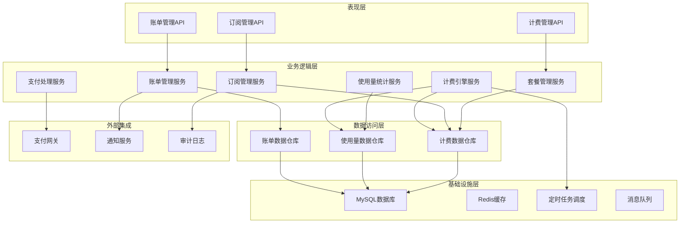

### 2.2 领域模型

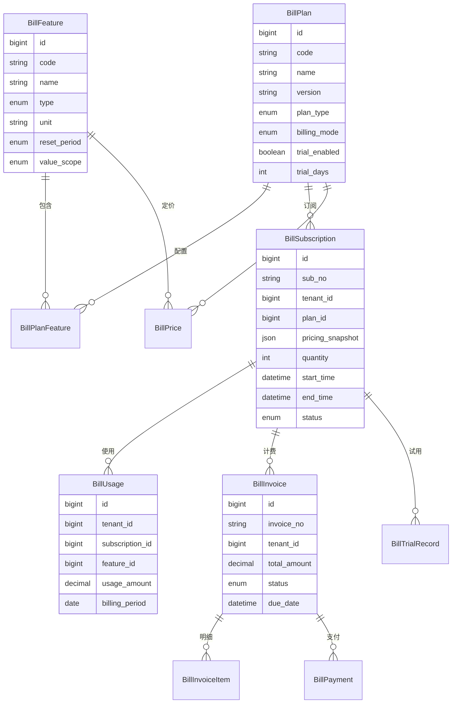

## 3. 核心功能设计

### 3.1 功能模块设计

#### 功能定义表 (bill_feature)

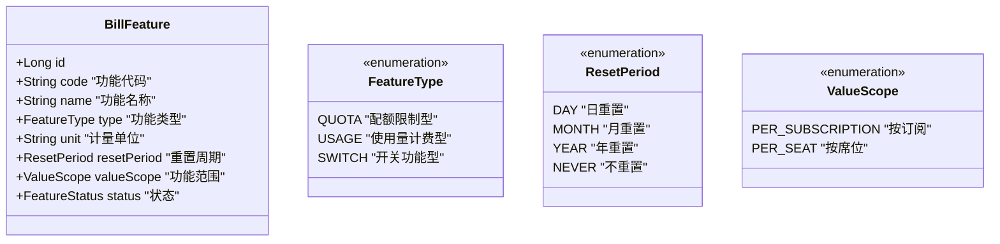

**功能类型说明：**
- **QUOTA（配额限制型）**：固定使用上限，包含在套餐费用中（如存储空间100GB）
- **USAGE（使用量计费型）**：按实际使用量计费，可设免费额度（如API调用）
- **SWITCH（开关功能型）**：功能开关，通常按周期收费（如高级分析功能）

#### 套餐管理设计

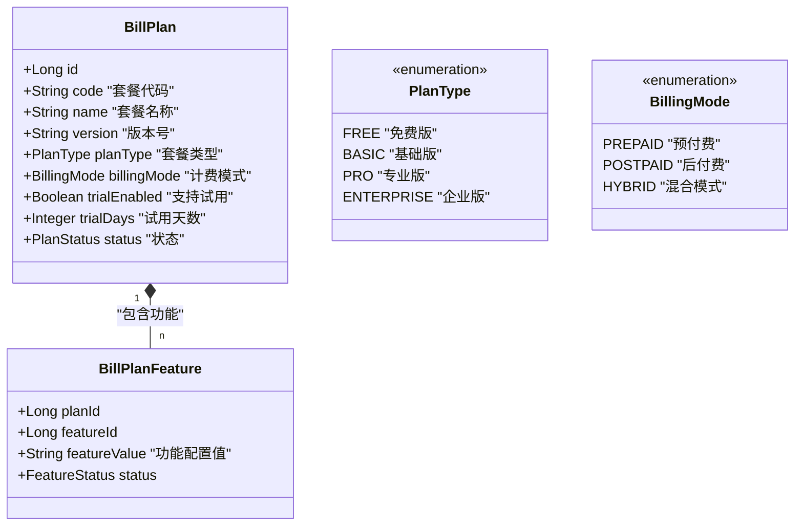

### 3.2 定价策略设计

#### 统一定价表设计

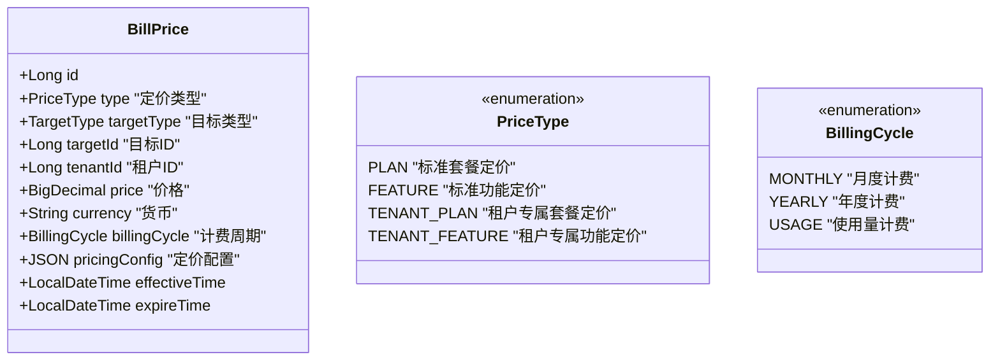

**定价配置JSON结构：**

```json
{
  "type": "quota|tiered|usage|package|tiered_fixed",
  "values": [
    {
      "min": 0,
      "max": 1000,
      "quantity": 10000,
      "price": 0.001
    }
  ]
}
```

### 3.3 订阅管理设计

#### 订阅生命周期

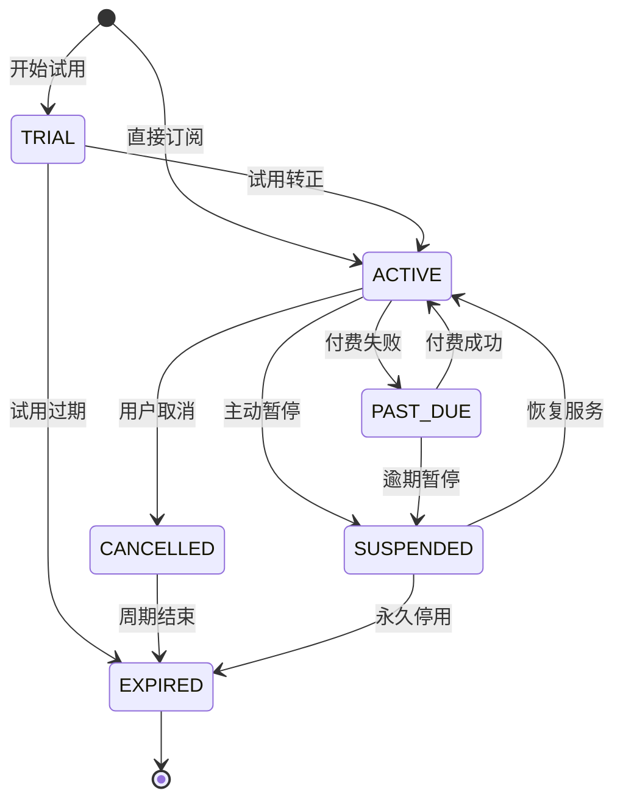

## 4. 计费引擎设计

### 4.1 计费处理流程

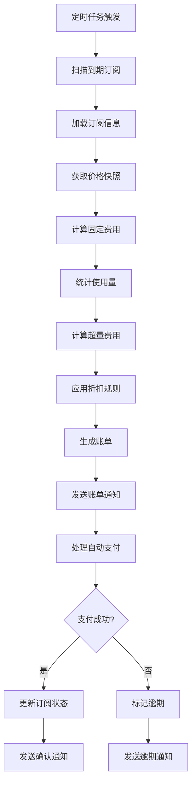

### 4.2 计费引擎核心组件

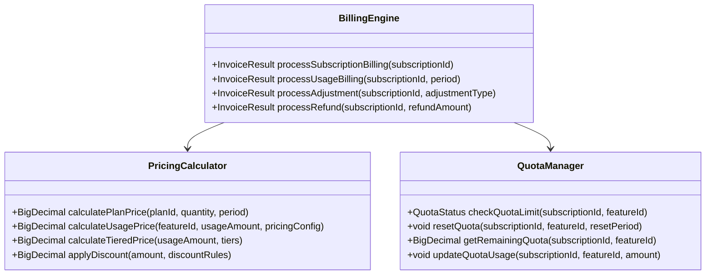

## 5. 数据库设计

### 5.1 核心表结构

```sql
-- 功能表
CREATE TABLE `bill_feature` (
  `id` BIGINT PRIMARY KEY AUTO_INCREMENT,
  `tenant_id` BIGINT NOT NULL DEFAULT 0 COMMENT '租户ID，0表示系统级',
  `code` VARCHAR(50) NOT NULL COMMENT '功能代码',
  `name` VARCHAR(100) NOT NULL COMMENT '功能名称',
  `description` TEXT COMMENT '功能描述',
  `type` ENUM('QUOTA','USAGE','SWITCH') NOT NULL COMMENT '功能类型',
  `unit` VARCHAR(20) COMMENT '计量单位',
  `reset_period` ENUM('DAY','MONTH','YEAR','NEVER') NOT NULL DEFAULT 'MONTH',
  `value_scope` ENUM('PER_SUBSCRIPTION','PER_SEAT') DEFAULT 'PER_SUBSCRIPTION',
  `status` ENUM('ACTIVE','INACTIVE') DEFAULT 'ACTIVE',
  `created_time` DATETIME NOT NULL DEFAULT CURRENT_TIMESTAMP,
  `updated_time` DATETIME NOT NULL DEFAULT CURRENT_TIMESTAMP ON UPDATE CURRENT_TIMESTAMP,
  `created_by` VARCHAR(100),
  `updated_by` VARCHAR(100),
  
  UNIQUE KEY `uk_tenant_code` (`tenant_id`, `code`),
  KEY `idx_type_status` (`type`, `status`),
  KEY `idx_reset_period` (`reset_period`, `type`)
) COMMENT='功能表';

-- 套餐表
CREATE TABLE `bill_plan` (
  `id` BIGINT PRIMARY KEY AUTO_INCREMENT,
  `tenant_id` BIGINT NOT NULL DEFAULT 0 COMMENT '租户ID，0表示系统级',
  `code` VARCHAR(50) NOT NULL COMMENT '套餐代码',
  `name` VARCHAR(100) NOT NULL COMMENT '套餐名称',
  `version` VARCHAR(20) NOT NULL DEFAULT 'v1.0' COMMENT '套餐版本号',
  `description` TEXT COMMENT '套餐描述',
  `plan_type` ENUM('FREE','BASIC','PRO','ENTERPRISE') NOT NULL COMMENT '套餐类型',
  `billing_mode` ENUM('PREPAID','POSTPAID','HYBRID') NOT NULL COMMENT '计费模式',
  `trial_enabled` TINYINT(1) DEFAULT 0 COMMENT '是否支持试用',
  `trial_days` INT DEFAULT 0 COMMENT '试用天数',
  `trial_limit_per_user` INT DEFAULT 1 COMMENT '每用户试用次数限制',
  `status` ENUM('DRAFT','ACTIVE','INACTIVE','DEPRECATED','ARCHIVED') DEFAULT 'DRAFT',
  `effective_time` DATETIME NOT NULL COMMENT '生效时间',
  `expire_time` DATETIME COMMENT '失效时间',
  `created_time` DATETIME NOT NULL DEFAULT CURRENT_TIMESTAMP,
  `updated_time` DATETIME NOT NULL DEFAULT CURRENT_TIMESTAMP ON UPDATE CURRENT_TIMESTAMP,
  `created_by` VARCHAR(100),
  `updated_by` VARCHAR(100),
  
  UNIQUE KEY `uk_tenant_plan_code_version` (`tenant_id`, `code`, `version`),
  KEY `idx_plan_type_status` (`plan_type`, `status`),
  KEY `idx_trial_enabled` (`trial_enabled`, `status`)
) COMMENT='套餐表';

-- 订阅表
CREATE TABLE `bill_subscription` (
  `id` BIGINT PRIMARY KEY AUTO_INCREMENT,
  `sub_no` VARCHAR(50) NOT NULL COMMENT '订阅编号',
  `tenant_id` BIGINT NOT NULL COMMENT '租户ID',
  `plan_id` BIGINT NOT NULL COMMENT '套餐ID',
  `remark` VARCHAR(512) COMMENT '备注信息',
  `pricing_snapshot` JSON NOT NULL COMMENT '价格快照',
  `quantity` INT UNSIGNED NOT NULL DEFAULT 1 COMMENT '订阅席位数量',
  `start_time` DATETIME NOT NULL COMMENT '订阅开始时间',
  `end_time` DATETIME COMMENT '订阅结束时间',
  `current_period_start_time` DATETIME NOT NULL COMMENT '当前计费周期开始时间',
  `current_period_end_time` DATETIME NOT NULL COMMENT '当前计费周期结束时间',
  `next_billing_time` DATETIME COMMENT '下次计费时间',
  `status` ENUM('TRIAL','ACTIVE','PAST_DUE','SUSPENDED','CANCELLED','EXPIRED') DEFAULT 'ACTIVE',
  `auto_renew` TINYINT(1) DEFAULT 1 COMMENT '是否自动续费',
  `cancel_at_period_end` TINYINT(1) DEFAULT 0 COMMENT '是否在周期结束时取消',
  `created_time` DATETIME NOT NULL DEFAULT CURRENT_TIMESTAMP,
  `updated_time` DATETIME NOT NULL DEFAULT CURRENT_TIMESTAMP ON UPDATE CURRENT_TIMESTAMP,
  `created_by` VARCHAR(100),
  `updated_by` VARCHAR(100),
    
  UNIQUE KEY `uk_sub_no` (`sub_no`),
  KEY `idx_tenant_status_period` (`tenant_id`, `status`, `current_period_end_time`),
  KEY `idx_plan_id` (`plan_id`),
  KEY `idx_next_billing` (`next_billing_time`, `auto_renew`),
  FOREIGN KEY (`plan_id`) REFERENCES `bill_plan`(`id`)
) COMMENT='订阅记录表';

-- 使用量记录表
CREATE TABLE `bill_usage` (
  `id` BIGINT PRIMARY KEY AUTO_INCREMENT,
  `tenant_id` BIGINT NOT NULL COMMENT '租户ID',
  `subscription_id` BIGINT NOT NULL COMMENT '订阅ID',
  `feature_id` BIGINT NOT NULL COMMENT '功能ID',
  `usage_time` DATETIME NOT NULL COMMENT '使用时间',
  `usage_amount` DECIMAL(18,4) NOT NULL COMMENT '使用量',
  `unit` VARCHAR(20) COMMENT '计量单位',
  `billing_period` DATE NOT NULL COMMENT '计费周期',
  `metadata` JSON COMMENT '使用量元数据',
  `created_time` DATETIME NOT NULL DEFAULT CURRENT_TIMESTAMP,
  
  KEY `idx_tenant_subscription` (`tenant_id`, `subscription_id`),
  KEY `idx_feature_billing_period` (`feature_id`, `billing_period`),
  KEY `idx_usage_time` (`usage_time`),
  KEY `idx_billing_period` (`billing_period`),
  KEY `idx_subscription_feature_period` (`subscription_id`, `feature_id`, `billing_period`),
  FOREIGN KEY (`subscription_id`) REFERENCES `bill_subscription`(`id`),
  FOREIGN KEY (`feature_id`) REFERENCES `bill_feature`(`id`)
) COMMENT='使用量记录表';
```

## 6. 多租户集成

### 6.1 租户数据隔离

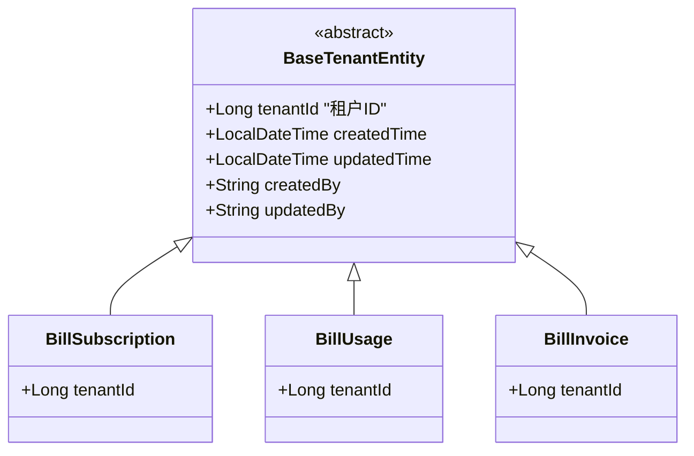

### 6.2 MyBatis多租户拦截器集成

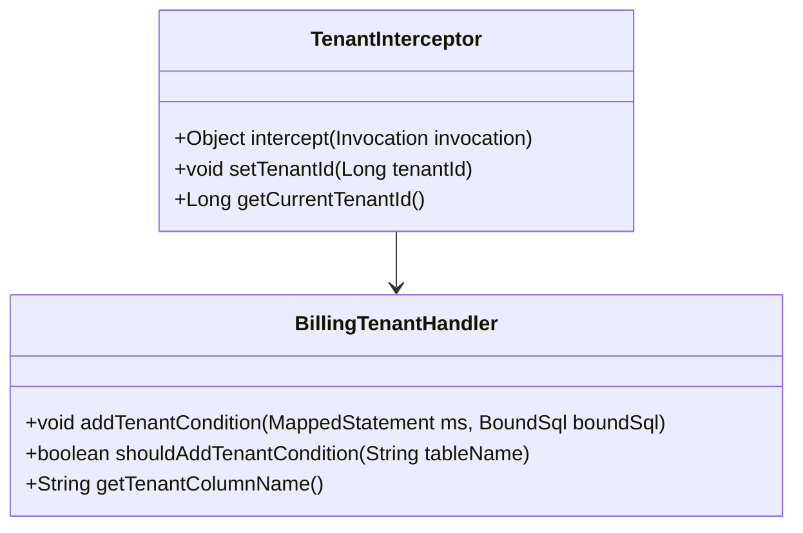

## 7. 系统集成

### 7.1 与现有模块集成

#### 审计日志集成

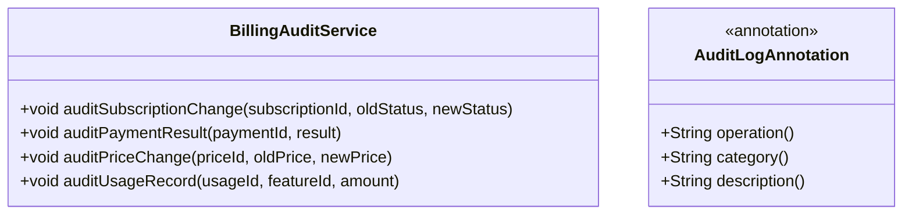

#### 通知系统集成

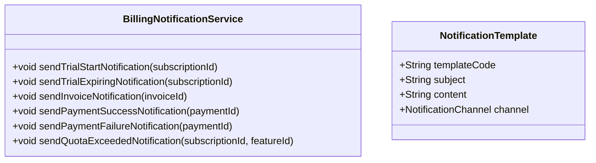

### 7.2 定时任务调度

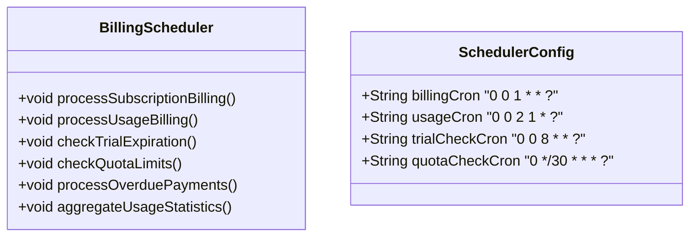

## 8. 性能优化

### 8.1 缓存策略

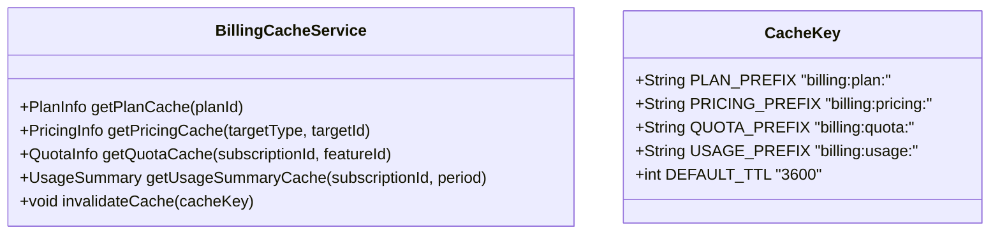

### 8.2 数据库优化

#### 索引优化策略

```sql
-- 订阅查询优化索引
CREATE INDEX idx_subscription_billing ON bill_subscription 
(tenant_id, status, next_billing_time, auto_renew);

-- 使用量聚合优化索引
CREATE INDEX idx_usage_aggregation ON bill_usage 
(subscription_id, feature_id, billing_period, usage_time);

-- 账单查询优化索引
CREATE INDEX idx_invoice_query ON bill_invoice
(tenant_id, status, due_date, billing_period_start);
```

#### 分区策略

```sql
-- 使用量表按月分区
CREATE TABLE `bill_usage_partitioned` (
  -- 表结构同 bill_usage
) PARTITION BY RANGE (TO_DAYS(billing_period)) (
  PARTITION p202401 VALUES LESS THAN (TO_DAYS('2024-02-01')),
  PARTITION p202402 VALUES LESS THAN (TO_DAYS('2024-03-01')),
  PARTITION p_future VALUES LESS THAN MAXVALUE
);
```

## 9. 安全设计

### 9.1 数据安全

| 安全措施 | 实现方式 | 说明 |
|---------|----------|------|
| 数据加密 | 利用rose-crypto模块 | 敏感数据字段加密存储 |
| 访问控制 | 租户级别隔离 | 确保租户间数据完全隔离 |
| 审计日志 | 集成rose-audit模块 | 记录所有关键操作 |
| API安全 | JWT认证 + 权限控制 | 多层安全验证 |

### 9.2 支付安全

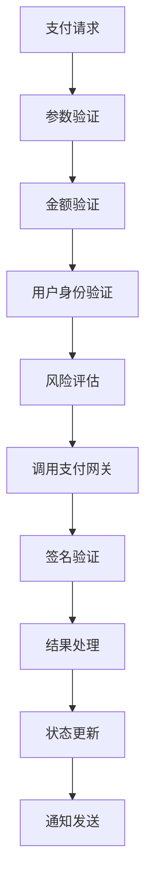

## 10. 监控与告警

### 10.1 业务指标监控

| 指标类型 | 监控内容 | 告警阈值 |
|---------|----------|----------|
| 订阅指标 | 新增订阅数、活跃订阅数、流失率 | 流失率 > 10% |
| 计费指标 | 计费成功率、计费延迟 | 成功率 < 95% |
| 支付指标 | 支付成功率、支付延迟 | 成功率 < 90% |
| 使用量指标 | 配额使用率、超量比例 | 使用率 > 90% |

### 10.2 告警规则

```yaml
alerts:
  - name: billing_failure_rate
    condition: billing_error_rate > 0.05
    severity: high
    actions:
      - email: admin@company.com
      - webhook: /api/alerts/billing
      
  - name: quota_exceeded
    condition: quota_utilization > 0.9
    severity: medium
    actions:
      - notification: tenant_admin
      - auto_scale: increase_quota
```

## 11. 扩展规划

### 11.1 国际化支持

- **多币种支持**：集成汇率服务，支持动态汇率转换
- **本地化定价**：根据地区制定差异化定价策略
- **税务计算**：支持不同国家和地区的税务规则

### 11.2 高级功能

- **智能定价**：基于使用模式和市场条件的动态定价
- **预测分析**：用户使用量预测和成本预估
- **自定义计费规则**：支持租户级别的个性化计费规则
- **API限流集成**：与API网关集成实现基于配额的限流
- **成本优化建议**：为用户提供成本优化建议

### 11.3 技术演进

- **微服务拆分**：随着业务复杂度增长，考虑拆分为独立的微服务
- **事件驱动架构**：引入事件溯源和CQRS模式
- **机器学习集成**：利用ML技术优化定价策略和预测分析
- **实时计费**：支持实时计费和即时扣费