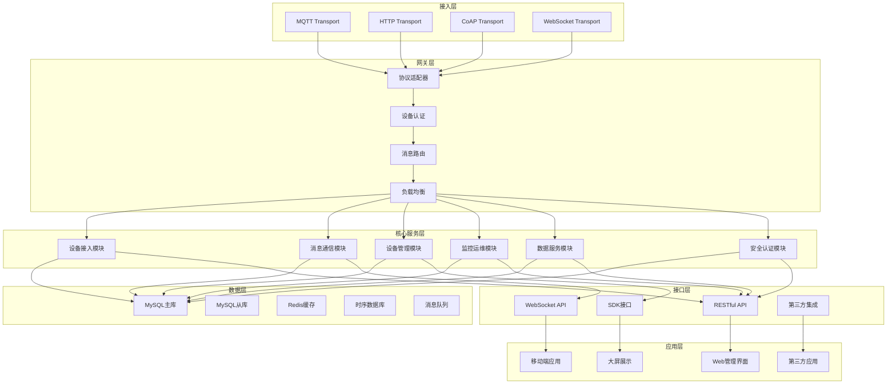
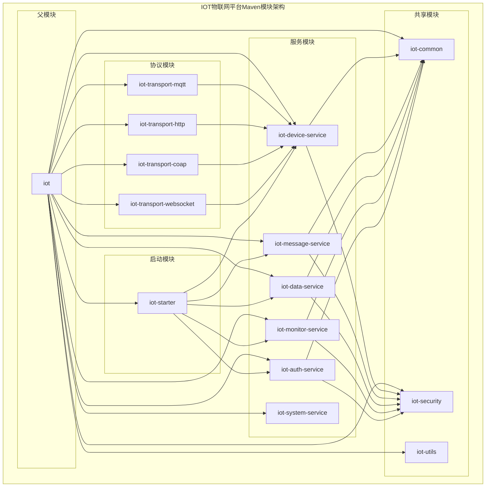
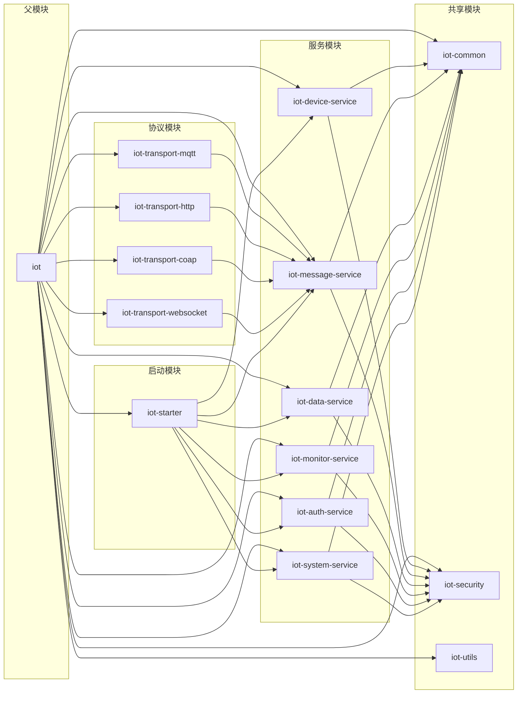

# IOT物联网平台技术设计文档

## 文档信息
- **文档版本**: v1.0.0
- **创建日期**: 2024-01-01
- **最后更新**: 2024-01-01
- **编写人员**: 技术团队
- **文档状态**: 设计阶段

## 目录
1. [系统概述](#1-系统概述)
2. [技术架构设计](#2-技术架构设计)
3. [详细设计](#3-详细设计)
4. [总结](#4-总结)

---

## 1. 系统概述

### 1.1 设计目标

IOT物联网平台旨在构建一个综合性的云端系统，为物联网设备提供统一的管理、监控和数据服务能力。平台设计目标包括：

#### 1.1.1 核心目标
- **设备统一管理**：支持多种协议设备接入，提供统一的设备生命周期管理
- **数据高效处理**：实现设备数据的实时采集、存储、分析和转发
- **平台开放能力**：提供丰富的API接口和SDK，支持第三方系统集成
- **安全可靠运行**：确保设备接入安全、数据传输加密、系统稳定运行

#### 1.1.2 业务目标
- **降低开发门槛**：提供标准化的设备接入方案和开发工具
- **提升运维效率**：实现设备远程监控、告警和运维管理
- **支持业务创新**：通过数据分析和规则引擎支持业务场景创新
- **保障数据安全**：满足数据合规要求，保护用户隐私

#### 1.1.3 技术目标
- **高并发处理**：支持大规模设备并发接入和数据处理
- **高可用设计**：确保系统7×24小时稳定运行
- **可扩展架构**：支持水平扩展，满足业务增长需求
- **标准化接口**：遵循行业标准，提供标准化API接口

### 1.2 架构原则

#### 1.2.1 整体架构原则
- **模块化设计**：基于Maven多模块实现模块化架构，模块间松耦合
- **分层架构**：采用经典的三层架构，清晰分离关注点
- **单一职责**：每个模块和组件只负责特定的业务功能
- **开闭原则**：对扩展开放，对修改封闭，支持功能扩展

#### 1.2.2 技术架构原则
- **技术栈统一**：统一使用Spring Boot生态，降低技术复杂度
- **数据一致性**：确保数据在分布式环境下的最终一致性
- **性能优先**：在满足功能需求的前提下，优先考虑系统性能
- **安全第一**：将安全设计贯穿整个系统架构

#### 1.2.3 业务架构原则
- **业务驱动**：以业务需求为导向，设计系统功能
- **用户中心**：以用户体验为中心，优化操作流程
- **数据驱动**：基于数据分析支持业务决策和优化
- **生态开放**：构建开放的生态系统，支持第三方集成

### 1.3 系统边界

#### 1.3.1 系统范围
- **设备接入层**：支持MQTT、HTTP、CoAP等协议设备接入
- **平台服务层**：提供设备管理、数据存储、规则引擎等核心服务
- **应用接口层**：提供RESTful API和SDK供第三方系统调用
- **管理界面层**：提供Web管理界面和移动端应用

#### 1.3.2 系统约束
- **技术约束**：基于Spring Boot单体架构，使用MyBatis Plus作为ORM框架
- **性能约束**：支持万级设备并发接入，毫秒级数据处理响应
- **安全约束**：满足等保2.0要求，支持数据加密和访问控制
- **合规约束**：符合GDPR、网络安全法等法律法规要求

---

## 2. 技术架构设计

### 2.1 整体架构

IOT物联网平台采用分层模块化架构，基于Maven多模块设计，确保系统的可维护性和可扩展性。



#### 2.1.1 架构层次说明

**接入层**
- **MQTT Transport**：处理MQTT协议设备接入，支持QoS级别和消息持久化，适用于直连设备、网关设备、LoRa设备等多种设备类型
- **HTTP Transport**：处理HTTP/HTTPS协议设备接入，支持RESTful API调用，适用于私有协议设备接入
- **CoAP Transport**：处理CoAP协议设备接入，适用于资源受限设备，支持轻量级通信
- **WebSocket Transport**：处理WebSocket协议，支持实时双向通信，适用于需要实时数据推送的场景

**网关层**
- **协议适配器**：统一协议处理，支持多种协议格式转换，包括泛化协议适配和云网关协议适配
- **设备认证**：设备身份验证和授权，支持"一机一密"、ID²认证、证书、Token等多种认证方式
- **消息路由**：消息分发和路由，支持Topic订阅和发布，实现就近接入和全球毫秒级接入
- **负载均衡**：设备接入负载均衡，确保系统高可用，支持跨地域、跨实例、跨账号设备分发

**核心服务层**
- **设备接入模块**：设备注册、认证、连接管理、状态监控，支持设备生命周期管理、设备分发、设备影子、设备拓扑、物模型管理
- **消息通信模块**：消息路由、订阅管理、场景联动、广播通信，支持服务端订阅、云产品流转、RRPC通信、规则引擎和数据转发
- **设备管理模块**：设备生命周期、状态管理、物模型、拓扑关系，支持设备影子同步、设备拓扑管理、物模型数字化管理
- **监控运维模块**：设备监控、告警、OTA升级、日志管理，支持在线调试、日志服务、监控告警、设备诊断
- **数据服务模块**：数据存储、分析、可视化、报表生成，支持数据接入、数据解析、数据存储、分析洞察、数据应用
- **安全认证模块**：身份认证、权限控制、数据加密、安全审计，支持安全认证和权限策略管理

**数据层**
- **MySQL主库**：存储设备信息、用户数据、配置信息等核心业务数据，支持高可用读写
- **MySQL从库**：读写分离，提高查询性能，支持数据备份和恢复
- **Redis缓存**：会话管理、实时数据缓存、分布式锁，支持热数据缓存
- **时序数据库**：存储设备历史数据，支持高效的时间序列查询，实现冷热数据分离
- **消息队列**：异步消息处理，支持削峰填谷，集成多种云产品数据流转

**接口层**
- **RESTful API**：提供标准的REST接口，支持设备管理和数据查询，支持API调用和消息发送
- **WebSocket API**：实时数据推送，支持设备状态实时更新，实现服务端订阅
- **SDK接口**：提供多语言SDK，便于第三方系统集成，支持6种语言版本
- **第三方集成**：支持与ERP、MES等业务系统对接，支持云产品流转和场景联动

**应用层**
- **Web管理界面**：设备管理、数据监控、系统配置、用户管理，支持可视化配置和实时监控
- **移动端应用**：移动设备管理和控制，支持iOS和Android，提供设备远程控制和状态查看
- **大屏展示**：数据可视化大屏，支持实时监控和数据分析，支持自定义大屏布局和组件
- **第三方应用**：开放API，支持第三方应用开发和集成，支持云产品流转和生态集成


### 2.2 技术栈选型

#### 2.2.1 核心技术栈

| 技术领域 | 技术选型 | 版本 | 选型理由 |
|---------|---------|------|---------|
| **应用框架** | Spring Boot | 3.5+ | 成熟稳定的企业级框架，生态完善 |
| **模块化架构** | Maven多模块 | 3.9 | 支持模块化设计，便于后续微服务拆分 |
| **数据访问** | MyBatis Plus | 3.5+ | 功能强大，支持代码生成，性能优秀 |
| **数据库** | MySQL | 8.0+ | 成熟稳定，支持事务，适合业务数据存储 |
| **缓存** | Redis | 7.0+ | 高性能内存数据库，支持多种数据结构 |
| **消息队列** | RabbitMQ | 3.12+ | 功能完善，支持多种消息模式 |
| **MQTT Broker** | EMQ X | 5.0+ | 高性能MQTT消息代理，支持集群部署 |
| **时序数据库** | InfluxDB | 2.7+ | 专为时序数据设计，查询性能优秀 |

#### 2.2.2 技术选型理由

**Spring Boot + Maven多模块**
- **成熟稳定**：Spring Boot是业界最成熟的Java应用框架
- **模块化支持**：Maven多模块提供模块化架构支持，便于系统演进
- **生态完善**：拥有丰富的中间件集成和工具支持
- **团队熟悉**：团队对Spring技术栈熟悉，降低学习成本

**MyBatis Plus**
- **功能强大**：提供丰富的CRUD操作和查询功能
- **代码生成**：支持自动代码生成，提高开发效率
- **性能优秀**：相比JPA，MyBatis Plus在复杂查询场景下性能更优
- **灵活配置**：支持灵活的SQL配置和动态查询

**MySQL + Redis**
- **数据分层**：MySQL存储业务数据，Redis提供缓存和会话存储
- **性能优化**：通过缓存减少数据库访问，提升系统性能
- **高可用**：支持主从复制和集群部署，确保数据安全

**EMQ X**
- **专业MQTT**：专为IoT场景设计的MQTT消息代理
- **高性能**：支持百万级设备并发连接
- **集群支持**：支持水平扩展，满足大规模部署需求
- **协议支持**：支持MQTT、CoAP、LwM2M等多种协议

### 2.3 Maven模块架构设计

基于Maven多模块架构，将IOT物联网平台划分为多个独立的Maven模块，每个模块负责特定的业务领域，便于团队协作和代码管理。



#### 2.3.1 Maven模块职责划分

**父模块 (iot)**

- **核心职责**：统一依赖管理、版本控制、构建配置
- **主要功能**：依赖版本管理、插件配置、公共属性定义
- **包含内容**：pom.xml父配置、依赖管理、构建插件


**服务模块组**
- **iot-device-service**：设备接入和管理服务实现，支持设备生命周期管理、设备分发、设备影子、设备拓扑、物模型管理
- **iot-message-service**：消息通信和路由服务实现，支持服务端订阅、云产品流转、RRPC通信、规则引擎和数据转发
- **iot-data-service**：数据存储和分析服务实现，支持数据接入、数据解析、数据存储、分析洞察、数据应用
- **iot-monitor-service**：监控告警和运维服务实现，支持在线调试、日志服务、监控告警、设备诊断、OTA升级
- **iot-auth-service**：安全认证和权限服务实现，支持安全认证和权限策略管理
- **iot-system-service**：系统管理服务实现，支持系统参数配置、功能开关管理、字典数据管理、国际化配置、主题与UI配置、数据备份与恢复

**协议模块组**
- **iot-transport-mqtt**：MQTT协议传输实现，支持直连设备、网关设备、LoRa设备等多种设备类型接入
- **iot-transport-http**：HTTP协议传输实现，支持私有协议设备接入和RESTful API调用
- **iot-transport-coap**：CoAP协议传输实现，适用于资源受限设备，支持轻量级通信
- **iot-transport-websocket**：WebSocket协议传输实现，支持实时双向通信，适用于需要实时数据推送的场景

**共享模块组**
- **iot-common**：公共组件、工具类、常量定义
- **iot-security**：安全相关组件、加密工具、认证框架
- **iot-utils**：通用工具类、异常处理、日志工具

**启动模块 (iot-starter)**
- **核心职责**：应用启动入口、配置加载、模块集成
- **主要功能**：Spring Boot启动类、配置管理、模块自动装配
- **包含内容**：主启动类、配置文件、模块集成配置

#### 2.3.2 Maven模块依赖关系



#### 2.3.3 Maven模块目录结构

```
iot/
├── pom.xml                                   # 父模块POM
├── iot-common/                               # 公共组件模块
├── iot-security/                             # 安全组件模块
├── iot-utils/                                # 工具类模块
├── iot-device-service/                       # 设备管理服务模块
├── iot-message-service/                      # 消息通信服务模块
├── iot-data-service/                         # 数据服务模块
├── iot-monitor-service/                      # 监控运维服务模块
├── iot-auth-service/                         # 安全认证服务模块
├── iot-system-service/                       # 系统管理服务模块
├── iot-transport-mqtt/                       # MQTT协议模块
├── iot-transport-http/                       # HTTP协议模块
├── iot-transport-coap/                       # CoAP协议模块
├── iot-transport-websocket/                  # WebSocket协议模块
└── iot-starter/                              # 启动模块
```

---

## 3. 详细设计

### 3.1 数据库设计

#### 3.1.1 数据库选型

**主数据库：MySQL 8.0**
- **选型理由**：成熟稳定的关系型数据库，支持事务、外键约束，适合存储设备信息、用户数据、配置信息等核心业务数据
- **应用场景**：设备管理、用户管理、系统配置、权限管理等业务数据存储

**缓存数据库：Redis 7.0**
- **选型理由**：高性能内存数据库，支持多种数据结构，适合缓存和会话存储
- **应用场景**：设备会话管理、实时数据缓存、分布式锁、热点数据缓存

**时序数据库：InfluxDB 2.7**
- **选型理由**：专为时序数据设计，查询性能优秀，支持数据压缩和高效的时间序列查询
- **应用场景**：设备历史数据存储、监控数据、告警历史、性能指标数据

#### 3.1.2 核心业务表设计

**设备管理相关表**

```sql
-- 产品分类表
CREATE TABLE iot_product_category (
    id BIGINT PRIMARY KEY AUTO_INCREMENT COMMENT '分类ID',
    name VARCHAR(128) NOT NULL COMMENT '分类名称',
    code VARCHAR(64) UNIQUE NOT NULL COMMENT '分类编码',
    parent_id BIGINT COMMENT '父分类ID',
    level INT DEFAULT 1 COMMENT '分类层级',
    sort_order INT DEFAULT 0 COMMENT '排序',
    icon VARCHAR(255) COMMENT '分类图标',
    description TEXT COMMENT '分类描述',
    status ENUM('ACTIVE', 'INACTIVE') DEFAULT 'ACTIVE' COMMENT '分类状态',
    tenant_id BIGINT COMMENT '租户ID',
    created_time DATETIME DEFAULT CURRENT_TIMESTAMP COMMENT '创建时间',
    updated_time DATETIME DEFAULT CURRENT_TIMESTAMP ON UPDATE CURRENT_TIMESTAMP COMMENT '更新时间',
    created_by VARCHAR(64) COMMENT '创建人',
    updated_by VARCHAR(64) COMMENT '更新人',
    deleted TINYINT DEFAULT 0 COMMENT '逻辑删除标识',
    version INT DEFAULT 1 COMMENT '版本号',
    INDEX idx_parent_id (parent_id),
    INDEX idx_code (code),
    INDEX idx_status (status),
    INDEX idx_tenant_id (tenant_id)
);

-- 产品模板表
CREATE TABLE iot_product_template (
    id BIGINT PRIMARY KEY AUTO_INCREMENT COMMENT '模板ID',
    name VARCHAR(128) NOT NULL COMMENT '模板名称',
    code VARCHAR(64) UNIQUE NOT NULL COMMENT '模板编码',
    category_id BIGINT COMMENT '所属分类ID',
    logo VARCHAR(255) COMMENT '模板Logo',
    description TEXT COMMENT '模板描述',
    node_type ENUM('DIRECT', 'GATEWAY', 'SUB_DEVICE') NOT NULL COMMENT '节点类型',
    auth_type ENUM('KEY', 'CERT', 'NONE') NOT NULL COMMENT '认证方式',
    network_type ENUM('WIFI', 'ETHERNET', 'CELLULAR', 'OTHER') COMMENT '网络类型',
    protocol_type ENUM('BLE', 'ZIGBEE', 'MODBUS', 'OPC_UA', 'CUSTOM') COMMENT '协议类型',
    data_format ENUM('JSON', 'CUSTOM') DEFAULT 'JSON' COMMENT '数据格式',
    template_config JSON COMMENT '模板配置信息',
    thing_model_content JSON COMMENT '预定义物模型内容',
    tags JSON COMMENT '模板标签',
    status ENUM('DRAFT', 'PUBLISHED', 'DEPRECATED') DEFAULT 'DRAFT' COMMENT '模板状态',
    version VARCHAR(32) DEFAULT '1.0.0' COMMENT '模板版本',
    download_count INT DEFAULT 0 COMMENT '下载次数',
    rating DECIMAL(3,2) DEFAULT 0.00 COMMENT '评分',
    tenant_id BIGINT COMMENT '租户ID',
    created_time DATETIME DEFAULT CURRENT_TIMESTAMP COMMENT '创建时间',
    updated_time DATETIME DEFAULT CURRENT_TIMESTAMP ON UPDATE CURRENT_TIMESTAMP COMMENT '更新时间',
    created_by VARCHAR(64) COMMENT '创建人',
    updated_by VARCHAR(64) COMMENT '更新人',
    deleted TINYINT DEFAULT 0 COMMENT '逻辑删除标识',
    version INT DEFAULT 1 COMMENT '版本号',
    INDEX idx_category_id (category_id),
    INDEX idx_code (code),
    INDEX idx_status (status),
    INDEX idx_node_type (node_type),
    INDEX idx_network_type (network_type),
    INDEX idx_protocol_type (protocol_type),
    INDEX idx_tenant_id (tenant_id)
);

-- 产品表
CREATE TABLE iot_product (
    id BIGINT PRIMARY KEY AUTO_INCREMENT COMMENT '产品ID',
    identifier VARCHAR(64) UNIQUE NOT NULL COMMENT '产品唯一标识',
    name VARCHAR(128) NOT NULL COMMENT '产品名称',
    logo VARCHAR(255) COMMENT '产品Logo',
    description TEXT COMMENT '产品描述',
    node_type ENUM('DIRECT', 'GATEWAY', 'SUB_DEVICE') NOT NULL COMMENT '节点类型',
    auth_type ENUM('KEY', 'CERT', 'NONE') NOT NULL COMMENT '认证方式',
    network_type ENUM('WIFI', 'ETHERNET', 'CELLULAR', 'OTHER') COMMENT '网络类型',
    protocol_type ENUM('BLE', 'ZIGBEE', 'MODBUS', 'OPC_UA', 'CUSTOM') COMMENT '协议类型',
    data_format ENUM('JSON', 'CUSTOM') DEFAULT 'JSON' COMMENT '数据格式',
    category_id BIGINT COMMENT '产品分类ID',
    template_id BIGINT COMMENT '基于的模板ID',
    tags JSON COMMENT '产品标签',
    status ENUM('DEVELOPING', 'PUBLISHED', 'OFFLINE') DEFAULT 'DEVELOPING' COMMENT '产品状态',
    device_count INT DEFAULT 0 COMMENT '设备数量',
    message_count BIGINT DEFAULT 0 COMMENT '消息数量',
    created_time DATETIME DEFAULT CURRENT_TIMESTAMP COMMENT '创建时间',
    updated_time DATETIME DEFAULT CURRENT_TIMESTAMP ON UPDATE CURRENT_TIMESTAMP COMMENT '更新时间',
    created_by VARCHAR(64) COMMENT '创建人',
    updated_by VARCHAR(64) COMMENT '更新人',
    deleted TINYINT DEFAULT 0 COMMENT '逻辑删除标识',
    version INT DEFAULT 1 COMMENT '版本号',
    INDEX idx_category_id (category_id),
    INDEX idx_template_id (template_id),
    INDEX idx_status (status),
    INDEX idx_node_type (node_type),
    INDEX idx_network_type (network_type),
    INDEX idx_protocol_type (protocol_type)
);

-- 设备表
CREATE TABLE iot_device (
    id BIGINT PRIMARY KEY AUTO_INCREMENT COMMENT '设备ID',
    name VARCHAR(128) NOT NULL COMMENT '设备名称',
    identifier VARCHAR(64) UNIQUE NOT NULL COMMENT '设备唯一标识',
    product_id BIGINT NOT NULL COMMENT '产品ID',
    secret VARCHAR(128) COMMENT '设备密钥',
    status ENUM('ONLINE', 'OFFLINE', 'FAULT', 'MAINTENANCE') DEFAULT 'OFFLINE' COMMENT '设备状态',
    last_online_time DATETIME COMMENT '最后在线时间',
    last_offline_time DATETIME COMMENT '最后离线时间',
    ip_address VARCHAR(45) COMMENT '设备IP地址',
    firmware_version VARCHAR(64) COMMENT '固件版本',
    hardware_version VARCHAR(64) COMMENT '硬件版本',
    location_info JSON COMMENT '地理位置信息',
    tags JSON COMMENT '设备标签',
    metadata JSON COMMENT '设备元数据',
    created_time DATETIME DEFAULT CURRENT_TIMESTAMP COMMENT '创建时间',
    updated_time DATETIME DEFAULT CURRENT_TIMESTAMP ON UPDATE CURRENT_TIMESTAMP COMMENT '更新时间',
    created_by VARCHAR(64) COMMENT '创建人',
    updated_by VARCHAR(64) COMMENT '更新人',
    deleted TINYINT DEFAULT 0 COMMENT '逻辑删除标识',
    version INT DEFAULT 1 COMMENT '版本号',
    INDEX idx_product_id (product_id),
    INDEX idx_status (status),
    INDEX idx_last_online_time (last_online_time)
);

-- 物模型表
CREATE TABLE iot_thing_model (
    id BIGINT PRIMARY KEY AUTO_INCREMENT COMMENT '物模型ID',
    name VARCHAR(128) NOT NULL COMMENT '模型名称',
    version VARCHAR(32) NOT NULL COMMENT '模型版本',
    product_id BIGINT NOT NULL COMMENT '产品ID',
    content JSON NOT NULL COMMENT '物模型内容(TSL)',
    status ENUM('DRAFT', 'PUBLISHED', 'DEPRECATED') DEFAULT 'DRAFT' COMMENT '模型状态',
    description TEXT COMMENT '模型描述',
    created_time DATETIME DEFAULT CURRENT_TIMESTAMP COMMENT '创建时间',
    updated_time DATETIME DEFAULT CURRENT_TIMESTAMP ON UPDATE CURRENT_TIMESTAMP COMMENT '更新时间',
    created_by VARCHAR(64) COMMENT '创建人',
    updated_by VARCHAR(64) COMMENT '更新人',
    deleted TINYINT DEFAULT 0 COMMENT '逻辑删除标识',
    version INT DEFAULT 1 COMMENT '版本号',
    INDEX idx_product_id (product_id),
    INDEX idx_status (status)
);
```

**用户权限相关表**

```sql
-- 用户表
CREATE TABLE iot_user (
    id BIGINT PRIMARY KEY AUTO_INCREMENT COMMENT '用户ID',
    username VARCHAR(64) UNIQUE NOT NULL COMMENT '用户名',
    email VARCHAR(128) UNIQUE NOT NULL COMMENT '邮箱',
    password VARCHAR(128) NOT NULL COMMENT '密码',
    real_name VARCHAR(64) COMMENT '真实姓名',
    phone VARCHAR(20) COMMENT '手机号',
    avatar VARCHAR(255) COMMENT '头像URL',
    status ENUM('ACTIVE', 'INACTIVE', 'LOCKED') DEFAULT 'ACTIVE' COMMENT '用户状态',
    last_login_time DATETIME COMMENT '最后登录时间',
    last_login_ip VARCHAR(45) COMMENT '最后登录IP',
    tenant_id BIGINT COMMENT '租户ID',
    created_time DATETIME DEFAULT CURRENT_TIMESTAMP COMMENT '创建时间',
    updated_time DATETIME DEFAULT CURRENT_TIMESTAMP ON UPDATE CURRENT_TIMESTAMP COMMENT '更新时间',
    created_by VARCHAR(64) COMMENT '创建人',
    updated_by VARCHAR(64) COMMENT '更新人',
    deleted TINYINT DEFAULT 0 COMMENT '逻辑删除标识',
    version INT DEFAULT 1 COMMENT '版本号',
    INDEX idx_email (email),
    INDEX idx_tenant_id (tenant_id),
    INDEX idx_status (status)
);

-- 角色表
CREATE TABLE iot_role (
    id BIGINT PRIMARY KEY AUTO_INCREMENT COMMENT '角色ID',
    name VARCHAR(64) NOT NULL COMMENT '角色名称',
    code VARCHAR(64) UNIQUE NOT NULL COMMENT '角色编码',
    type ENUM('SYSTEM', 'CUSTOM') DEFAULT 'CUSTOM' COMMENT '角色类型',
    description TEXT COMMENT '角色描述',
    tenant_id BIGINT COMMENT '租户ID',
    created_time DATETIME DEFAULT CURRENT_TIMESTAMP COMMENT '创建时间',
    updated_time DATETIME DEFAULT CURRENT_TIMESTAMP ON UPDATE CURRENT_TIMESTAMP COMMENT '更新时间',
    created_by VARCHAR(64) COMMENT '创建人',
    updated_by VARCHAR(64) COMMENT '更新人',
    deleted TINYINT DEFAULT 0 COMMENT '逻辑删除标识',
    version INT DEFAULT 1 COMMENT '版本号',
    INDEX idx_code (code),
    INDEX idx_tenant_id (tenant_id)
);

-- 权限表
CREATE TABLE iot_permission (
    id BIGINT PRIMARY KEY AUTO_INCREMENT COMMENT '权限ID',
    name VARCHAR(128) NOT NULL COMMENT '权限名称',
    code VARCHAR(128) UNIQUE NOT NULL COMMENT '权限编码',
    type ENUM('MENU', 'BUTTON', 'API') NOT NULL COMMENT '权限类型',
    resource_path VARCHAR(255) COMMENT '资源路径',
    parent_id BIGINT COMMENT '父权限ID',
    sort_order INT DEFAULT 0 COMMENT '排序',
    description TEXT COMMENT '权限描述',
    created_time DATETIME DEFAULT CURRENT_TIMESTAMP COMMENT '创建时间',
    updated_time DATETIME DEFAULT CURRENT_TIMESTAMP ON UPDATE CURRENT_TIMESTAMP COMMENT '更新时间',
    created_by VARCHAR(64) COMMENT '创建人',
    updated_by VARCHAR(64) COMMENT '更新人',
    deleted TINYINT DEFAULT 0 COMMENT '逻辑删除标识',
    version INT DEFAULT 1 COMMENT '版本号',
    INDEX idx_code (code),
    INDEX idx_parent_id (parent_id)
);
```

**消息通信相关表**

```sql
-- 消息记录表
CREATE TABLE iot_message (
    id BIGINT PRIMARY KEY AUTO_INCREMENT COMMENT '消息ID',
    identifier VARCHAR(64) UNIQUE NOT NULL COMMENT '消息唯一标识',
    device_id BIGINT NOT NULL COMMENT '设备ID',
    type ENUM('UP', 'DOWN') NOT NULL COMMENT '消息方向',
    topic VARCHAR(255) NOT NULL COMMENT '消息主题',
    payload JSON COMMENT '消息内容',
    qos_level TINYINT DEFAULT 0 COMMENT 'QoS级别',
    status ENUM('PENDING', 'SENT', 'DELIVERED', 'FAILED') DEFAULT 'PENDING' COMMENT '消息状态',
    retry_count TINYINT DEFAULT 0 COMMENT '重试次数',
    sent_time DATETIME COMMENT '发送时间',
    delivered_time DATETIME COMMENT '送达时间',
    created_time DATETIME DEFAULT CURRENT_TIMESTAMP COMMENT '创建时间',
    updated_time DATETIME DEFAULT CURRENT_TIMESTAMP ON UPDATE CURRENT_TIMESTAMP COMMENT '更新时间',
    INDEX idx_device_id (device_id),
    INDEX idx_type (type),
    INDEX idx_status (status),
    INDEX idx_created_time (created_time)
);

-- 规则引擎表
CREATE TABLE iot_rule (
    id BIGINT PRIMARY KEY AUTO_INCREMENT COMMENT '规则ID',
    name VARCHAR(128) NOT NULL COMMENT '规则名称',
    type ENUM('DATA_FORWARD', 'ALARM', 'ACTION') NOT NULL COMMENT '规则类型',
    trigger_condition JSON NOT NULL COMMENT '触发条件',
    action_config JSON NOT NULL COMMENT '动作配置',
    status ENUM('ACTIVE', 'INACTIVE') DEFAULT 'ACTIVE' COMMENT '规则状态',
    priority INT DEFAULT 0 COMMENT '优先级',
    description TEXT COMMENT '规则描述',
    tenant_id BIGINT COMMENT '租户ID',
    created_time DATETIME DEFAULT CURRENT_TIMESTAMP COMMENT '创建时间',
    updated_time DATETIME DEFAULT CURRENT_TIMESTAMP ON UPDATE CURRENT_TIMESTAMP COMMENT '更新时间',
    created_by VARCHAR(64) COMMENT '创建人',
    updated_by VARCHAR(64) COMMENT '更新人',
    deleted TINYINT DEFAULT 0 COMMENT '逻辑删除标识',
    version INT DEFAULT 1 COMMENT '版本号',
    INDEX idx_type (type),
    INDEX idx_status (status),
    INDEX idx_tenant_id (tenant_id)
);
```

#### 3.1.3 数据存储策略

**分层存储策略**
- **热数据**：存储在Redis中，包括设备会话、实时数据、热点配置等
- **温数据**：存储在MySQL中，包括设备信息、用户数据、业务配置等
- **冷数据**：存储在InfluxDB中，包括历史数据、监控数据、日志数据等

**数据备份策略**
- **实时备份**：MySQL主从复制，确保数据实时同步
- **定时备份**：每日全量备份，每小时增量备份
- **异地备份**：重要数据异地存储，确保数据安全

### 3.2 接口设计

#### 3.2.1 RESTful API设计规范

**通用响应格式**
```json
{
    "code": 200,
    "message": "操作成功",
    "data": {},
    "timestamp": "2024-12-19T10:30:00Z",
    "requestId": "req_123456789"
}
```

**错误码规范**
- **200**：操作成功
- **400**：请求参数错误
- **401**：未授权访问
- **403**：权限不足
- **404**：资源不存在
- **500**：服务器内部错误

#### 3.2.2 核心业务接口

**设备管理接口**

```java
/**
 * 设备管理控制器
 */
@RestController
@RequestMapping("/api/v1/devices")
@Tag(name = "设备管理", description = "设备增删改查接口")
public class DeviceController {

    /**
     * 创建设备
     */
    @PostMapping
    @Operation(summary = "创建设备")
    public ApiResponse<DeviceResponse> createDevice(
            @Valid @RequestBody DeviceCreateRequest request);

    /**
     * 获取设备详情
     */
    @GetMapping("/{deviceId}")
    @Operation(summary = "获取设备详情")
    public ApiResponse<DeviceResponse> getDevice(
            @PathVariable @Positive Long deviceId);

    /**
     * 更新设备信息
     */
    @PutMapping("/{deviceId}")
    @Operation(summary = "更新设备信息")
    public ApiResponse<DeviceResponse> updateDevice(
            @PathVariable @Positive Long deviceId,
            @Valid @RequestBody DeviceUpdateRequest request);

    /**
     * 删除设备
     */
    @DeleteMapping("/{deviceId}")
    @Operation(summary = "删除设备")
    public ApiResponse<Void> deleteDevice(
            @PathVariable @Positive Long deviceId);

    /**
     * 分页查询设备
     */
    @GetMapping
    @Operation(summary = "分页查询设备")
    public ApiResponse<Page<DeviceResponse>> pageDevices(
            @Valid DeviceQueryRequest request);

    /**
     * 设备上线
     */
    @PostMapping("/{deviceId}/online")
    @Operation(summary = "设备上线")
    public ApiResponse<Void> deviceOnline(
            @PathVariable @Positive Long deviceId);

    /**
     * 设备下线
     */
    @PostMapping("/{deviceId}/offline")
    @Operation(summary = "设备下线")
    public ApiResponse<Void> deviceOffline(
            @PathVariable @Positive Long deviceId);
}
```

**消息通信接口**

```java
/**
 * 消息通信控制器
 */
@RestController
@RequestMapping("/api/v1/messages")
@Tag(name = "消息通信", description = "消息发送和查询接口")
public class MessageController {

    /**
     * 发送消息到设备
     */
    @PostMapping("/send")
    @Operation(summary = "发送消息到设备")
    public ApiResponse<MessageResponse> sendMessage(
            @Valid @RequestBody MessageSendRequest request);

    /**
     * 查询消息历史
     */
    @GetMapping("/history")
    @Operation(summary = "查询消息历史")
    public ApiResponse<Page<MessageResponse>> getMessageHistory(
            @Valid MessageQueryRequest request);

    /**
     * 获取消息详情
     */
    @GetMapping("/{messageId}")
    @Operation(summary = "获取消息详情")
    public ApiResponse<MessageResponse> getMessage(
            @PathVariable String messageId);

    /**
     * 批量发送消息
     */
    @PostMapping("/batch-send")
    @Operation(summary = "批量发送消息")
    public ApiResponse<List<MessageResponse>> batchSendMessage(
            @Valid @RequestBody BatchMessageRequest request);
}
```

**数据查询接口**

```java
/**
 * 数据查询控制器
 */
@RestController
@RequestMapping("/api/v1/data")
@Tag(name = "数据查询", description = "设备数据查询接口")
public class DataController {

    /**
     * 查询设备属性数据
     */
    @GetMapping("/properties/{deviceId}")
    @Operation(summary = "查询设备属性数据")
    public ApiResponse<List<PropertyDataResponse>> getPropertyData(
            @PathVariable @Positive Long deviceId,
            @Valid PropertyDataQueryRequest request);

    /**
     * 查询设备事件数据
     */
    @GetMapping("/events/{deviceId}")
    @Operation(summary = "查询设备事件数据")
    public ApiResponse<List<EventDataResponse>> getEventData(
            @PathVariable @Positive Long deviceId,
            @Valid EventDataQueryRequest request);

    /**
     * 查询设备服务调用记录
     */
    @GetMapping("/services/{deviceId}")
    @Operation(summary = "查询设备服务调用记录")
    public ApiResponse<List<ServiceDataResponse>> getServiceData(
            @PathVariable @Positive Long deviceId,
            @Valid ServiceDataQueryRequest request);

    /**
     * 导出设备数据
     */
    @GetMapping("/export/{deviceId}")
    @Operation(summary = "导出设备数据")
    public ResponseEntity<Resource> exportDeviceData(
            @PathVariable @Positive Long deviceId,
            @Valid DataExportRequest request);
}
```

#### 3.2.3 WebSocket接口设计

**实时数据推送接口**

```java
/**
 * WebSocket消息处理器
 */
@Component
@Slf4j
public class WebSocketMessageHandler {

    /**
     * 设备状态变更推送
     */
    public void pushDeviceStatusChange(DeviceStatusChangeEvent event) {
        // 推送给订阅了设备状态变更的用户
    }

    /**
     * 设备数据实时推送
     */
    public void pushDeviceData(DeviceDataEvent event) {
        // 推送给订阅了设备数据的用户
    }

    /**
     * 告警消息推送
     */
    public void pushAlarmMessage(AlarmEvent event) {
        // 推送给订阅了告警消息的用户
    }
}
```

### 3.3 安全设计

#### 3.3.1 认证授权机制

**设备认证**
- **一机一密**：每个设备使用唯一的密钥进行认证
- **证书认证**：支持X.509证书认证，适用于高安全场景
- **Token认证**：支持JWT Token认证，适用于API调用

**用户认证**
- **用户名密码**：基础的用户名密码认证
- **多因子认证**：支持短信、邮箱、TOTP等多因子认证
- **第三方登录**：支持OAuth2、LDAP等第三方认证

**权限控制**
- **RBAC模型**：基于角色的访问控制
- **细粒度权限**：支持API权限、数据权限、功能权限
- **动态权限**：支持运行时权限变更

#### 3.3.2 数据安全

**传输加密**
- **TLS/SSL**：所有网络通信使用TLS加密
- **端到端加密**：敏感数据端到端加密传输
- **签名验证**：消息签名验证，防止篡改

**存储加密**
- **数据库加密**：敏感数据在数据库中加密存储
- **文件加密**：重要文件加密存储
- **密钥管理**：统一的密钥管理和轮换机制

#### 3.3.3 安全审计

**操作日志**
- **用户操作**：记录所有用户操作日志
- **系统操作**：记录系统关键操作日志
- **安全事件**：记录安全相关事件日志

**审计追踪**
- **数据变更**：记录重要数据的变更历史
- **权限变更**：记录权限变更历史
- **访问记录**：记录敏感资源的访问记录

### 3.4 性能设计

#### 3.4.1 高并发处理

**连接池管理**
- **数据库连接池**：HikariCP连接池，支持高并发数据库访问
- **Redis连接池**：Lettuce连接池，支持高并发缓存访问
- **MQTT连接池**：EMQ X连接池，支持大规模设备接入

**异步处理**
- **消息队列**：使用RabbitMQ进行异步消息处理
- **线程池**：使用线程池处理并发任务
- **响应式编程**：使用WebFlux进行响应式编程

#### 3.4.2 缓存策略

**多级缓存**
- **本地缓存**：使用Caffeine进行本地缓存
- **分布式缓存**：使用Redis进行分布式缓存
- **CDN缓存**：使用CDN缓存静态资源

**缓存策略**
- **热点数据**：热点数据优先缓存
- **缓存预热**：系统启动时预热缓存
- **缓存更新**：支持缓存自动更新和失效

#### 3.4.3 数据库优化

**索引优化**
- **复合索引**：根据查询模式创建复合索引
- **覆盖索引**：使用覆盖索引减少回表查询
- **索引维护**：定期维护和优化索引

**查询优化**
- **分页查询**：使用分页减少数据传输量
- **批量操作**：使用批量操作提高性能
- **读写分离**：使用读写分离提高查询性能

### 3.5 监控设计

#### 3.5.1 系统监控

**应用监控**
- **性能指标**：CPU、内存、线程、GC等性能指标
- **业务指标**：设备数量、消息数量、用户数量等业务指标
- **异常监控**：异常捕获、错误统计、告警通知

**基础设施监控**
- **服务器监控**：服务器资源使用情况监控
- **数据库监控**：数据库性能监控
- **网络监控**：网络连接和流量监控

#### 3.5.2 业务监控

**设备监控**
- **设备状态**：设备在线状态监控
- **设备性能**：设备性能指标监控
- **设备告警**：设备异常告警监控

**数据监控**
- **数据质量**：数据完整性、准确性监控
- **数据处理**：数据处理性能监控
- **数据存储**：存储空间使用情况监控

#### 3.5.3 告警机制

**告警规则**
- **阈值告警**：基于阈值的告警规则
- **趋势告警**：基于趋势的告警规则
- **异常告警**：基于异常的告警规则

**告警通知**
- **多渠道通知**：邮件、短信、Webhook等多种通知方式
- **告警升级**：告警升级和自动处理机制
- **告警抑制**：告警抑制和去重机制

