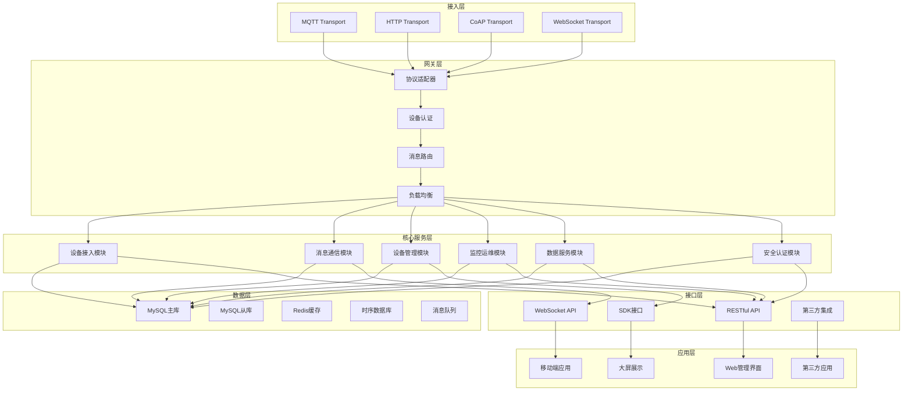
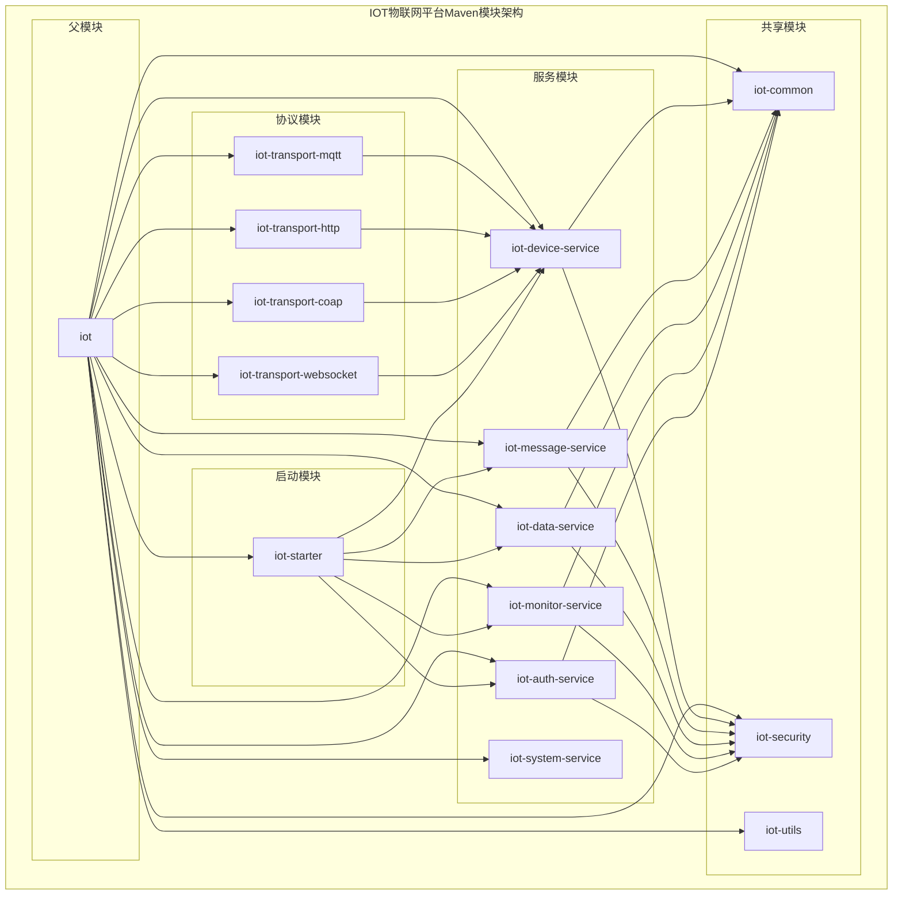
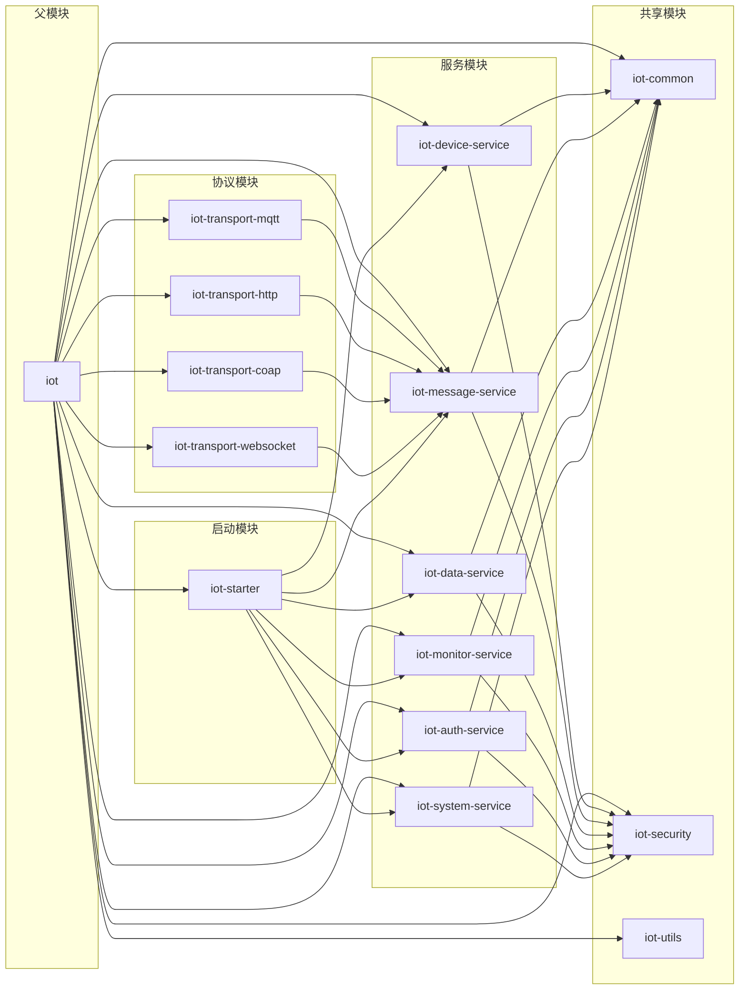

# IOT物联网平台技术设计文档

## 文档信息

- **文档版本**: v1.0.0
- **创建日期**: 2024-01-01
- **最后更新**: 2024-01-01
- **编写人员**: 技术团队
- **文档状态**: 设计阶段

## 目录

1. [系统概述](#1-系统概述)
2. [技术架构设计](#2-技术架构设计)
3. [详细设计](#3-详细设计)
4. [总结](#4-总结)

---

## 1. 系统概述

### 1.1 设计目标

IOT物联网平台旨在构建一个综合性的云端系统，为物联网设备提供统一的管理、监控和数据服务能力。平台设计目标包括：

#### 1.1.1 核心目标

- **设备统一管理**：支持多种协议设备接入，提供统一的设备生命周期管理
- **数据高效处理**：实现设备数据的实时采集、存储、分析和转发
- **平台开放能力**：提供丰富的API接口和SDK，支持第三方系统集成
- **安全可靠运行**：确保设备接入安全、数据传输加密、系统稳定运行

#### 1.1.2 业务目标

- **降低开发门槛**：提供标准化的设备接入方案和开发工具
- **提升运维效率**：实现设备远程监控、告警和运维管理
- **支持业务创新**：通过数据分析和规则引擎支持业务场景创新
- **保障数据安全**：满足数据合规要求，保护用户隐私

#### 1.1.3 技术目标

- **高并发处理**：支持大规模设备并发接入和数据处理
- **高可用设计**：确保系统7×24小时稳定运行
- **可扩展架构**：支持水平扩展，满足业务增长需求
- **标准化接口**：遵循行业标准，提供标准化API接口

### 1.2 架构原则

#### 1.2.1 整体架构原则

- **模块化设计**：基于Maven多模块实现模块化架构，模块间松耦合
- **分层架构**：采用经典的三层架构，清晰分离关注点
- **单一职责**：每个模块和组件只负责特定的业务功能
- **开闭原则**：对扩展开放，对修改封闭，支持功能扩展

#### 1.2.2 技术架构原则

- **技术栈统一**：统一使用Spring Boot生态，降低技术复杂度
- **数据一致性**：确保数据在分布式环境下的最终一致性
- **性能优先**：在满足功能需求的前提下，优先考虑系统性能
- **安全第一**：将安全设计贯穿整个系统架构

#### 1.2.3 业务架构原则

- **业务驱动**：以业务需求为导向，设计系统功能
- **用户中心**：以用户体验为中心，优化操作流程
- **数据驱动**：基于数据分析支持业务决策和优化
- **生态开放**：构建开放的生态系统，支持第三方集成

### 1.3 系统边界

#### 1.3.1 系统范围

- **设备接入层**：支持MQTT、HTTP、CoAP等协议设备接入
- **平台服务层**：提供设备管理、数据存储、规则引擎等核心服务
- **应用接口层**：提供RESTful API和SDK供第三方系统调用
- **管理界面层**：提供Web管理界面和移动端应用

#### 1.3.2 系统约束

- **技术约束**：基于Spring Boot单体架构，使用MyBatis Plus作为ORM框架
- **性能约束**：支持万级设备并发接入，毫秒级数据处理响应
- **安全约束**：满足等保2.0要求，支持数据加密和访问控制
- **合规约束**：符合GDPR、网络安全法等法律法规要求

---

## 2. 技术架构设计

### 2.1 整体架构

IOT物联网平台采用分层模块化架构，基于Maven多模块设计，确保系统的可维护性和可扩展性。



#### 2.1.1 架构层次说明

**接入层**

- **MQTT Transport**：处理MQTT协议设备接入，支持QoS级别和消息持久化，适用于直连设备、网关设备、LoRa设备等多种设备类型
- **HTTP Transport**：处理HTTP/HTTPS协议设备接入，支持RESTful API调用，适用于私有协议设备接入
- **CoAP Transport**：处理CoAP协议设备接入，适用于资源受限设备，支持轻量级通信
- **WebSocket Transport**：处理WebSocket协议，支持实时双向通信，适用于需要实时数据推送的场景

**网关层**

- **协议适配器**：统一协议处理，支持多种协议格式转换，包括泛化协议适配和云网关协议适配
- **设备认证**：设备身份验证和授权，支持"一机一密"、ID²认证、证书、Token等多种认证方式
- **消息路由**：消息分发和路由，支持Topic订阅和发布，实现就近接入和全球毫秒级接入
- **负载均衡**：设备接入负载均衡，确保系统高可用，支持跨地域、跨实例、跨账号设备分发

**核心服务层**

- **设备接入模块**：设备注册、认证、连接管理、状态监控，支持设备生命周期管理、设备分发、设备影子、设备拓扑、物模型管理
- **消息通信模块**：消息路由、订阅管理、场景联动、广播通信，支持服务端订阅、云产品流转、RRPC通信、规则引擎和数据转发
- **设备管理模块**：设备生命周期、状态管理、物模型、拓扑关系，支持设备影子同步、设备拓扑管理、物模型数字化管理
- **监控运维模块**：设备监控、告警、OTA升级、日志管理，支持在线调试、日志服务、监控告警、设备诊断
- **数据服务模块**：数据存储、分析、可视化、报表生成，支持数据接入、数据解析、数据存储、分析洞察、数据应用
- **安全认证模块**：身份认证、权限控制、数据加密、安全审计，支持安全认证和权限策略管理

**数据层**

- **MySQL主库**：存储设备信息、用户数据、配置信息等核心业务数据，支持高可用读写
- **MySQL从库**：读写分离，提高查询性能，支持数据备份和恢复
- **Redis缓存**：会话管理、实时数据缓存、分布式锁，支持热数据缓存
- **时序数据库**：存储设备历史数据，支持高效的时间序列查询，实现冷热数据分离
- **消息队列**：异步消息处理，支持削峰填谷，集成多种云产品数据流转

**接口层**

- **RESTful API**：提供标准的REST接口，支持设备管理和数据查询，支持API调用和消息发送
- **WebSocket API**：实时数据推送，支持设备状态实时更新，实现服务端订阅
- **SDK接口**：提供多语言SDK，便于第三方系统集成，支持6种语言版本
- **第三方集成**：支持与ERP、MES等业务系统对接，支持云产品流转和场景联动

**应用层**

- **Web管理界面**：设备管理、数据监控、系统配置、用户管理，支持可视化配置和实时监控
- **移动端应用**：移动设备管理和控制，支持iOS和Android，提供设备远程控制和状态查看
- **大屏展示**：数据可视化大屏，支持实时监控和数据分析，支持自定义大屏布局和组件
- **第三方应用**：开放API，支持第三方应用开发和集成，支持云产品流转和生态集成

### 2.2 技术栈选型

#### 2.2.1 核心技术栈

| 技术领域            | 技术选型         | 版本    | 选型理由               |
|-----------------|--------------|-------|--------------------|
| **应用框架**        | Spring Boot  | 3.5+  | 成熟稳定的企业级框架，生态完善    |
| **模块化架构**       | Maven多模块     | 3.9   | 支持模块化设计，便于后续微服务拆分  |
| **数据访问**        | MyBatis Plus | 3.5+  | 功能强大，支持代码生成，性能优秀   |
| **数据库**         | MySQL        | 8.0+  | 成熟稳定，支持事务，适合业务数据存储 |
| **缓存**          | Redis        | 7.0+  | 高性能内存数据库，支持多种数据结构  |
| **消息队列**        | RabbitMQ     | 3.12+ | 功能完善，支持多种消息模式      |
| **MQTT Broker** | EMQ X        | 5.0+  | 高性能MQTT消息代理，支持集群部署 |
| **时序数据库**       | InfluxDB     | 2.7+  | 专为时序数据设计，查询性能优秀    |

#### 2.2.2 技术选型理由

**Spring Boot + Maven多模块**

- **成熟稳定**：Spring Boot是业界最成熟的Java应用框架
- **模块化支持**：Maven多模块提供模块化架构支持，便于系统演进
- **生态完善**：拥有丰富的中间件集成和工具支持
- **团队熟悉**：团队对Spring技术栈熟悉，降低学习成本

**MyBatis Plus**

- **功能强大**：提供丰富的CRUD操作和查询功能
- **代码生成**：支持自动代码生成，提高开发效率
- **性能优秀**：相比JPA，MyBatis Plus在复杂查询场景下性能更优
- **灵活配置**：支持灵活的SQL配置和动态查询

**MySQL + Redis**

- **数据分层**：MySQL存储业务数据，Redis提供缓存和会话存储
- **性能优化**：通过缓存减少数据库访问，提升系统性能
- **高可用**：支持主从复制和集群部署，确保数据安全

**EMQ X**

- **专业MQTT**：专为IoT场景设计的MQTT消息代理
- **高性能**：支持百万级设备并发连接
- **集群支持**：支持水平扩展，满足大规模部署需求
- **协议支持**：支持MQTT、CoAP、LwM2M等多种协议

### 2.3 Maven模块架构设计

基于Maven多模块架构，将IOT物联网平台划分为多个独立的Maven模块，每个模块负责特定的业务领域，便于团队协作和代码管理。



#### 2.3.1 Maven模块职责划分

**父模块 (iot)**

- **核心职责**：统一依赖管理、版本控制、构建配置
- **主要功能**：依赖版本管理、插件配置、公共属性定义
- **包含内容**：pom.xml父配置、依赖管理、构建插件

**服务模块组**

- **iot-device-service**：设备接入和管理服务实现，支持设备生命周期管理、设备分发、设备影子、设备拓扑、物模型管理
- **iot-message-service**：消息通信和路由服务实现，支持服务端订阅、云产品流转、RRPC通信、规则引擎和数据转发
- **iot-data-service**：数据存储和分析服务实现，支持数据接入、数据解析、数据存储、分析洞察、数据应用
- **iot-monitor-service**：监控告警和运维服务实现，支持在线调试、日志服务、监控告警、设备诊断、OTA升级
- **iot-auth-service**：安全认证和权限服务实现，支持安全认证和权限策略管理
- **iot-system-service**：系统管理服务实现，支持系统参数配置、功能开关管理、字典数据管理、国际化配置、主题与UI配置、数据备份与恢复

**协议模块组**

- **iot-transport-mqtt**：MQTT协议传输实现，支持直连设备、网关设备、LoRa设备等多种设备类型接入
- **iot-transport-http**：HTTP协议传输实现，支持私有协议设备接入和RESTful API调用
- **iot-transport-coap**：CoAP协议传输实现，适用于资源受限设备，支持轻量级通信
- **iot-transport-websocket**：WebSocket协议传输实现，支持实时双向通信，适用于需要实时数据推送的场景

**共享模块组**

- **iot-common**：公共组件、工具类、常量定义
- **iot-security**：安全相关组件、加密工具、认证框架
- **iot-utils**：通用工具类、异常处理、日志工具

**启动模块 (iot-starter)**

- **核心职责**：应用启动入口、配置加载、模块集成
- **主要功能**：Spring Boot启动类、配置管理、模块自动装配
- **包含内容**：主启动类、配置文件、模块集成配置

#### 2.3.2 Maven模块依赖关系



#### 2.3.3 Maven模块目录结构

```
iot/
├── pom.xml                                   # 父模块POM
├── iot-common/                               # 公共组件模块
├── iot-security/                             # 安全组件模块
├── iot-utils/                                # 工具类模块
├── iot-device-service/                       # 设备管理服务模块
├── iot-message-service/                      # 消息通信服务模块
├── iot-data-service/                         # 数据服务模块
├── iot-monitor-service/                      # 监控运维服务模块
├── iot-auth-service/                         # 安全认证服务模块
├── iot-system-service/                       # 系统管理服务模块
├── iot-transport-mqtt/                       # MQTT协议模块
├── iot-transport-http/                       # HTTP协议模块
├── iot-transport-coap/                       # CoAP协议模块
├── iot-transport-websocket/                  # WebSocket协议模块
└── iot-starter/                              # 启动模块
```

---

## 3. 详细设计

### 3.1 数据库设计

#### 3.1.1 数据库选型

**主数据库：MySQL 8.0**

- **选型理由**：成熟稳定的关系型数据库，支持事务、外键约束，适合存储设备信息、用户数据、配置信息等核心业务数据
- **应用场景**：设备管理、用户管理、系统配置、权限管理等业务数据存储

**缓存数据库：Redis 7.0**

- **选型理由**：高性能内存数据库，支持多种数据结构，适合缓存和会话存储
- **应用场景**：设备会话管理、实时数据缓存、分布式锁、热点数据缓存

**时序数据库：InfluxDB 2.7**

- **选型理由**：专为时序数据设计，查询性能优秀，支持数据压缩和高效的时间序列查询
- **应用场景**：设备历史数据存储、监控数据、告警历史、性能指标数据

#### 3.1.2 核心业务表设计

**设备管理相关表**

```sql
-- 产品分类表
CREATE TABLE iot_product_category (
    id BIGINT PRIMARY KEY AUTO_INCREMENT COMMENT '分类ID',
    name VARCHAR(128) NOT NULL COMMENT '分类名称',
    code VARCHAR(64) UNIQUE NOT NULL COMMENT '分类标识符',
    parent_id BIGINT COMMENT '父分类ID',
    level INT DEFAULT 1 COMMENT '分类层级',
    sort_order INT DEFAULT 0 COMMENT '排序',
    icon VARCHAR(255) COMMENT '分类图标',
    description TEXT COMMENT '分类描述',
    type ENUM('STANDARD', 'CUSTOM') DEFAULT 'CUSTOM' COMMENT '分类类型：标准行业分类/自定义分类',
    template_id BIGINT COMMENT '关联的物模型模板ID',
    status ENUM('ACTIVE', 'INACTIVE') DEFAULT 'ACTIVE' COMMENT '分类状态',
    tenant_id BIGINT COMMENT '租户ID',
    created_time DATETIME DEFAULT CURRENT_TIMESTAMP COMMENT '创建时间',
    updated_time DATETIME DEFAULT CURRENT_TIMESTAMP ON UPDATE CURRENT_TIMESTAMP COMMENT '更新时间',
    created_by VARCHAR(64) COMMENT '创建人',
    updated_by VARCHAR(64) COMMENT '更新人',
    deleted TINYINT DEFAULT 0 COMMENT '逻辑删除标识',
    version INT DEFAULT 1 COMMENT '版本号',
    INDEX idx_product_category_parent_id (parent_id),
    INDEX idx_product_category_code (code),
    INDEX idx_product_category_type (type),
    INDEX idx_product_category_status (status),
    INDEX idx_product_category_tenant_id (tenant_id),
    INDEX idx_product_category_template_id (template_id)
);

-- 物模型模板表
CREATE TABLE iot_thing_model_template (
    id BIGINT PRIMARY KEY AUTO_INCREMENT COMMENT '模板ID',
    name VARCHAR(128) NOT NULL COMMENT '模板名称',
    code VARCHAR(64) UNIQUE NOT NULL COMMENT '模板标识符',
    description TEXT COMMENT '模板描述',
    
    -- 物模型内容（TSL格式）
    content JSON NOT NULL COMMENT '物模型模板内容(TSL)',
    
    -- 分类关联
    category_id BIGINT COMMENT '关联的产品分类ID',
    industry_type VARCHAR(64) COMMENT '行业类型',
    
    -- 模板类型和状态
    type ENUM('STANDARD', 'CUSTOM') DEFAULT 'CUSTOM' COMMENT '模板类型：标准模板/自定义模板',
    status ENUM('ACTIVE', 'INACTIVE', 'DEPRECATED') DEFAULT 'ACTIVE' COMMENT '模板状态',
    publish_status ENUM('DRAFT', 'PUBLISHED', 'OFFLINE') DEFAULT 'DRAFT' COMMENT '发布状态',
    
    -- 版本信息
    version VARCHAR(32) DEFAULT '1.0' COMMENT '模板版本',
    change_log TEXT COMMENT '变更说明',
    
    -- 使用统计
    usage_count INT DEFAULT 0 COMMENT '使用次数',
    last_used_time DATETIME COMMENT '最后使用时间',
    
    -- 标签和备注
    tags JSON COMMENT '模板标签',
    remarks TEXT COMMENT '备注信息',
    
    -- 审计字段
    created_time DATETIME DEFAULT CURRENT_TIMESTAMP COMMENT '创建时间',
    updated_time DATETIME DEFAULT CURRENT_TIMESTAMP ON UPDATE CURRENT_TIMESTAMP COMMENT '更新时间',
    created_by VARCHAR(64) COMMENT '创建人',
    updated_by VARCHAR(64) COMMENT '更新人',
    deleted TINYINT DEFAULT 0 COMMENT '逻辑删除标识',
    version_num INT DEFAULT 1 COMMENT '版本号',
    
    -- 索引
    INDEX idx_thing_model_template_category_id (category_id),
    INDEX idx_thing_model_template_code (code),
    INDEX idx_thing_model_template_type (type),
    INDEX idx_thing_model_template_status (status),
    INDEX idx_thing_model_template_publish_status (publish_status),
    INDEX idx_thing_model_template_industry_type (industry_type)
);

-- 产品表
CREATE TABLE iot_product (
    id BIGINT PRIMARY KEY AUTO_INCREMENT COMMENT '产品ID',
    code VARCHAR(64) UNIQUE NOT NULL COMMENT '产品标识符',
    name VARCHAR(128) NOT NULL COMMENT '产品名称',
    logo VARCHAR(255) COMMENT '产品Logo',
    description TEXT COMMENT '产品描述',
    node_type ENUM('DIRECT', 'GATEWAY', 'SUB_DEVICE') NOT NULL COMMENT '节点类型',
    auth_type ENUM('KEY', 'CERT', 'NONE') NOT NULL COMMENT '认证方式',
    network_type ENUM('WIFI', 'ETHERNET', 'CELLULAR', 'OTHER') COMMENT '网络类型',
    protocol_type ENUM('BLE', 'ZIGBEE', 'MODBUS', 'OPC_UA', 'CUSTOM') COMMENT '协议类型',
    data_format ENUM('JSON', 'CUSTOM') DEFAULT 'JSON' COMMENT '数据格式',
    category_id BIGINT NOT NULL COMMENT '产品分类ID',
    tags JSON COMMENT '产品标签',
    status ENUM('DEVELOPING', 'PUBLISHED', 'OFFLINE') DEFAULT 'DEVELOPING' COMMENT '产品状态',
    created_time DATETIME DEFAULT CURRENT_TIMESTAMP COMMENT '创建时间',
    updated_time DATETIME DEFAULT CURRENT_TIMESTAMP ON UPDATE CURRENT_TIMESTAMP COMMENT '更新时间',
    created_by VARCHAR(64) COMMENT '创建人',
    updated_by VARCHAR(64) COMMENT '更新人',
    deleted TINYINT DEFAULT 0 COMMENT '逻辑删除标识',
    version INT DEFAULT 1 COMMENT '版本号',
    INDEX idx_product_category_id (category_id),
    INDEX idx_product_code (code),
    INDEX idx_product_status (status),
    INDEX idx_product_node_type (node_type),
    INDEX idx_product_network_type (network_type),
    INDEX idx_product_protocol_type (protocol_type)
);

-- 物模型表
CREATE TABLE iot_thing_model (
    id BIGINT PRIMARY KEY AUTO_INCREMENT COMMENT '物模型ID',
    name VARCHAR(128) NOT NULL COMMENT '物模型名称',
    product_id BIGINT NOT NULL COMMENT '产品ID',
    content JSON NOT NULL COMMENT '物模型内容(TSL)',
    status ENUM('DRAFT', 'PUBLISHED', 'DEPRECATED') DEFAULT 'DRAFT' COMMENT '模型状态',
    description TEXT COMMENT '模型描述',
    change_log TEXT COMMENT '变更说明',
    created_time DATETIME DEFAULT CURRENT_TIMESTAMP COMMENT '创建时间',
    updated_time DATETIME DEFAULT CURRENT_TIMESTAMP ON UPDATE CURRENT_TIMESTAMP COMMENT '更新时间',
    created_by VARCHAR(64) COMMENT '创建人',
    updated_by VARCHAR(64) COMMENT '更新人',
    deleted TINYINT DEFAULT 0 COMMENT '逻辑删除标识',
    version INT DEFAULT 1 COMMENT '版本号',
    INDEX idx_thing_model_product_id (product_id),
    INDEX idx_thing_model_status (status),
    INDEX idx_thing_model_version (version),
    UNIQUE KEY uk_thing_model_product_version (product_id, version)
    -- 注意：MySQL不支持WHERE子句的唯一约束，需要在应用层确保一个产品只能有一个已发布的物模型
);

-- 设备表
CREATE TABLE iot_device (
    id BIGINT PRIMARY KEY AUTO_INCREMENT COMMENT '设备ID',
    name VARCHAR(128) NOT NULL COMMENT '设备名称',
    code VARCHAR(64) UNIQUE NOT NULL COMMENT '设备标识符',
    product_id BIGINT NOT NULL COMMENT '产品ID',
    secret VARCHAR(128) COMMENT '设备密钥',
    nickname VARCHAR(128) COMMENT '设备昵称',
    status ENUM('ONLINE', 'OFFLINE', 'FAULT', 'MAINTENANCE') DEFAULT 'OFFLINE' COMMENT '设备状态',
    last_online_time DATETIME COMMENT '最后在线时间',
    last_offline_time DATETIME COMMENT '最后离线时间',
    ip_address VARCHAR(45) COMMENT '设备IP地址',
    firmware_version VARCHAR(64) COMMENT '固件版本',
    hardware_version VARCHAR(64) COMMENT '硬件版本',
    location_info JSON COMMENT '地理位置信息',
    tags JSON COMMENT '设备标签',
    metadata JSON COMMENT '设备元数据',
    created_time DATETIME DEFAULT CURRENT_TIMESTAMP COMMENT '创建时间',
    updated_time DATETIME DEFAULT CURRENT_TIMESTAMP ON UPDATE CURRENT_TIMESTAMP COMMENT '更新时间',
    created_by VARCHAR(64) COMMENT '创建人',
    updated_by VARCHAR(64) COMMENT '更新人',
    deleted TINYINT DEFAULT 0 COMMENT '逻辑删除标识',
    version INT DEFAULT 1 COMMENT '版本号',
    INDEX idx_device_product_id (product_id),
    INDEX idx_device_code (code),
    INDEX idx_device_status (status),
    INDEX idx_device_last_online_time (last_online_time)
);


-- 设备属性表（时序数据）
CREATE TABLE iot_device_property (
    id BIGINT PRIMARY KEY AUTO_INCREMENT COMMENT '属性记录ID',
    device_id BIGINT NOT NULL COMMENT '设备ID',
    code VARCHAR(64) NOT NULL COMMENT '属性标识符',
    value JSON NOT NULL COMMENT '属性值',
    timestamp DATETIME NOT NULL COMMENT '时间戳',
    quality INT DEFAULT 1 COMMENT '数据质量(0-1)',
    created_time DATETIME DEFAULT CURRENT_TIMESTAMP COMMENT '创建时间',
    INDEX idx_device_property_device_code_timestamp (device_id, code, timestamp),
    INDEX idx_device_property_timestamp (timestamp)
);

-- 设备影子表（最新状态）
CREATE TABLE iot_device_shadow (
    device_id BIGINT PRIMARY KEY COMMENT '设备ID',
    properties JSON COMMENT '当前属性值',
    desired_properties JSON COMMENT '期望属性值',
    reported_properties JSON COMMENT '上报属性值',
    version BIGINT DEFAULT 1 COMMENT '版本号',
    updated_time DATETIME DEFAULT CURRENT_TIMESTAMP ON UPDATE CURRENT_TIMESTAMP COMMENT '更新时间',
    INDEX idx_device_shadow_version (version)
);

-- 设备事件表
CREATE TABLE iot_device_event (
    id BIGINT PRIMARY KEY AUTO_INCREMENT COMMENT '事件ID',
    device_id BIGINT NOT NULL COMMENT '设备ID',
    code VARCHAR(64) NOT NULL COMMENT '事件标识符',
    data JSON COMMENT '事件数据',
    type ENUM('PROPERTY_CHANGED', 'DEVICE_ONLINE', 'DEVICE_OFFLINE', 'DEVICE_FAULT', 'CUSTOM') NOT NULL COMMENT '事件类型',
    timestamp DATETIME NOT NULL COMMENT '事件时间',
    created_time DATETIME DEFAULT CURRENT_TIMESTAMP COMMENT '创建时间',
    INDEX idx_device_event_device_code_timestamp (device_id, code, timestamp),
    INDEX idx_device_event_timestamp (timestamp)
);

-- 设备服务调用表
CREATE TABLE iot_device_service (
    id BIGINT PRIMARY KEY AUTO_INCREMENT COMMENT '服务调用ID',
    device_id BIGINT NOT NULL COMMENT '设备ID',
    service_code VARCHAR(64) NOT NULL COMMENT '服务标识符',
    input_params JSON COMMENT '输入参数',
    output_params JSON COMMENT '输出参数',
    status ENUM('PENDING', 'SUCCESS', 'FAILED', 'TIMEOUT') DEFAULT 'PENDING' COMMENT '调用状态',
    request_id VARCHAR(64) COMMENT '请求ID',
    timestamp DATETIME NOT NULL COMMENT '调用时间',
    response_time INT COMMENT '响应时间(毫秒)',
    error_message TEXT COMMENT '错误信息',
    created_time DATETIME DEFAULT CURRENT_TIMESTAMP COMMENT '创建时间',
    INDEX idx_device_service_device_code_timestamp (device_id, service_code, timestamp),
    INDEX idx_device_service_status (status),
    INDEX idx_device_service_request_id (request_id)
);

-- 设备分组表
CREATE TABLE iot_device_group (
    id BIGINT PRIMARY KEY AUTO_INCREMENT COMMENT '分组ID',
    name VARCHAR(128) NOT NULL COMMENT '分组名称',
    parent_id BIGINT COMMENT '父分组ID',
    level INT DEFAULT 1 COMMENT '分组层级',
    sort_order INT DEFAULT 0 COMMENT '排序',
    description TEXT COMMENT '分组描述',
    tenant_id BIGINT COMMENT '租户ID',
    created_time DATETIME DEFAULT CURRENT_TIMESTAMP COMMENT '创建时间',
    updated_time DATETIME DEFAULT CURRENT_TIMESTAMP ON UPDATE CURRENT_TIMESTAMP COMMENT '更新时间',
    created_by VARCHAR(64) COMMENT '创建人',
    updated_by VARCHAR(64) COMMENT '更新人',
    deleted TINYINT DEFAULT 0 COMMENT '逻辑删除标识',
    version INT DEFAULT 1 COMMENT '版本号',
    INDEX idx_device_group_parent_id (parent_id),
    INDEX idx_device_group_tenant_id (tenant_id)
);

-- 设备分组关联表
CREATE TABLE iot_device_group_relation (
    id BIGINT PRIMARY KEY AUTO_INCREMENT COMMENT '关联ID',
    device_id BIGINT NOT NULL COMMENT '设备ID',
    group_id BIGINT NOT NULL COMMENT '分组ID',
    created_time DATETIME DEFAULT CURRENT_TIMESTAMP COMMENT '创建时间',
    INDEX idx_device_group_relation_device_id (device_id),
    INDEX idx_device_group_relation_group_id (group_id),
    UNIQUE KEY uk_device_group_relation_device_group (device_id, group_id)
);

-- 设备标签表
CREATE TABLE iot_device_tag (
    id BIGINT PRIMARY KEY AUTO_INCREMENT COMMENT '标签ID',
    name VARCHAR(64) NOT NULL COMMENT '标签名称',
    color VARCHAR(7) COMMENT '标签颜色',
    description TEXT COMMENT '标签描述',
    tenant_id BIGINT COMMENT '租户ID',
    created_time DATETIME DEFAULT CURRENT_TIMESTAMP COMMENT '创建时间',
    updated_time DATETIME DEFAULT CURRENT_TIMESTAMP ON UPDATE CURRENT_TIMESTAMP COMMENT '更新时间',
    created_by VARCHAR(64) COMMENT '创建人',
    updated_by VARCHAR(64) COMMENT '更新人',
    deleted TINYINT DEFAULT 0 COMMENT '逻辑删除标识',
    version INT DEFAULT 1 COMMENT '版本号',
    INDEX idx_device_tag_tenant_id (tenant_id)
);

-- 设备标签关联表
CREATE TABLE iot_device_tag_relation (
    id BIGINT PRIMARY KEY AUTO_INCREMENT COMMENT '关联ID',
    device_id BIGINT NOT NULL COMMENT '设备ID',
    tag_id BIGINT NOT NULL COMMENT '标签ID',
    created_time DATETIME DEFAULT CURRENT_TIMESTAMP COMMENT '创建时间',
    INDEX idx_device_tag_relation_device_id (device_id),
    INDEX idx_device_tag_relation_tag_id (tag_id),
    UNIQUE KEY uk_device_tag_relation_device_tag (device_id, tag_id)
);

```

**用户权限相关表**

```sql
-- 用户表
CREATE TABLE iot_user (
    id BIGINT PRIMARY KEY AUTO_INCREMENT COMMENT '用户ID',
    username VARCHAR(64) UNIQUE NOT NULL COMMENT '用户名',
    email VARCHAR(128) UNIQUE NOT NULL COMMENT '邮箱',
    password VARCHAR(128) NOT NULL COMMENT '密码',
    real_name VARCHAR(64) COMMENT '真实姓名',
    phone VARCHAR(20) COMMENT '手机号',
    avatar VARCHAR(255) COMMENT '头像URL',
    status ENUM('ACTIVE', 'INACTIVE', 'LOCKED') DEFAULT 'ACTIVE' COMMENT '用户状态',
    last_login_time DATETIME COMMENT '最后登录时间',
    last_login_ip VARCHAR(45) COMMENT '最后登录IP',
    tenant_id BIGINT COMMENT '租户ID',
    created_time DATETIME DEFAULT CURRENT_TIMESTAMP COMMENT '创建时间',
    updated_time DATETIME DEFAULT CURRENT_TIMESTAMP ON UPDATE CURRENT_TIMESTAMP COMMENT '更新时间',
    created_by VARCHAR(64) COMMENT '创建人',
    updated_by VARCHAR(64) COMMENT '更新人',
    deleted TINYINT DEFAULT 0 COMMENT '逻辑删除标识',
    version INT DEFAULT 1 COMMENT '版本号',
    INDEX idx_user_username (username),
    INDEX idx_user_email (email),
    INDEX idx_user_tenant_id (tenant_id),
    INDEX idx_user_status (status)
);

-- 角色表
CREATE TABLE iot_role (
    id BIGINT PRIMARY KEY AUTO_INCREMENT COMMENT '角色ID',
    name VARCHAR(64) NOT NULL COMMENT '角色名称',
    code VARCHAR(64) UNIQUE NOT NULL COMMENT '角色标识符',
    type ENUM('SYSTEM', 'CUSTOM') DEFAULT 'CUSTOM' COMMENT '角色类型',
    description TEXT COMMENT '角色描述',
    tenant_id BIGINT COMMENT '租户ID',
    created_time DATETIME DEFAULT CURRENT_TIMESTAMP COMMENT '创建时间',
    updated_time DATETIME DEFAULT CURRENT_TIMESTAMP ON UPDATE CURRENT_TIMESTAMP COMMENT '更新时间',
    created_by VARCHAR(64) COMMENT '创建人',
    updated_by VARCHAR(64) COMMENT '更新人',
    deleted TINYINT DEFAULT 0 COMMENT '逻辑删除标识',
    version INT DEFAULT 1 COMMENT '版本号',
    INDEX idx_role_code (code),
    INDEX idx_role_tenant_id (tenant_id)
);

-- 权限表
CREATE TABLE iot_permission (
    id BIGINT PRIMARY KEY AUTO_INCREMENT COMMENT '权限ID',
    name VARCHAR(128) NOT NULL COMMENT '权限名称',
    code VARCHAR(128) UNIQUE NOT NULL COMMENT '权限标识符',
    type ENUM('MENU', 'BUTTON', 'API') NOT NULL COMMENT '权限类型',
    resource_path VARCHAR(255) COMMENT '资源路径',
    parent_id BIGINT COMMENT '父权限ID',
    sort_order INT DEFAULT 0 COMMENT '排序',
    description TEXT COMMENT '权限描述',
    created_time DATETIME DEFAULT CURRENT_TIMESTAMP COMMENT '创建时间',
    updated_time DATETIME DEFAULT CURRENT_TIMESTAMP ON UPDATE CURRENT_TIMESTAMP COMMENT '更新时间',
    created_by VARCHAR(64) COMMENT '创建人',
    updated_by VARCHAR(64) COMMENT '更新人',
    deleted TINYINT DEFAULT 0 COMMENT '逻辑删除标识',
    version INT DEFAULT 1 COMMENT '版本号',
    INDEX idx_permission_code (code),
    INDEX idx_permission_parent_id (parent_id)
);

-- 用户角色关联表
CREATE TABLE iot_user_role (
    id BIGINT PRIMARY KEY AUTO_INCREMENT COMMENT '关联ID',
    user_id BIGINT NOT NULL COMMENT '用户ID',
    role_id BIGINT NOT NULL COMMENT '角色ID',
    tenant_id BIGINT COMMENT '租户ID',
    created_time DATETIME DEFAULT CURRENT_TIMESTAMP COMMENT '创建时间',
    updated_time DATETIME DEFAULT CURRENT_TIMESTAMP ON UPDATE CURRENT_TIMESTAMP COMMENT '更新时间',
    created_by VARCHAR(64) COMMENT '创建人',
    updated_by VARCHAR(64) COMMENT '更新人',
    deleted TINYINT DEFAULT 0 COMMENT '逻辑删除标识',
    version INT DEFAULT 1 COMMENT '版本号',
    INDEX idx_user_role_user_id (user_id),
    INDEX idx_user_role_role_id (role_id),
    INDEX idx_user_role_tenant_id (tenant_id),
    UNIQUE KEY uk_user_role (user_id, role_id)
);

-- 角色权限关联表
CREATE TABLE iot_role_permission (
    id BIGINT PRIMARY KEY AUTO_INCREMENT COMMENT '关联ID',
    role_id BIGINT NOT NULL COMMENT '角色ID',
    permission_id BIGINT NOT NULL COMMENT '权限ID',
    tenant_id BIGINT COMMENT '租户ID',
    created_time DATETIME DEFAULT CURRENT_TIMESTAMP COMMENT '创建时间',
    updated_time DATETIME DEFAULT CURRENT_TIMESTAMP ON UPDATE CURRENT_TIMESTAMP COMMENT '更新时间',
    created_by VARCHAR(64) COMMENT '创建人',
    updated_by VARCHAR(64) COMMENT '更新人',
    deleted TINYINT DEFAULT 0 COMMENT '逻辑删除标识',
    version INT DEFAULT 1 COMMENT '版本号',
    INDEX idx_role_permission_role_id (role_id),
    INDEX idx_role_permission_permission_id (permission_id),
    INDEX idx_role_permission_tenant_id (tenant_id),
    UNIQUE KEY uk_role_permission (role_id, permission_id)
);

-- 告警规则表
CREATE TABLE iot_alarm_rule (
    id BIGINT PRIMARY KEY AUTO_INCREMENT COMMENT '告警规则ID',
    name VARCHAR(128) NOT NULL COMMENT '规则名称',
    code VARCHAR(64) UNIQUE NOT NULL COMMENT '规则标识符',
    type ENUM('THRESHOLD', 'TREND', 'PATTERN', 'CUSTOM') NOT NULL COMMENT '告警类型',
    product_id BIGINT COMMENT '产品ID（为空表示所有产品）',
    device_id BIGINT COMMENT '设备ID（为空表示所有设备）',
    trigger_condition JSON NOT NULL COMMENT '触发条件',
    severity ENUM('LOW', 'MEDIUM', 'HIGH', 'CRITICAL') DEFAULT 'MEDIUM' COMMENT '告警级别',
    status ENUM('ACTIVE', 'INACTIVE') DEFAULT 'ACTIVE' COMMENT '规则状态',
    description TEXT COMMENT '规则描述',
    tenant_id BIGINT COMMENT '租户ID',
    created_time DATETIME DEFAULT CURRENT_TIMESTAMP COMMENT '创建时间',
    updated_time DATETIME DEFAULT CURRENT_TIMESTAMP ON UPDATE CURRENT_TIMESTAMP COMMENT '更新时间',
    created_by VARCHAR(64) COMMENT '创建人',
    updated_by VARCHAR(64) COMMENT '更新人',
    deleted TINYINT DEFAULT 0 COMMENT '逻辑删除标识',
    version INT DEFAULT 1 COMMENT '版本号',
    INDEX idx_alarm_rule_code (code),
    INDEX idx_alarm_rule_type (type),
    INDEX idx_alarm_rule_product_id (product_id),
    INDEX idx_alarm_rule_device_id (device_id),
    INDEX idx_alarm_rule_severity (severity),
    INDEX idx_alarm_rule_status (status),
    INDEX idx_alarm_rule_tenant_id (tenant_id)
);

-- 告警记录表
CREATE TABLE iot_alarm_record (
    id BIGINT PRIMARY KEY AUTO_INCREMENT COMMENT '告警记录ID',
    alarm_rule_id BIGINT NOT NULL COMMENT '告警规则ID',
    device_id BIGINT NOT NULL COMMENT '设备ID',
    severity ENUM('LOW', 'MEDIUM', 'HIGH', 'CRITICAL') NOT NULL COMMENT '告警级别',
    status ENUM('ACTIVE', 'ACKNOWLEDGED', 'RESOLVED', 'CLOSED') DEFAULT 'ACTIVE' COMMENT '告警状态',
    title VARCHAR(255) NOT NULL COMMENT '告警标题',
    content TEXT COMMENT '告警内容',
    trigger_data JSON COMMENT '触发数据',
    acknowledged_by VARCHAR(64) COMMENT '确认人',
    acknowledged_time DATETIME COMMENT '确认时间',
    resolved_by VARCHAR(64) COMMENT '解决人',
    resolved_time DATETIME COMMENT '解决时间',
    resolved_note TEXT COMMENT '解决说明',
    created_time DATETIME DEFAULT CURRENT_TIMESTAMP COMMENT '创建时间',
    updated_time DATETIME DEFAULT CURRENT_TIMESTAMP ON UPDATE CURRENT_TIMESTAMP COMMENT '更新时间',
    INDEX idx_alarm_record_alarm_rule_id (alarm_rule_id),
    INDEX idx_alarm_record_device_id (device_id),
    INDEX idx_alarm_record_severity (severity),
    INDEX idx_alarm_record_status (status),
    INDEX idx_alarm_record_created_time (created_time)
);

-- 告警通知表
CREATE TABLE iot_alarm_notice (
    id BIGINT PRIMARY KEY AUTO_INCREMENT COMMENT '通知ID',
    alarm_record_id BIGINT NOT NULL COMMENT '告警记录ID',
    notice_type ENUM('EMAIL', 'SMS', 'WEBHOOK', 'DINGTALK', 'WECHAT') NOT NULL COMMENT '通知类型',
    recipient VARCHAR(255) NOT NULL COMMENT '接收人',
    content TEXT NOT NULL COMMENT '通知内容',
    status ENUM('PENDING', 'SENT', 'FAILED') DEFAULT 'PENDING' COMMENT '发送状态',
    sent_time DATETIME COMMENT '发送时间',
    error_message TEXT COMMENT '错误信息',
    retry_count TINYINT DEFAULT 0 COMMENT '重试次数',
    created_time DATETIME DEFAULT CURRENT_TIMESTAMP COMMENT '创建时间',
    INDEX idx_alarm_notice_alarm_record_id (alarm_record_id),
    INDEX idx_alarm_notice_type (notice_type),
    INDEX idx_alarm_notice_status (status),
    INDEX idx_alarm_notice_created_time (created_time)
);

-- 操作日志表
CREATE TABLE iot_operation_log (
    id BIGINT PRIMARY KEY AUTO_INCREMENT COMMENT '日志ID',
    user_id BIGINT COMMENT '操作用户ID',
    username VARCHAR(64) COMMENT '操作用户名',
    operation_type ENUM('CREATE', 'UPDATE', 'DELETE', 'QUERY', 'LOGIN', 'LOGOUT', 'OTHER') NOT NULL COMMENT '操作类型',
    resource_type VARCHAR(64) COMMENT '资源类型',
    resource_id BIGINT COMMENT '资源ID',
    operation_desc VARCHAR(255) COMMENT '操作描述',
    request_url VARCHAR(500) COMMENT '请求URL',
    request_method VARCHAR(10) COMMENT '请求方法',
    request_params JSON COMMENT '请求参数',
    response_result JSON COMMENT '响应结果',
    ip_address VARCHAR(45) COMMENT 'IP地址',
    user_agent VARCHAR(500) COMMENT '用户代理',
    status ENUM('SUCCESS', 'FAILED') DEFAULT 'SUCCESS' COMMENT '操作状态',
    error_message TEXT COMMENT '错误信息',
    execution_time INT COMMENT '执行时间(毫秒)',
    tenant_id BIGINT COMMENT '租户ID',
    created_time DATETIME DEFAULT CURRENT_TIMESTAMP COMMENT '创建时间',
    INDEX idx_operation_log_user_id (user_id),
    INDEX idx_operation_log_operation_type (operation_type),
    INDEX idx_operation_log_resource_type (resource_type),
    INDEX idx_operation_log_status (status),
    INDEX idx_operation_log_tenant_id (tenant_id),
    INDEX idx_operation_log_created_time (created_time)
);

-- 设备日志表
CREATE TABLE iot_device_log (
    id BIGINT PRIMARY KEY AUTO_INCREMENT COMMENT '日志ID',
    device_id BIGINT NOT NULL COMMENT '设备ID',
    log_type ENUM('CONNECT', 'DISCONNECT', 'MESSAGE', 'ERROR', 'WARNING', 'INFO') NOT NULL COMMENT '日志类型',
    log_level ENUM('DEBUG', 'INFO', 'WARN', 'ERROR', 'FATAL') DEFAULT 'INFO' COMMENT '日志级别',
    title VARCHAR(255) COMMENT '日志标题',
    content TEXT COMMENT '日志内容',
    data JSON COMMENT '相关数据',
    ip_address VARCHAR(45) COMMENT '设备IP地址',
    created_time DATETIME DEFAULT CURRENT_TIMESTAMP COMMENT '创建时间',
    INDEX idx_device_log_device_id (device_id),
    INDEX idx_device_log_log_type (log_type),
    INDEX idx_device_log_log_level (log_level),
    INDEX idx_device_log_created_time (created_time)
);

-- 系统日志表
CREATE TABLE iot_system_log (
    id BIGINT PRIMARY KEY AUTO_INCREMENT COMMENT '日志ID',
    log_type ENUM('SYSTEM', 'SECURITY', 'PERFORMANCE', 'BUSINESS') NOT NULL COMMENT '日志类型',
    log_level ENUM('DEBUG', 'INFO', 'WARN', 'ERROR', 'FATAL') DEFAULT 'INFO' COMMENT '日志级别',
    module VARCHAR(64) COMMENT '模块名称',
    title VARCHAR(255) COMMENT '日志标题',
    content TEXT COMMENT '日志内容',
    data JSON COMMENT '相关数据',
    stack_trace TEXT COMMENT '堆栈信息',
    created_time DATETIME DEFAULT CURRENT_TIMESTAMP COMMENT '创建时间',
    INDEX idx_system_log_log_type (log_type),
    INDEX idx_system_log_log_level (log_level),
    INDEX idx_system_log_module (module),
    INDEX idx_system_log_created_time (created_time)
);

-- 设备统计表
CREATE TABLE iot_device_statistics (
    id BIGINT PRIMARY KEY AUTO_INCREMENT COMMENT '统计ID',
    tenant_id BIGINT COMMENT '租户ID',
    product_id BIGINT COMMENT '产品ID',
    date DATE NOT NULL COMMENT '统计日期',
    total_devices INT DEFAULT 0 COMMENT '设备总数',
    online_devices INT DEFAULT 0 COMMENT '在线设备数',
    offline_devices INT DEFAULT 0 COMMENT '离线设备数',
    fault_devices INT DEFAULT 0 COMMENT '故障设备数',
    new_devices INT DEFAULT 0 COMMENT '新增设备数',
    active_devices INT DEFAULT 0 COMMENT '活跃设备数',
    message_count BIGINT DEFAULT 0 COMMENT '消息总数',
    created_time DATETIME DEFAULT CURRENT_TIMESTAMP COMMENT '创建时间',
    updated_time DATETIME DEFAULT CURRENT_TIMESTAMP ON UPDATE CURRENT_TIMESTAMP COMMENT '更新时间',
    INDEX idx_device_statistics_tenant_id (tenant_id),
    INDEX idx_device_statistics_product_id (product_id),
    INDEX idx_device_statistics_date (date),
    UNIQUE KEY uk_device_statistics_tenant_product_date (tenant_id, product_id, date)
);

-- 消息统计表
CREATE TABLE iot_message_statistics (
    id BIGINT PRIMARY KEY AUTO_INCREMENT COMMENT '统计ID',
    tenant_id BIGINT COMMENT '租户ID',
    product_id BIGINT COMMENT '产品ID',
    device_id BIGINT COMMENT '设备ID',
    date DATE NOT NULL COMMENT '统计日期',
    hour TINYINT COMMENT '统计小时(0-23)',
    message_type ENUM('UP', 'DOWN') NOT NULL COMMENT '消息类型',
    message_count BIGINT DEFAULT 0 COMMENT '消息数量',
    success_count BIGINT DEFAULT 0 COMMENT '成功数量',
    failed_count BIGINT DEFAULT 0 COMMENT '失败数量',
    avg_response_time INT DEFAULT 0 COMMENT '平均响应时间(毫秒)',
    created_time DATETIME DEFAULT CURRENT_TIMESTAMP COMMENT '创建时间',
    updated_time DATETIME DEFAULT CURRENT_TIMESTAMP ON UPDATE CURRENT_TIMESTAMP COMMENT '更新时间',
    INDEX idx_message_statistics_tenant_id (tenant_id),
    INDEX idx_message_statistics_product_id (product_id),
    INDEX idx_message_statistics_device_id (device_id),
    INDEX idx_message_statistics_date (date),
    INDEX idx_message_statistics_type (message_type),
    UNIQUE KEY uk_message_statistics_tenant_product_device_date_hour_type (tenant_id, product_id, device_id, date, hour, message_type)
);

-- 系统配置表
CREATE TABLE iot_system_config (
    id BIGINT PRIMARY KEY AUTO_INCREMENT COMMENT '配置ID',
    config_key VARCHAR(128) UNIQUE NOT NULL COMMENT '配置键',
    config_value TEXT COMMENT '配置值',
    config_type ENUM('STRING', 'NUMBER', 'BOOLEAN', 'JSON', 'FILE') DEFAULT 'STRING' COMMENT '配置类型',
    description TEXT COMMENT '配置描述',
    is_system TINYINT DEFAULT 0 COMMENT '是否系统配置',
    status ENUM('ACTIVE', 'INACTIVE') DEFAULT 'ACTIVE' COMMENT '配置状态',
    created_time DATETIME DEFAULT CURRENT_TIMESTAMP COMMENT '创建时间',
    updated_time DATETIME DEFAULT CURRENT_TIMESTAMP ON UPDATE CURRENT_TIMESTAMP COMMENT '更新时间',
    created_by VARCHAR(64) COMMENT '创建人',
    updated_by VARCHAR(64) COMMENT '更新人',
    deleted TINYINT DEFAULT 0 COMMENT '逻辑删除标识',
    version INT DEFAULT 1 COMMENT '版本号',
    INDEX idx_system_config_config_key (config_key),
    INDEX idx_system_config_is_system (is_system),
    INDEX idx_system_config_status (status)
);

-- 租户配置表
CREATE TABLE iot_tenant_config (
    id BIGINT PRIMARY KEY AUTO_INCREMENT COMMENT '配置ID',
    tenant_id BIGINT NOT NULL COMMENT '租户ID',
    config_key VARCHAR(128) NOT NULL COMMENT '配置键',
    config_value TEXT COMMENT '配置值',
    config_type ENUM('STRING', 'NUMBER', 'BOOLEAN', 'JSON', 'FILE') DEFAULT 'STRING' COMMENT '配置类型',
    description TEXT COMMENT '配置描述',
    status ENUM('ACTIVE', 'INACTIVE') DEFAULT 'ACTIVE' COMMENT '配置状态',
    created_time DATETIME DEFAULT CURRENT_TIMESTAMP COMMENT '创建时间',
    updated_time DATETIME DEFAULT CURRENT_TIMESTAMP ON UPDATE CURRENT_TIMESTAMP COMMENT '更新时间',
    created_by VARCHAR(64) COMMENT '创建人',
    updated_by VARCHAR(64) COMMENT '更新人',
    deleted TINYINT DEFAULT 0 COMMENT '逻辑删除标识',
    version INT DEFAULT 1 COMMENT '版本号',
    INDEX idx_tenant_config_tenant_id (tenant_id),
    INDEX idx_tenant_config_config_key (config_key),
    INDEX idx_tenant_config_status (status),
    UNIQUE KEY uk_tenant_config (tenant_id, config_key)
);

-- 租户表
CREATE TABLE iot_tenant (
    id BIGINT PRIMARY KEY AUTO_INCREMENT COMMENT '租户ID',
    name VARCHAR(128) NOT NULL COMMENT '租户名称',
    code VARCHAR(64) UNIQUE NOT NULL COMMENT '租户标识符',
    type ENUM('ENTERPRISE', 'PERSONAL', 'TRIAL') DEFAULT 'ENTERPRISE' COMMENT '租户类型',
    status ENUM('ACTIVE', 'INACTIVE', 'SUSPENDED') DEFAULT 'ACTIVE' COMMENT '租户状态',
    contact_name VARCHAR(64) COMMENT '联系人姓名',
    contact_email VARCHAR(128) COMMENT '联系人邮箱',
    contact_phone VARCHAR(20) COMMENT '联系人电话',
    address TEXT COMMENT '地址信息',
    max_device_count INT DEFAULT 1000 COMMENT '最大设备数量',
    max_user_count INT DEFAULT 100 COMMENT '最大用户数量',
    subscription_plan VARCHAR(32) COMMENT '订阅计划',
    subscription_start_time DATETIME COMMENT '订阅开始时间',
    subscription_end_time DATETIME COMMENT '订阅结束时间',
    created_time DATETIME DEFAULT CURRENT_TIMESTAMP COMMENT '创建时间',
    updated_time DATETIME DEFAULT CURRENT_TIMESTAMP ON UPDATE CURRENT_TIMESTAMP COMMENT '更新时间',
    created_by VARCHAR(64) COMMENT '创建人',
    updated_by VARCHAR(64) COMMENT '更新人',
    deleted TINYINT DEFAULT 0 COMMENT '逻辑删除标识',
    version INT DEFAULT 1 COMMENT '版本号',
    INDEX idx_tenant_code (code),
    INDEX idx_tenant_type (type),
    INDEX idx_tenant_status (status),
    INDEX idx_tenant_subscription_end_time (subscription_end_time)
);
```

**消息通信相关表**

```sql
-- 消息记录表
CREATE TABLE iot_message (
    id BIGINT PRIMARY KEY AUTO_INCREMENT COMMENT '消息ID',
    identifier VARCHAR(64) UNIQUE NOT NULL COMMENT '消息唯一标识',
    device_id BIGINT NOT NULL COMMENT '设备ID',
    type ENUM('UP', 'DOWN') NOT NULL COMMENT '消息方向',
    topic VARCHAR(255) NOT NULL COMMENT '消息主题',
    payload JSON COMMENT '消息内容',
    qos_level TINYINT DEFAULT 0 COMMENT 'QoS级别',
    status ENUM('PENDING', 'SENT', 'DELIVERED', 'FAILED') DEFAULT 'PENDING' COMMENT '消息状态',
    retry_count TINYINT DEFAULT 0 COMMENT '重试次数',
    sent_time DATETIME COMMENT '发送时间',
    delivered_time DATETIME COMMENT '送达时间',
    created_time DATETIME DEFAULT CURRENT_TIMESTAMP COMMENT '创建时间',
    updated_time DATETIME DEFAULT CURRENT_TIMESTAMP ON UPDATE CURRENT_TIMESTAMP COMMENT '更新时间',
    INDEX idx_message_device_id (device_id),
    INDEX idx_message_identifier (identifier),
    INDEX idx_message_type (type),
    INDEX idx_message_status (status),
    INDEX idx_message_created_time (created_time)
);

-- 规则引擎表
CREATE TABLE iot_rule (
    id BIGINT PRIMARY KEY AUTO_INCREMENT COMMENT '规则ID',
    name VARCHAR(128) NOT NULL COMMENT '规则名称',
    code VARCHAR(64) UNIQUE NOT NULL COMMENT '规则标识符',
    type ENUM('DATA_FORWARD', 'ALARM', 'ACTION') NOT NULL COMMENT '规则类型',
    trigger_condition JSON NOT NULL COMMENT '触发条件',
    action_config JSON NOT NULL COMMENT '动作配置',
    status ENUM('ACTIVE', 'INACTIVE') DEFAULT 'ACTIVE' COMMENT '规则状态',
    priority INT DEFAULT 0 COMMENT '优先级',
    description TEXT COMMENT '规则描述',
    tenant_id BIGINT COMMENT '租户ID',
    created_time DATETIME DEFAULT CURRENT_TIMESTAMP COMMENT '创建时间',
    updated_time DATETIME DEFAULT CURRENT_TIMESTAMP ON UPDATE CURRENT_TIMESTAMP COMMENT '更新时间',
    created_by VARCHAR(64) COMMENT '创建人',
    updated_by VARCHAR(64) COMMENT '更新人',
    deleted TINYINT DEFAULT 0 COMMENT '逻辑删除标识',
    version INT DEFAULT 1 COMMENT '版本号',
    INDEX idx_rule_code (code),
    INDEX idx_rule_type (type),
    INDEX idx_rule_status (status),
    INDEX idx_rule_tenant_id (tenant_id)
);

-- 固件管理表
CREATE TABLE iot_firmware (
    id BIGINT PRIMARY KEY AUTO_INCREMENT COMMENT '固件ID',
    name VARCHAR(128) NOT NULL COMMENT '固件名称',
    version VARCHAR(64) NOT NULL COMMENT '固件版本',
    product_id BIGINT NOT NULL COMMENT '产品ID',
    type ENUM('FULL', 'DIFF') DEFAULT 'FULL' COMMENT '固件类型',
    size BIGINT COMMENT '固件大小(字节)',
    url VARCHAR(500) COMMENT '固件下载地址',
    md5 VARCHAR(32) COMMENT '固件MD5值',
    sha256 VARCHAR(64) COMMENT '固件SHA256值',
    description TEXT COMMENT '固件描述',
    change_log TEXT COMMENT '变更日志',
    status ENUM('DRAFT', 'PUBLISHED', 'OFFLINE') DEFAULT 'DRAFT' COMMENT '固件状态',
    created_time DATETIME DEFAULT CURRENT_TIMESTAMP COMMENT '创建时间',
    updated_time DATETIME DEFAULT CURRENT_TIMESTAMP ON UPDATE CURRENT_TIMESTAMP COMMENT '更新时间',
    created_by VARCHAR(64) COMMENT '创建人',
    updated_by VARCHAR(64) COMMENT '更新人',
    deleted TINYINT DEFAULT 0 COMMENT '逻辑删除标识',
    version_num INT DEFAULT 1 COMMENT '版本号',
    INDEX idx_firmware_product_id (product_id),
    INDEX idx_firmware_version (version),
    INDEX idx_firmware_status (status),
    UNIQUE KEY uk_firmware_product_version (product_id, version)
);

-- 固件升级任务表
CREATE TABLE iot_firmware_upgrade_task (
    id BIGINT PRIMARY KEY AUTO_INCREMENT COMMENT '升级任务ID',
    name VARCHAR(128) NOT NULL COMMENT '任务名称',
    firmware_id BIGINT NOT NULL COMMENT '固件ID',
    target_devices JSON COMMENT '目标设备列表',
    upgrade_strategy ENUM('BATCH', 'GRADUAL', 'SINGLE') DEFAULT 'BATCH' COMMENT '升级策略',
    batch_size INT DEFAULT 100 COMMENT '批次大小',
    retry_count INT DEFAULT 3 COMMENT '重试次数',
    timeout_seconds INT DEFAULT 300 COMMENT '超时时间(秒)',
    status ENUM('PENDING', 'RUNNING', 'SUCCESS', 'FAILED', 'CANCELLED') DEFAULT 'PENDING' COMMENT '任务状态',
    progress INT DEFAULT 0 COMMENT '进度百分比',
    success_count INT DEFAULT 0 COMMENT '成功数量',
    failed_count INT DEFAULT 0 COMMENT '失败数量',
    start_time DATETIME COMMENT '开始时间',
    end_time DATETIME COMMENT '结束时间',
    created_time DATETIME DEFAULT CURRENT_TIMESTAMP COMMENT '创建时间',
    updated_time DATETIME DEFAULT CURRENT_TIMESTAMP ON UPDATE CURRENT_TIMESTAMP COMMENT '更新时间',
    created_by VARCHAR(64) COMMENT '创建人',
    updated_by VARCHAR(64) COMMENT '更新人',
    deleted TINYINT DEFAULT 0 COMMENT '逻辑删除标识',
    version INT DEFAULT 1 COMMENT '版本号',
    INDEX idx_firmware_upgrade_task_firmware_id (firmware_id),
    INDEX idx_firmware_upgrade_task_status (status),
    INDEX idx_firmware_upgrade_task_created_time (created_time)
);

-- 数据流转规则表
CREATE TABLE iot_data_forward_rule (
    id BIGINT PRIMARY KEY AUTO_INCREMENT COMMENT '规则ID',
    name VARCHAR(128) NOT NULL COMMENT '规则名称',
    code VARCHAR(64) UNIQUE NOT NULL COMMENT '规则标识符',
    product_id BIGINT COMMENT '产品ID（为空表示所有产品）',
    topic_filter VARCHAR(255) NOT NULL COMMENT '主题过滤器',
    destination_type ENUM('HTTP', 'MQTT', 'AMQP', 'KAFKA', 'OTS', 'RDS') NOT NULL COMMENT '目标类型',
    destination_config JSON NOT NULL COMMENT '目标配置',
    data_format ENUM('JSON', 'BINARY', 'CUSTOM') DEFAULT 'JSON' COMMENT '数据格式',
    status ENUM('ACTIVE', 'INACTIVE') DEFAULT 'ACTIVE' COMMENT '规则状态',
    description TEXT COMMENT '规则描述',
    tenant_id BIGINT COMMENT '租户ID',
    created_time DATETIME DEFAULT CURRENT_TIMESTAMP COMMENT '创建时间',
    updated_time DATETIME DEFAULT CURRENT_TIMESTAMP ON UPDATE CURRENT_TIMESTAMP COMMENT '更新时间',
    created_by VARCHAR(64) COMMENT '创建人',
    updated_by VARCHAR(64) COMMENT '更新人',
    deleted TINYINT DEFAULT 0 COMMENT '逻辑删除标识',
    version INT DEFAULT 1 COMMENT '版本号',
    INDEX idx_data_forward_rule_code (code),
    INDEX idx_data_forward_rule_product_id (product_id),
    INDEX idx_data_forward_rule_destination_type (destination_type),
    INDEX idx_data_forward_rule_status (status),
    INDEX idx_data_forward_rule_tenant_id (tenant_id)
);

-- 数据流转记录表
CREATE TABLE iot_data_forward_record (
    id BIGINT PRIMARY KEY AUTO_INCREMENT COMMENT '记录ID',
    rule_id BIGINT NOT NULL COMMENT '规则ID',
    device_id BIGINT NOT NULL COMMENT '设备ID',
    topic VARCHAR(255) NOT NULL COMMENT '消息主题',
    payload JSON COMMENT '消息内容',
    destination_type ENUM('HTTP', 'MQTT', 'AMQP', 'KAFKA', 'OTS', 'RDS') NOT NULL COMMENT '目标类型',
    status ENUM('PENDING', 'SUCCESS', 'FAILED', 'TIMEOUT') DEFAULT 'PENDING' COMMENT '转发状态',
    retry_count TINYINT DEFAULT 0 COMMENT '重试次数',
    error_message TEXT COMMENT '错误信息',
    sent_time DATETIME COMMENT '发送时间',
    response_time INT COMMENT '响应时间(毫秒)',
    created_time DATETIME DEFAULT CURRENT_TIMESTAMP COMMENT '创建时间',
    INDEX idx_data_forward_record_rule_id (rule_id),
    INDEX idx_data_forward_record_device_id (device_id),
    INDEX idx_data_forward_record_status (status),
    INDEX idx_data_forward_record_created_time (created_time)
);


```

#### 3.1.3 数据存储策略

**分层存储策略**

- **热数据**：存储在Redis中，包括设备会话、实时数据、热点配置等
- **温数据**：存储在MySQL中，包括设备信息、用户数据、业务配置等
- **冷数据**：存储在InfluxDB中，包括历史数据、监控数据、日志数据等

**数据备份策略**

- **实时备份**：MySQL主从复制，确保数据实时同步
- **定时备份**：每日全量备份，每小时增量备份
- **异地备份**：重要数据异地存储，确保数据安全

### 3.2 接口设计

#### 3.2.1 接口分层架构

**接口分类**

- **管理端接口（Admin API）**：面向管理员的Web管理界面
- **设备端API接口（Device API）**：面向设备的通信接口，按协议划分
- **开发者API接口（Developer API）**：面向开发者的RESTful API

**接口架构图**

```
┌─────────────────────────────────────────────────────────────┐
│                    物联网平台接口层                            │
├─────────────────────────────────────────────────────────────┤
│  管理端接口 (Admin API)    │  设备端API (Device API)        │
│  ┌─────────────────────┐  │  ┌─────────────────────────────┐ │
│  │ 产品管理接口        │  │  │ MQTT协议接口                │ │
│  │ 设备管理接口        │  │  │ HTTP/HTTPS协议接口          │ │
│  │ 用户管理接口        │  │  │ WebSocket协议接口           │ │
│  │ 系统管理接口        │  │  │ CoAP协议接口                │ │
│  └─────────────────────┘  │  └─────────────────────────────┘ │
├─────────────────────────────────────────────────────────────┤
│                    开发者API接口 (Developer API)              │
│  ┌─────────────────────────────────────────────────────────┐ │
│  │ RESTful API        │ SDK接口        │ Webhook接口      │ │
│  └─────────────────────────────────────────────────────────┘ │
└─────────────────────────────────────────────────────────────┘
```

#### 3.2.2 管理端接口（Admin API）

**接口特点**

- **认证方式**：JWT Token认证
- **权限控制**：基于RBAC的细粒度权限控制
- **响应格式**：统一的JSON响应格式
- **文档规范**：OpenAPI 3.0规范

**通用响应格式**

```json
{
    "code": 200,
    "message": "操作成功",
    "data": {},
    "timestamp": "2024-12-19T10:30:00Z",
    "requestId": "req_123456789"
}
```

**错误码规范**

- **200**：操作成功
- **400**：请求参数错误
- **401**：未授权访问
- **403**：权限不足
- **404**：资源不存在
- **500**：服务器内部错误

**核心管理接口**

```
# 产品分类管理接口
POST   /api/product/categories
GET    /api/product/categories/{categoryId}
PUT    /api/product/categories/{categoryId}
DELETE /api/product/categories/{categoryId}

# 产品分类列表
GET    /api/product/categories?parentId={parentId}&pageNo={pageNo}&pageSize={pageSize}

# 产品分类树
GET    /api/product/categories/tree

# 产品管理接口
POST   /api/products
GET    /api/products/{productId}
PUT    /api/products/{productId}
DELETE /api/products/{productId}

# 产品列表
GET    /api/products?categoryId={categoryId}&pageNo={pageNo}&pageSize={pageSize}

# 产品统计
GET    /api/products/{productId}/statistics

# 物模型管理接口
POST   /api/products/{productId}/thingmodel
GET    /api/products/{productId}/thingmodel
PUT    /api/products/{productId}/thingmodel
DELETE /api/products/{productId}/thingmodel

# 物模型发布
POST   /api/products/{productId}/thingmodel/publish

# 物模型版本
GET    /api/products/{productId}/thingmodel/versions

# 设备管理接口
POST   /api/devices
GET    /api/devices/{deviceId}
PUT    /api/devices/{deviceId}
DELETE /api/devices/{deviceId}

# 设备列表
GET    /api/devices?productId={productId}&pageNo={pageNo}&pageSize={pageSize}

# 批量创建设备
POST   /api/devices/batch

# 设备状态
GET    /api/devices/{deviceId}/status

# 设备拓扑关系
GET    /api/devices/{deviceId}/topology
POST   /api/devices/{deviceId}/topology
DELETE /api/devices/{deviceId}/topology

# 用户管理接口
POST   /api/users
GET    /api/users/{userId}
PUT    /api/users/{userId}
DELETE /api/users/{userId}

# 用户列表
GET    /api/users?pageNo={pageNo}&pageSize={pageSize}

# 角色管理接口
POST   /api/roles
GET    /api/roles/{roleId}
PUT    /api/roles/{roleId}
DELETE /api/roles/{roleId}

# 角色列表
GET    /api/roles?pageNo={pageNo}&pageSize={pageSize}

# 权限管理接口
POST   /api/permissions
GET    /api/permissions/{permissionId}
PUT    /api/permissions/{permissionId}
DELETE /api/permissions/{permissionId}

# 权限列表
GET    /api/permissions?pageNo={pageNo}&pageSize={pageSize}
```

#### 3.2.3 设备端API接口（Device API）

**接口特点**

- **多协议支持**：MQTT、HTTP/HTTPS、WebSocket、CoAP
- **设备认证**：基于设备密钥或证书的认证
- **消息格式**：JSON格式，支持二进制数据
- **QoS支持**：支持不同级别的服务质量保证

**1. MQTT协议接口**

**系统主题（$sys开头）**

```
# 设备属性上报
Topic: $sys/{productKey}/{deviceName}/thing/event/property/post
Payload: {
  "id": "123",
  "version": "1.0",
  "params": {
    "temperature": 25.5,
    "humidity": 60.2
  },
  "method": "thing.event.property.post"
}

# 设备属性设置响应
Topic: $sys/{productKey}/{deviceName}/thing/service/property/set
Payload: {
  "id": "123",
  "code": 200,
  "data": {}
}

# 设备事件上报
Topic: $sys/{productKey}/{deviceName}/thing/event/{eventName}/post
Payload: {
  "id": "123",
  "version": "1.0",
  "params": {
    "value": "event_value"
  },
  "method": "thing.event.{eventName}.post"
}

# 设备服务调用
Topic: $sys/{productKey}/{deviceName}/thing/service/{serviceName}
Payload: {
  "id": "123",
  "version": "1.0",
  "params": {
    "param1": "value1"
  },
  "method": "thing.service.{serviceName}"
}

# 设备服务响应
Topic: $sys/{productKey}/{deviceName}/thing/service/{serviceName}/reply
Payload: {
  "id": "123",
  "code": 200,
  "data": {
    "result": "success"
  }
}

# 设备生命周期事件
Topic: $sys/{productKey}/{deviceName}/thing/lifecycle
Payload: {
  "id": "123",
  "version": "1.0",
  "params": {
    "status": "online"
  },
  "method": "thing.lifecycle"
}

# 设备拓扑关系变更
Topic: $sys/{productKey}/{deviceName}/thing/topo/lifecycle
Payload: {
  "id": "123",
  "version": "1.0",
  "params": {
    "action": "add",
    "subDevice": "sub_device_name"
  },
  "method": "thing.topo.lifecycle"
}
```

**自定义主题**

```
# 用户自定义主题格式
Topic: /{productKey}/{deviceName}/user/{topic}

# 示例：设备状态上报
Topic: /{productKey}/{deviceName}/user/status
Payload: {"status": "online", "timestamp": 1640995200000}

# 示例：设备日志上报
Topic: /{productKey}/{deviceName}/user/log
Payload: {"level": "info", "message": "device started", "timestamp": 1640995200000}
```

**主题权限控制**

```
# 设备发布权限
- $sys/{productKey}/{deviceName}/thing/event/property/post
- $sys/{productKey}/{deviceName}/thing/event/{eventName}/post
- $sys/{productKey}/{deviceName}/thing/service/{serviceName}/reply
- $sys/{productKey}/{deviceName}/thing/lifecycle
- $sys/{productKey}/{deviceName}/thing/topo/lifecycle
- /{productKey}/{deviceName}/user/{topic}

# 设备订阅权限
- $sys/{productKey}/{deviceName}/thing/service/property/set
- $sys/{productKey}/{deviceName}/thing/service/{serviceName}
- $sys/{productKey}/{deviceName}/thing/config/push
```

**主题设计原则**

- **层次化结构**：使用/分隔符构建层次化主题结构
- **产品隔离**：通过productKey实现产品级别的主题隔离
- **设备隔离**：通过deviceName实现设备级别的主题隔离
- **系统区分**：使用$sys前缀区分系统主题和用户主题
- **权限控制**：基于主题的发布订阅权限控制

**2. HTTP/HTTPS协议接口**

**设备数据接口**

```
# 设备属性上报
POST /api/device/{deviceName}/properties
Content-Type: application/json
Payload: {
  "properties": {
    "temperature": 25.5,
    "humidity": 60.2
  }
}

# 设备事件上报
POST /api/device/{deviceName}/events/{eventName}
Content-Type: application/json
Payload: {
  "eventData": {
    "value": "event_value"
  }
}

# 设备服务调用
POST /api/device/{deviceName}/services/{serviceName}
Content-Type: application/json
Payload: {
  "params": {
    "param1": "value1"
  }
}

# 设备属性查询
GET /api/device/{deviceName}/properties

# 设备事件查询
GET /api/device/{deviceName}/events
```

**设备影子接口**

```
# 获取设备影子
GET /api/device/{deviceName}/shadow

# 更新设备影子
PUT /api/device/{deviceName}/shadow
Content-Type: application/json
Payload: {
  "state": {
    "desired": {
      "temperature": 26.0
    },
    "reported": {
      "temperature": 25.5
    }
  }
}
```

**3. WebSocket协议接口**

**连接URL**

```
# 设备连接
ws://iot-platform.com/ws/device/{deviceId}
```

**消息格式**

```json
{
  "type": "property_report",
  "deviceId": "device_001",
  "timestamp": 1640995200000,
  "data": {
    "temperature": 25.5,
    "humidity": 60.2
  }
}
```

**支持的消息类型**

- **property_report**: 设备属性上报
- **event_report**: 设备事件上报
- **command_response**: 命令响应
- **status_update**: 状态更新
- **error**: 错误消息


