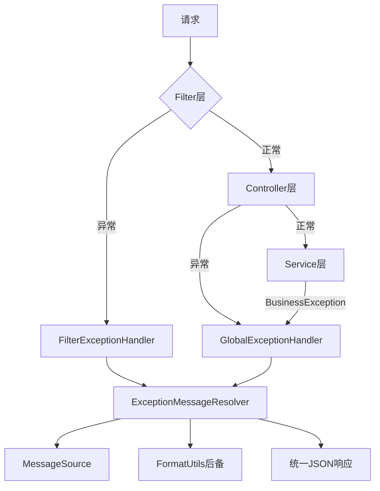

# 异常处理体系使用指南

## 🏗️ 架构概览



## 📋 组件说明

### 1. ExceptionMessageResolver
- **职责**: 统一的异常消息国际化处理
- **特点**: 支持MessageSource、FormatUtils后备机制
- **使用**: 自动被其他组件调用

### 2. GlobalExceptionHandler
- **职责**: 处理Controller层异常
- **特点**: 使用@RestControllerAdvice，返回统一JSON格式
- **覆盖**: BusinessException、RateLimitException、验证异常等

### 3. FilterExceptionHandler
- **职责**: 处理Filter层异常
- **特点**: 继承OncePerRequestFilter，手动写入JSON响应
- **配置**: 通过ExceptionHandlerConfig自动注册

## 🚀 使用示例

### Service层抛出异常

```java
@Service
public class UserService {
    
    public User findById(Long id) {
        if (id == null) {
            // 简单错误，不需要国际化
            throw new BusinessException("用户ID不能为空");
        }
        
        User user = userRepository.findById(id);
        if (user == null) {
            // 国际化错误
            throw BusinessException.withI18n("user.not.found", "用户不存在", id);
        }
        
        return user;
    }
    
    public void validateEmail(String email) {
        if (!EmailValidator.isValid(email)) {
            // 国际化验证错误
            throw BusinessException.withI18n("validation.email.invalid", "邮箱格式不正确", email);
        }
    }
}
```

### Controller层

```java
@RestController
public class UserController {
    
    @GetMapping("/users/{id}")
    public User getUser(@PathVariable Long id) {
        // 直接调用Service，异常由GlobalExceptionHandler处理
        return userService.findById(id);
    }
    
    @PostMapping("/users")
    public User createUser(@Valid @RequestBody CreateUserRequest request) {
        // 验证异常由GlobalExceptionHandler处理
        return userService.createUser(request);
    }
}
```

### Filter层

```java
@Component
public class AuthenticationFilter implements Filter {
    
    @Override
    public void doFilter(ServletRequest request, ServletResponse response, FilterChain chain) 
            throws IOException, ServletException {
        
        String token = extractToken(request);
        if (token == null) {
            // Filter层异常由FilterExceptionHandler处理
            throw new BusinessException("认证令牌缺失");
        }
        
        if (!isValidToken(token)) {
            throw BusinessException.withI18n("auth.token.invalid", "认证令牌无效");
        }
        
        chain.doFilter(request, response);
    }
}
```

## 📝 国际化配置

### messages.properties (默认英文)
```properties
user.not.found=User with ID {0} not found
validation.email.invalid=Email {0} format is invalid
auth.token.invalid=Authentication token is invalid
rate.limit.exceeded=Rate limit exceeded for user {0}
```

### messages_zh_CN.properties (中文)
```properties
user.not.found=用户ID {0} 不存在
validation.email.invalid=邮箱 {0} 格式不正确
auth.token.invalid=认证令牌无效
rate.limit.exceeded=用户 {0} 请求过于频繁
```

## 🔧 配置说明

### 1. 启用异常处理

在Spring Boot应用中，只需要确保相关类在扫描路径下：

```java
@SpringBootApplication
@ComponentScan(basePackages = "io.github.rose.core")
public class Application {
    public static void main(String[] args) {
        SpringApplication.run(Application.class, args);
    }
}
```

### 2. 自定义MessageSource

```java
@Configuration
public class MessageConfig {
    
    @Bean
    public MessageSource messageSource() {
        ResourceBundleMessageSource messageSource = new ResourceBundleMessageSource();
        messageSource.setBasename("messages");
        messageSource.setDefaultEncoding("UTF-8");
        return messageSource;
    }
}
```

### 3. 自定义异常处理

```java
@RestControllerAdvice
@Order(Ordered.HIGHEST_PRECEDENCE) // 优先级高于GlobalExceptionHandler
public class CustomExceptionHandler {
    
    @ExceptionHandler(CustomException.class)
    public ResponseEntity<Result<Void>> handleCustomException(CustomException e) {
        String message = ExceptionMessageResolver.resolveI18nMessage(
            "custom.error", 
            "Custom error occurred", 
            e.getErrorCode()
        );
        
        Result<Void> result = Result.failure("CUSTOM_ERROR", message);
        return ResponseEntity.badRequest().body(result);
    }
}
```

## 📊 响应格式

### 成功响应
```json
{
  "success": true,
  "code": "SUCCESS",
  "message": "操作成功",
  "data": {
    "id": 1,
    "name": "张三"
  }
}
```

### 错误响应
```json
{
  "success": false,
  "code": "USER_NOT_FOUND",
  "message": "用户ID 123 不存在",
  "data": null
}
```

### 验证错误响应
```json
{
  "success": false,
  "code": "VALIDATION_ERROR",
  "message": "email: 邮箱格式不正确; name: 姓名不能为空",
  "data": null
}
```

## 🎯 最佳实践

### 1. 异常分类

```java
// ✅ 简单内部错误，不需要国际化
throw new BusinessException("配置文件解析失败");

// ✅ 用户错误，需要国际化
throw BusinessException.withI18n("user.not.found", "用户不存在", userId);

// ✅ 系统错误，带原因
throw new BusinessException("数据库连接失败", sqlException);
```

### 2. 错误码规范

```java
// 使用有意义的错误码
public static final String USER_NOT_FOUND = "user.not.found";
public static final String VALIDATION_FAILED = "validation.failed";
public static final String RATE_LIMIT_EXCEEDED = "rate.limit.exceeded";
```

### 3. 消息参数化

```java
// ✅ 参数化消息，支持多语言
throw BusinessException.withI18n("validation.range", "值必须在{0}到{1}之间", min, max);

// ❌ 硬编码消息，不支持国际化
throw new BusinessException("值必须在" + min + "到" + max + "之间");
```

### 4. 异常链保留

```java
try {
    // 外部API调用
    apiClient.call();
} catch (ApiException e) {
    // 保留原始异常信息
    throw new BusinessException("API调用失败: " + e.getMessage(), e);
}
```

## 🔍 调试和监控

### 1. 日志记录

异常处理器会自动记录日志：
- WARN级别：业务异常、参数异常
- ERROR级别：系统异常、运行时异常

### 2. 监控指标

可以通过AOP或Micrometer添加异常监控：

```java
@Component
@Aspect
public class ExceptionMonitoringAspect {
    
    private final MeterRegistry meterRegistry;
    
    @AfterThrowing(pointcut = "@within(org.springframework.web.bind.annotation.RestController)", 
                   throwing = "exception")
    public void monitorException(Exception exception) {
        Counter.builder("exception.count")
            .tag("type", exception.getClass().getSimpleName())
            .register(meterRegistry)
            .increment();
    }
}
```

## 🚨 注意事项

1. **Filter异常处理优先级**: FilterExceptionHandler设置为最高优先级
2. **MessageSource缓存**: ExceptionMessageResolver会缓存MessageSource实例
3. **线程安全**: 所有组件都是线程安全的
4. **性能考虑**: 消息解析有缓存机制，性能良好
5. **测试支持**: 提供了Mock MessageSource的测试工具方法

这套异常处理体系提供了完整的、分层的、国际化的异常处理解决方案，既保证了代码的简洁性，又提供了强大的功能。
