## 1. 领域模型

本章节梳理计费域的核心聚合、关键字段与关系。模型以“订阅 → 计费/开票 → 支付 → 入账（Posting）→ 退款”的主链路为中心，兼顾回调与对账。

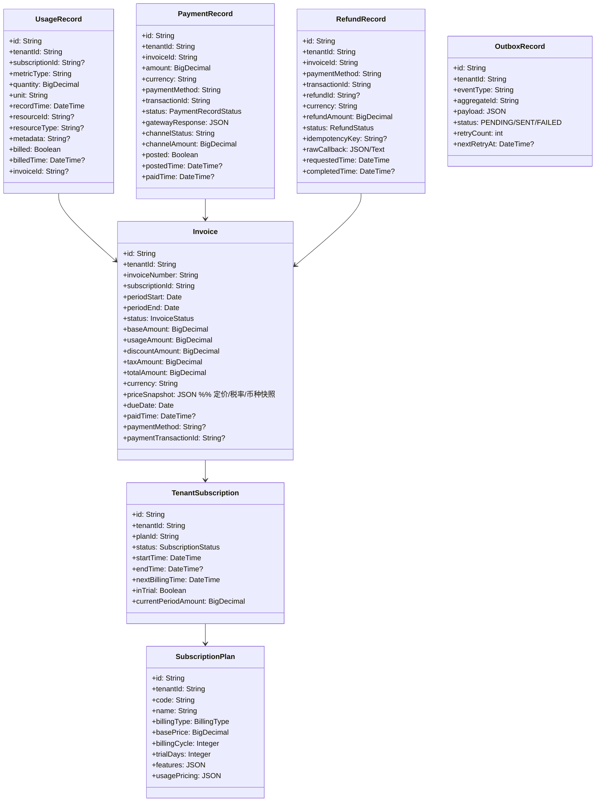

## 2. 状态机

- 订阅（SubscriptionStatus）
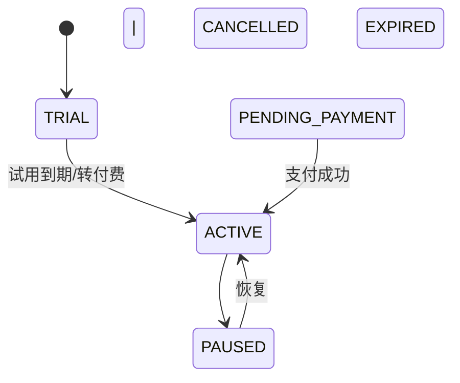

- 账单（InvoiceStatus）
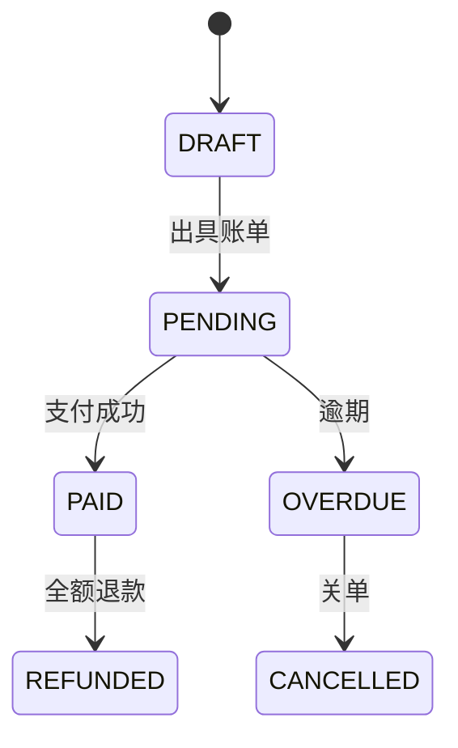

- 支付记录（PaymentRecordStatus）
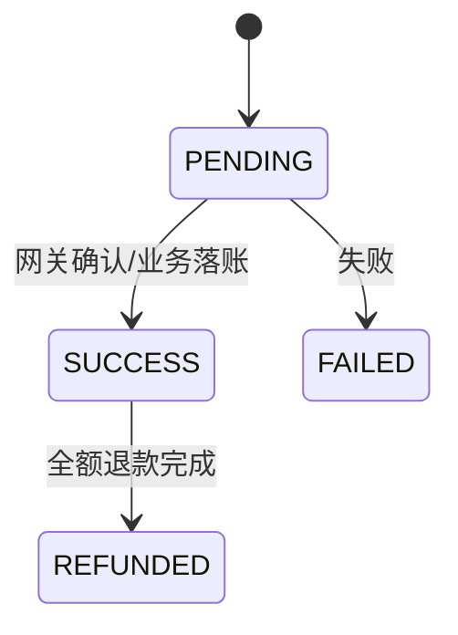

- 退款记录（RefundStatus）
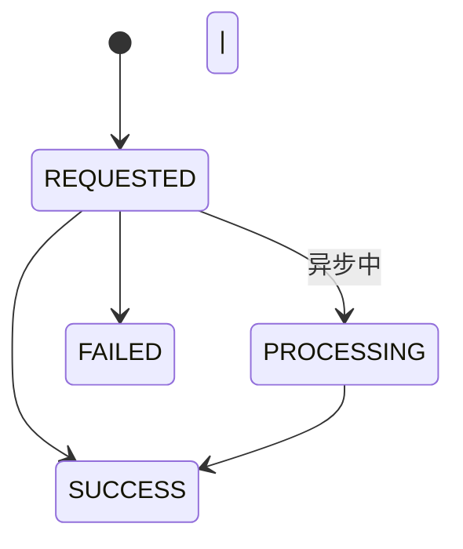

## 3. 业务流程

#### 3.1 订阅 → 计费/开票

- 订阅
  1) 创建订阅（可含试用）→ 设置 nextBillingTime
  2) 变更计划：更新 planId 与 currentPeriodAmount（按策略可做按比例计费）

- 计费/开票
  1) 到期批量生成账单：periodStart/End、base/usage/discount/tax/total
  2) 写入 currency（来自租户/计划配置）与 priceSnapshot（定价/税率/币种快照）
  3) 标记区间内 UsageRecord 为 billed，关联 invoiceId

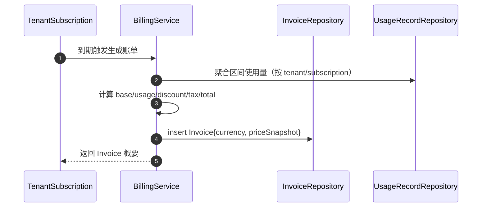

#### 3.2 支付

  1) 回调/主动确认 → 幂等校验(transactionId 唯一)
  2) 新建 PaymentRecord=PENDING → 成功后更新为 SUCCESS 并写 paidTime
  3) Invoice 置为 PAID，记录 paymentMethod/transactionId
  4) Outbox 写入 PaymentSucceeded（与业务同事务）

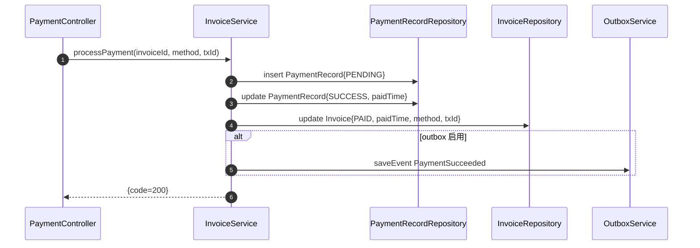

#### 3.2.1 支付回调幂等（建议）
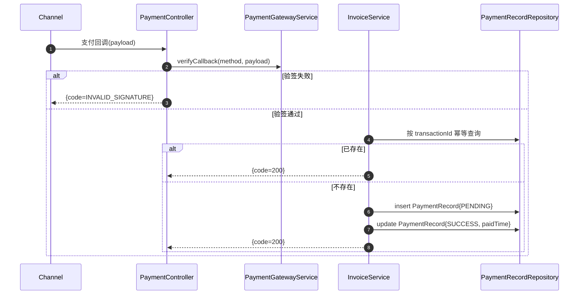

#### 3.3 入账（Posting）

  1) 对账/结算作业扫描 SUCCESS 但未 posted 的 PaymentRecord
  2) 记总账成功 → posted=true, postedTime=now（乐观锁防并发）

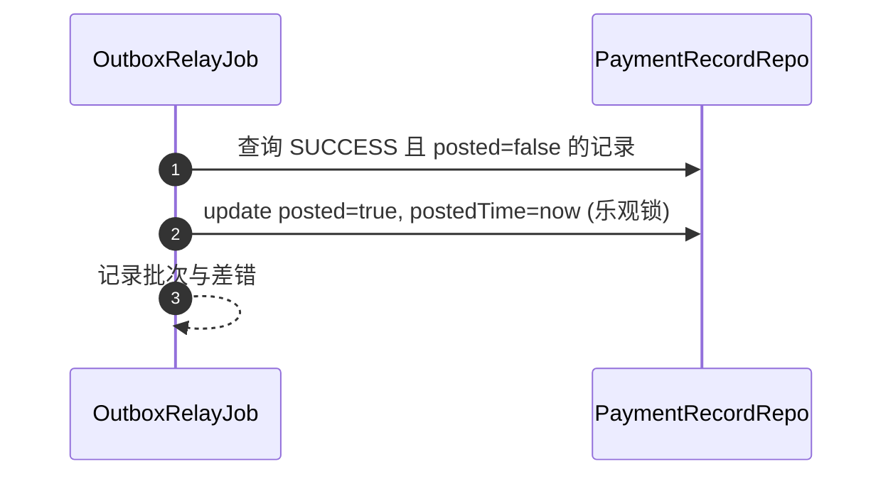

#### 3.4 退款

  1) requestRefund(invoiceId, amount, reason, idempotencyKey?) 幂等：传入幂等键已成功则直接返回
  2) 校验剩余可退余额（累计 SUCCESS 的 RefundRecord）
  3) 网关同步成功 → 插入 RefundRecord{SUCCESS, refundId} 并外发 RefundSucceeded
  4) 网关异步 → 回调 processRefundCallback：按 (invoiceId, refundId) upsert，更新金额/状态/原文
  5) 部分退款口径：Invoice 仍为 PAID；累计成功退款金额 ≥ totalAmount 时置为 REFUNDED 并外发 InvoiceRefunded

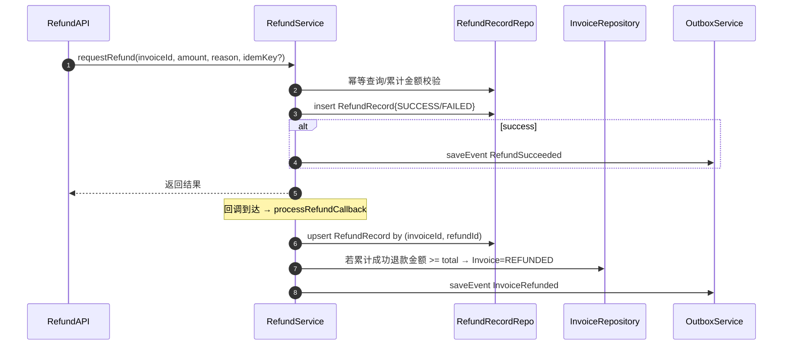

#### 3.5 对账

  1) 维度：按交易日、渠道分页/分租户并发
  2) 同步 PaymentRecord.channelAmount/channelStatus（保留网关原值）
  3) 差错记录：缺失/金额不符/状态不符，支持重试与人工复核
  4) 幂等落库：唯一键或 version 乐观锁

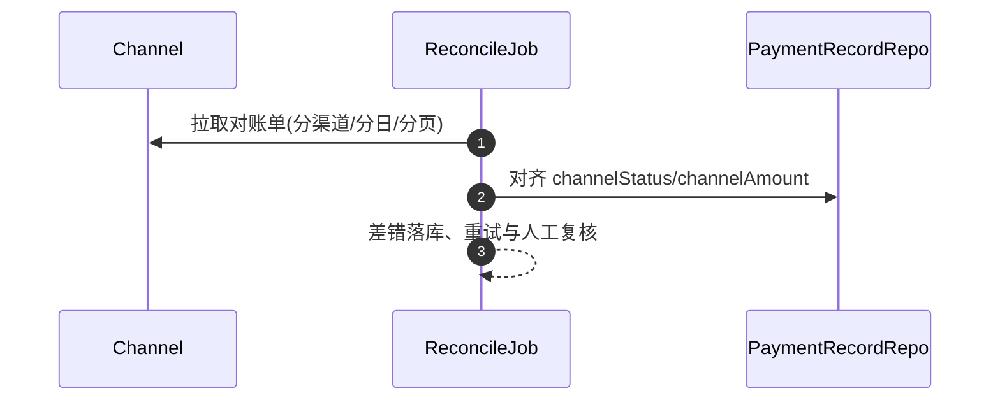