# 计费领域模型设计方案

本文档描述 rose-billing-service 的领域边界、聚合、实体/值对象、状态机、领域服务与事件，作为当前实现与后续演进的统一参考。

## 1. 领域总览
- 目标：为多租户产品提供订阅与用量计费、开票、收款入账、通知与基础报表能力，保障幂等一致、可审计可追溯。
- 有界上下文（Bounded Contexts）
  - Catalog：套餐与定价（SubscriptionPlan）
  - Subscription：订阅生命周期与计费周期（TenantSubscription）
  - Billing & Invoicing：计费与开票（Invoice、UsageRecord）
  - Payments：收款与入账（PaymentRecord + PaymentProcessors）
  - Notifications（外部）：模板与多通道发送
  - Reporting：收入与用量统计（未来可演进至 OLAP）

## 2. 聚合与核心模型

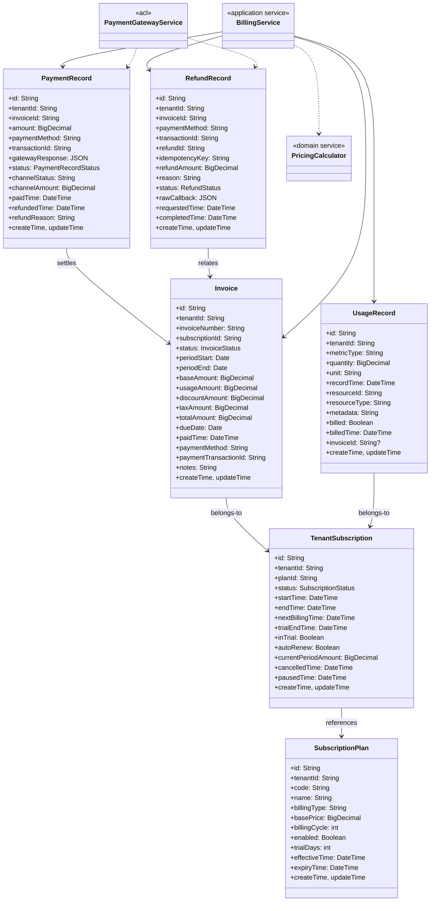

- 值对象（示例）：
  - Money(amount, currency)，Tax(taxRate, taxAmount)，Discount(type, value)
  - BillingCycle(periodStart, periodEnd)，UsageLimit(metricType, quota, policy)

## 3. 状态机

- 订阅（TenantSubscription.status）
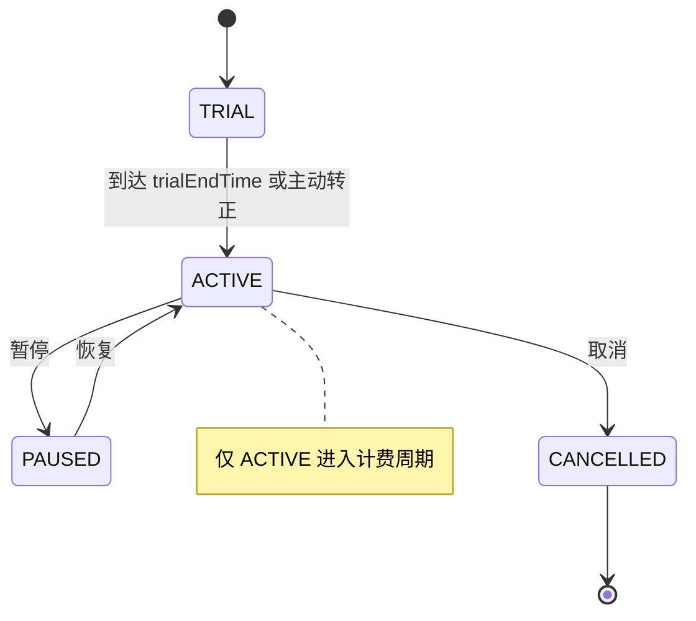

- 账单（Invoice.status）
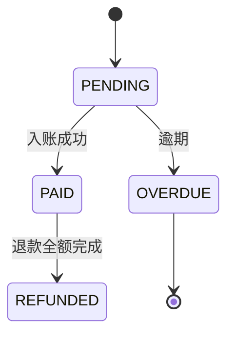

- 退款记录（RefundRecord.status）
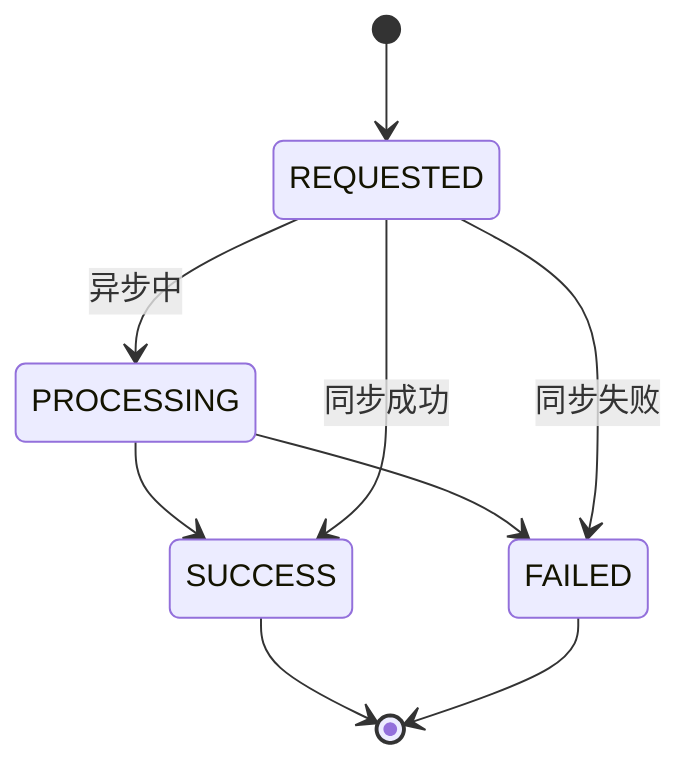

- 支付记录（PaymentRecord.status）
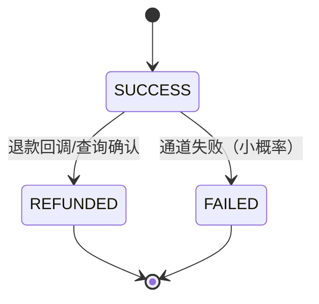

## 4. 关键流程
### 4.1 支付成功链路
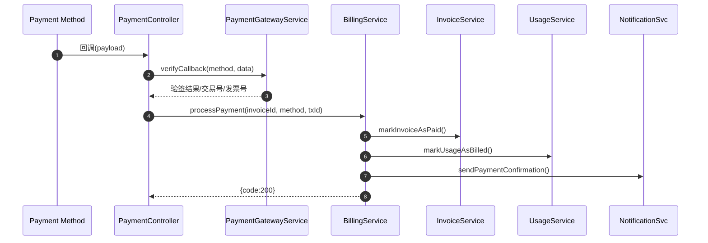

### 4.2 退款全量/部分退款时序
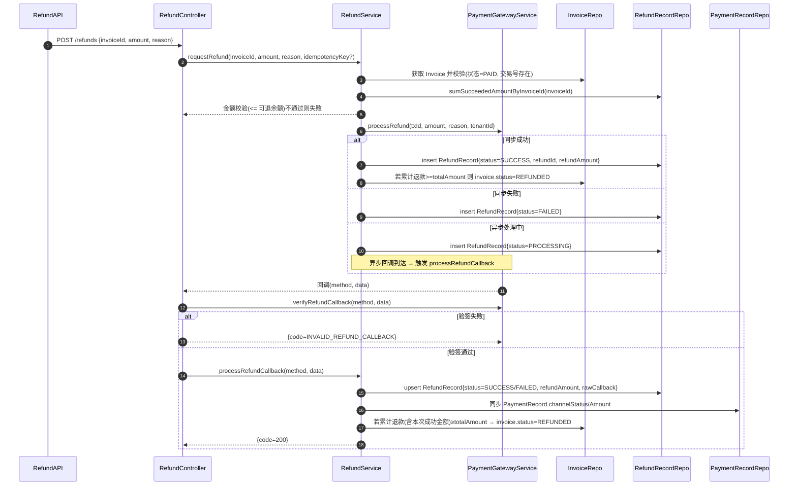

### 4.3 支付回调幂等
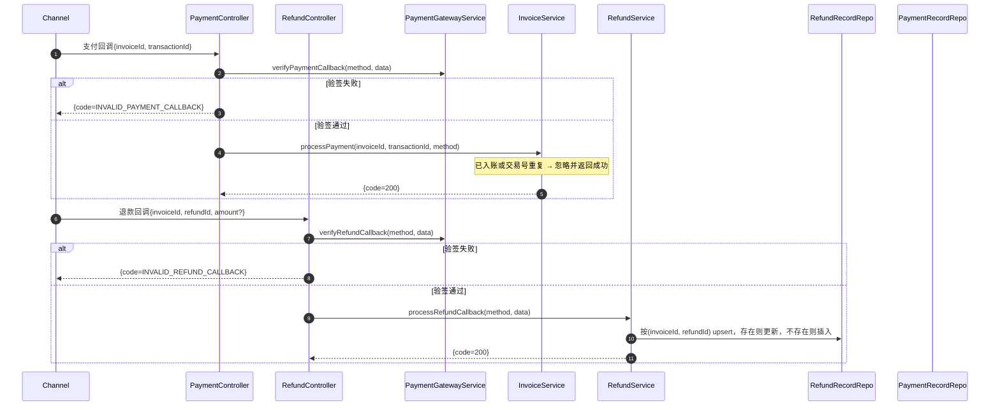

### 4.4 退款回调幂等
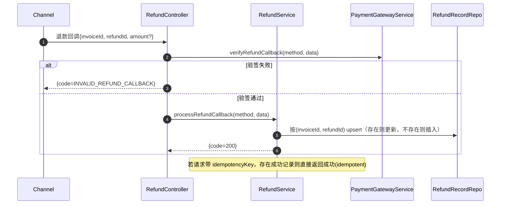

### 4.5 异常落库重试（回调/出账）
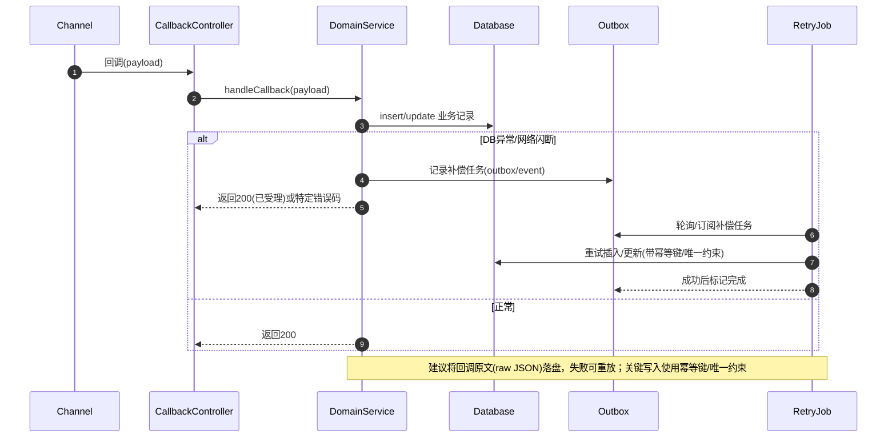

### 4.5 日对账流程
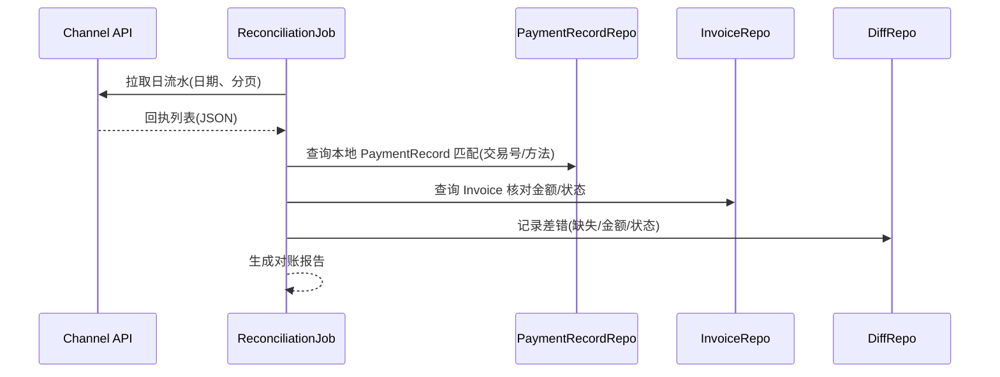

### 4.6 退款时序
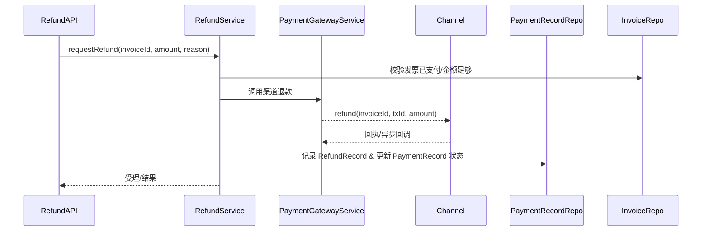

## 5. 风险与演进
- 幂等与一致性：引入 PaymentRecord 唯一约束、Outbox + MQ 外发、失败重试与死信
- 对账与退款：日对账作业、差错表、退款/撤销流程与状态机
- 订阅复杂度：proration、试用/延期、超额与最低承诺、税务与多币种
- 可观测性：指标（成功率/延迟/掉单）、Tracing、SLO 报表
- 存储与查询：避免函数导致索引失效（派生列/物化视图/OLAP）