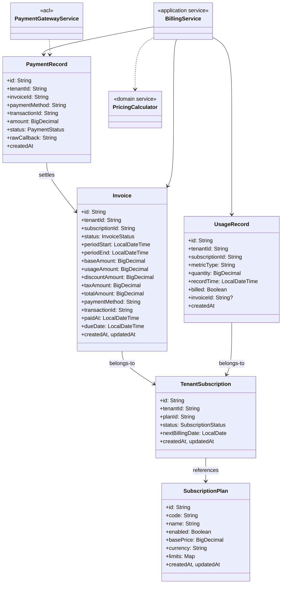
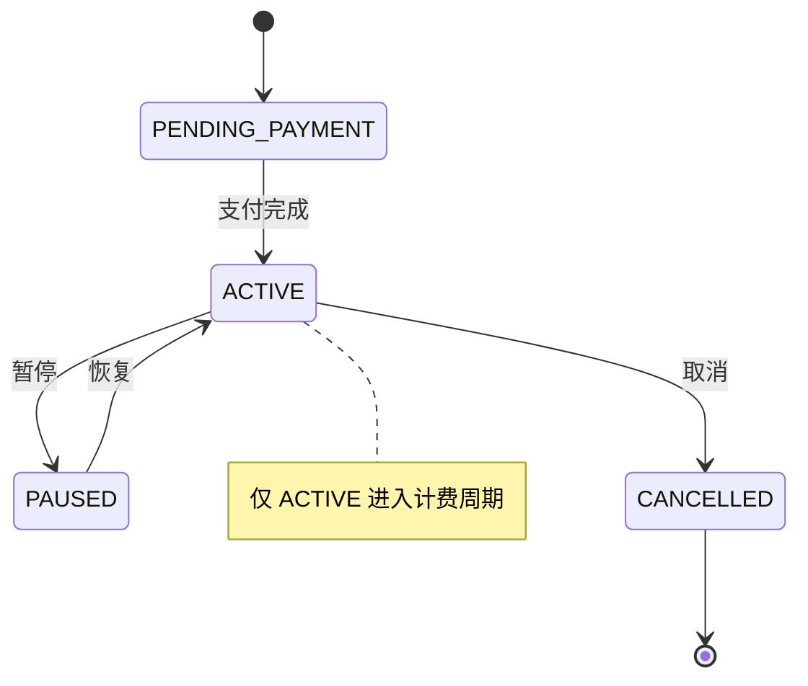
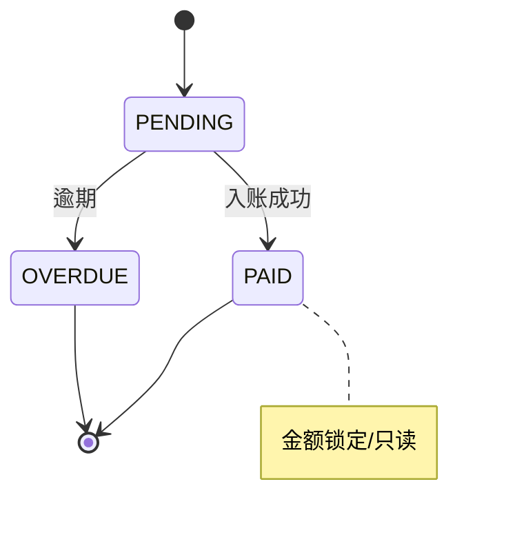
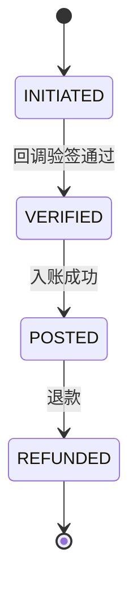
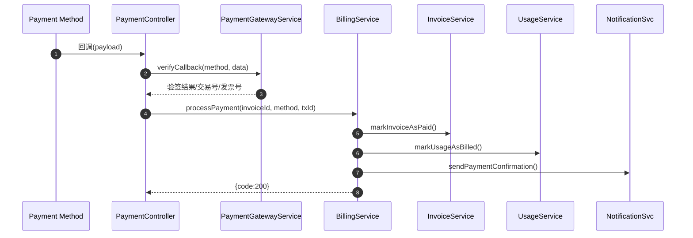
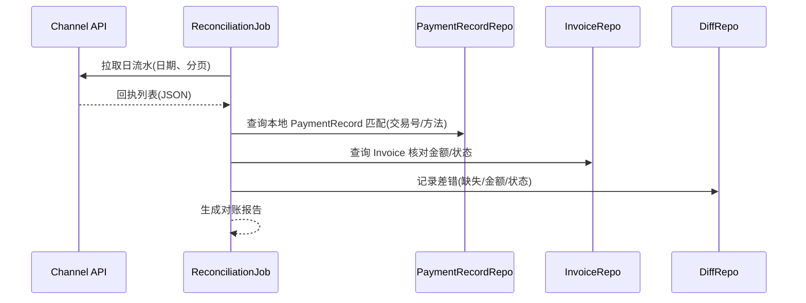
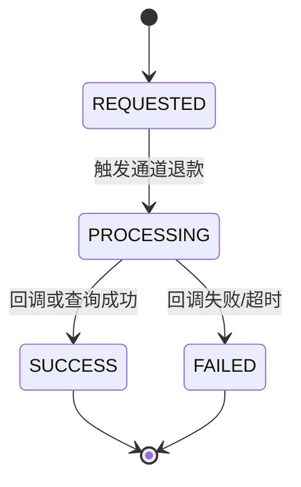
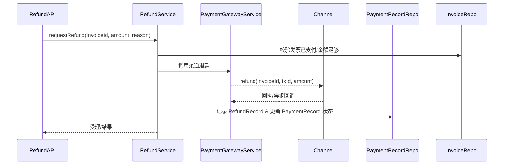

# 计费领域模型设计方案

本文档描述 rose-billing-service 的领域边界、聚合、实体/值对象、状态机、领域服务与事件，作为当前实现与后续演进的统一参考。

## 1. 领域总览
- 目标：为多租户产品提供订阅与用量计费、开票、收款入账、通知与基础报表能力，保障幂等一致、可审计可追溯。
- 有界上下文（Bounded Contexts）
  - Catalog：套餐与定价（SubscriptionPlan）
  - Subscription：订阅生命周期与计费周期（TenantSubscription）
  - Billing & Invoicing：计费与开票（Invoice、UsageRecord）
  - Payments：收款与入账（PaymentRecord + PaymentProcessors）
  - Notifications（外部）：模板与多通道发送
  - Reporting：收入与用量统计（未来可演进至 OLAP）

## 2. 聚合与核心模型

- 值对象（示例）：
  - Money(amount, currency)，Tax(taxRate, taxAmount)，Discount(type, value)
  - BillingCycle(periodStart, periodEnd)，UsageLimit(metricType, quota, policy)

## 3. 领域状态机

## 4. 关键领域服务
- PricingCalculator（领域服务）
  - 输入：SubscriptionPlan、UsageRecords、Discount/Tax 策略
  - 输出：base/usage/discount/tax/total 金额
- BillingService（应用编排）
  - 生成账单：周期聚合用量 → 计算金额 → 持久化 Invoice
  - 处理支付成功：标记发票已付、结转用量、发送通知、发布事件
- PaymentGatewayService（防腐层 ACL）
  - 路由渠道处理器（Alipay/WeChat/Stripe），生成链接、回调验签、交易查询

## 5. 领域事件
- PaymentSucceededEvent(tenantId, invoiceId, transactionId, paymentMethod, amount, occurredAt)
  - 订阅方：通知服务、对账作业、数据看板
- 规划事件：InvoiceGeneratedEvent、SubscriptionChangedEvent（升级/降级/暂停/恢复）
- 事件原则：不可变载荷、与领域语言对齐；推荐 Outbox + MQ 保障送达

## 6. 领域不变式与业务约束
- 每订阅每周期最多一张有效账单
- 同一 UsageRecord 仅结转一次（billed=true 且绑定 invoiceId）
- 同一 (paymentMethod, transactionId) 仅允许一次成功入账（唯一约束）
- 发票 PAID 后金额与周期不可变（审计）
- ACTIVE 订阅才能进入计费周期

## 7. 仓储与持久化策略
- MyBatis-Plus + @TableLogic：逻辑删除自动过滤
- Wrapper 聚合统计替换手写 SQL；复杂跨表统计保留 SQL 或改造为视图/分步计算
- 索引建议
  - Invoice：tenantId+status、subscriptionId+periodStart/periodEnd、transactionId(unique 可选)
  - UsageRecord：tenantId+recordTime、subscriptionId+billed、metricType+recordTime
  - PaymentRecord：(paymentMethod, transactionId) UNIQUE、invoiceId+status
- 审计字段：PaymentRecord.rawCallback 保留回执原文

## 8. 支付与通知集成（ACL）
- 支付验签（现阶段）：HMAC-SHA256(invoiceId|交易号|timestamp) + 时间窗；后续替换官方 SDK/证书
- 通知：BillingNotificationClient 调用 notification-service /api/notifications/send（模板 + 变量）

## 9. 典型时序（支付成功链路）

## 10. 风险与演进
- 幂等与一致性：引入 PaymentRecord 唯一约束、Outbox + MQ 外发、失败重试与死信
- 对账与退款：日对账作业、差错表、退款/撤销流程与状态机
- 订阅复杂度：proration、试用/延期、超额与最低承诺、税务与多币种
- 可观测性：指标（成功率/延迟/掉单）、Tracing、SLO 报表
- 存储与查询：避免函数导致索引失效（派生列/物化视图/OLAP）

## 11. 对账与退款领域设计（扩展）

### 11.1 对账目标与原则
- 目标：保证通道流水与内部账务数据一致，快速发现与处理差错；提供审计可追溯性
- 原则：单向不可变记录（PaymentRecord.rawCallback 保留原文）、可重放的计算（幂等）、差错留痕

### 11.2 模型扩展
- PaymentRecord 增补字段
  - channelStatus: String（SUCCESS/FAILED/PENDING）
  - channelAmount: BigDecimal（通道确认金额）
  - posted: Boolean（是否已入账）
  - postedAt: LocalDateTime
- ReconciliationDiff 差错记录（新表/聚合）
  - id, date, tenantId, invoiceId, paymentMethod, transactionId
  - diffType(MISSING_INTERNAL/MISSING_CHANNEL/AMOUNT_MISMATCH/STATUS_MISMATCH)
  - channelSnapshot(JSON), internalSnapshot(JSON), resolved(Boolean), resolvedAt, note

### 11.3 日对账流程

### 11.4 差错处理策略
- MISSING_INTERNAL（通道有/内部无）：尝试以回执补录 PaymentRecord（标注来源=RECONCILIATION），触发后续入账校验
- MISSING_CHANNEL（内部有/通道无）：标记异常等待人工复核，必要时申请通道查询/追踪
- AMOUNT_MISMATCH/STATUS_MISMATCH：以通道为准还是以内部为准需策略配置，默认人工复核

### 11.5 退款领域
- RefundRecord（新聚合）
  - id, tenantId, invoiceId, paymentMethod, transactionId, refundId, refundAmount, reason, status(REQUESTED/PROCESSING/SUCCESS/FAILED), createdAt, updatedAt, rawCallback
- 状态机

- 关键约束
  - 仅 PAID 发票允许退款；退款总额 ≤ 已收金额
  - 退款成功后生成负向分录（或负向 InvoiceLine），保证账务可追溯

### 11.6 退款时序

### 11.7 Outbox + 可靠事件（建议）
- Outbox 表：记录待外发事件（PaymentSucceeded/RefundSucceeded），事务内写入
- EventRelay：定时/消息触发可靠外发至 MQ；失败重试与死信
- 订阅者：通知、对账、BI 等