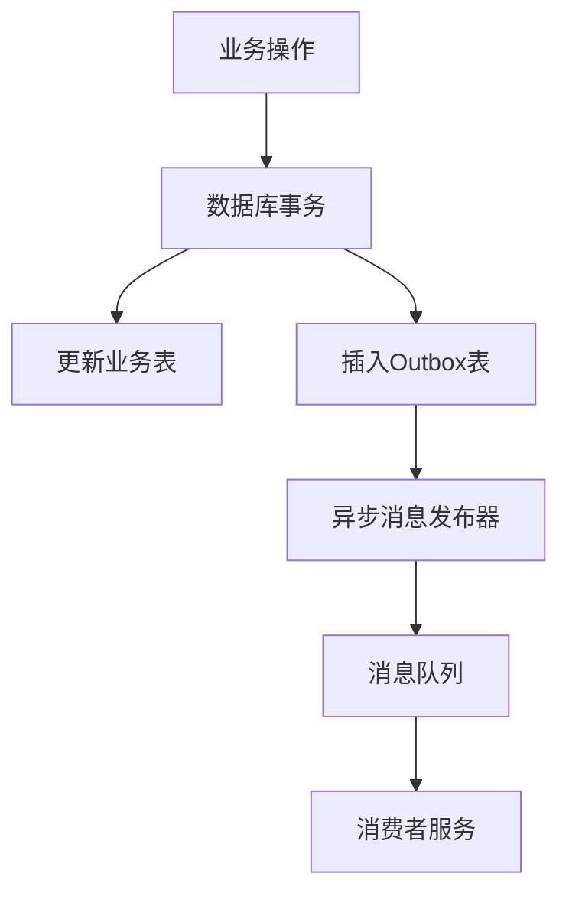
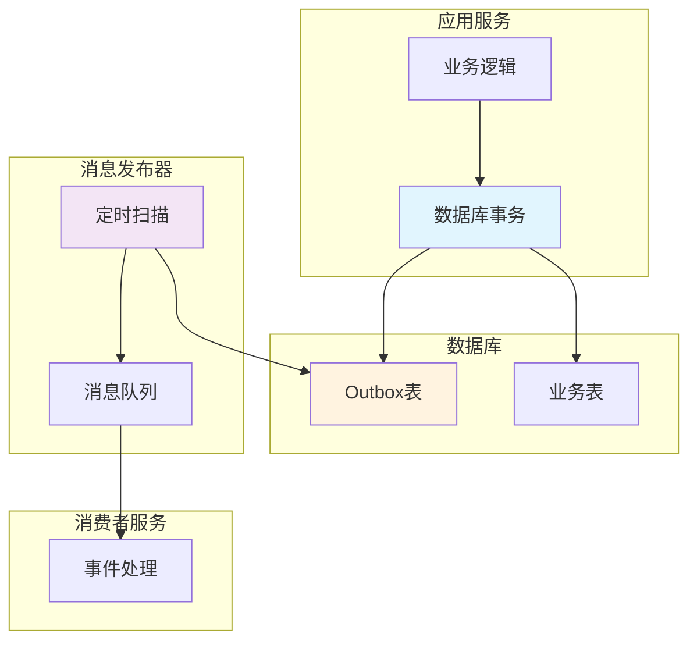
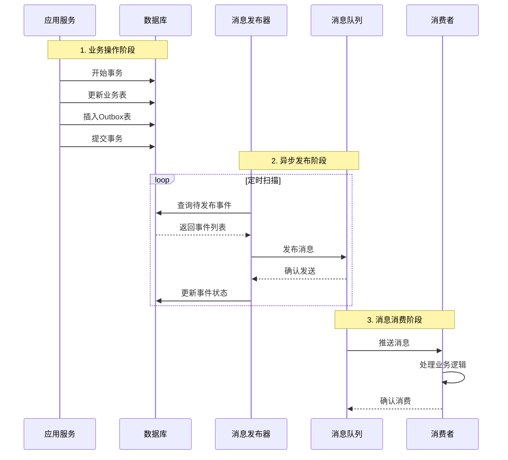
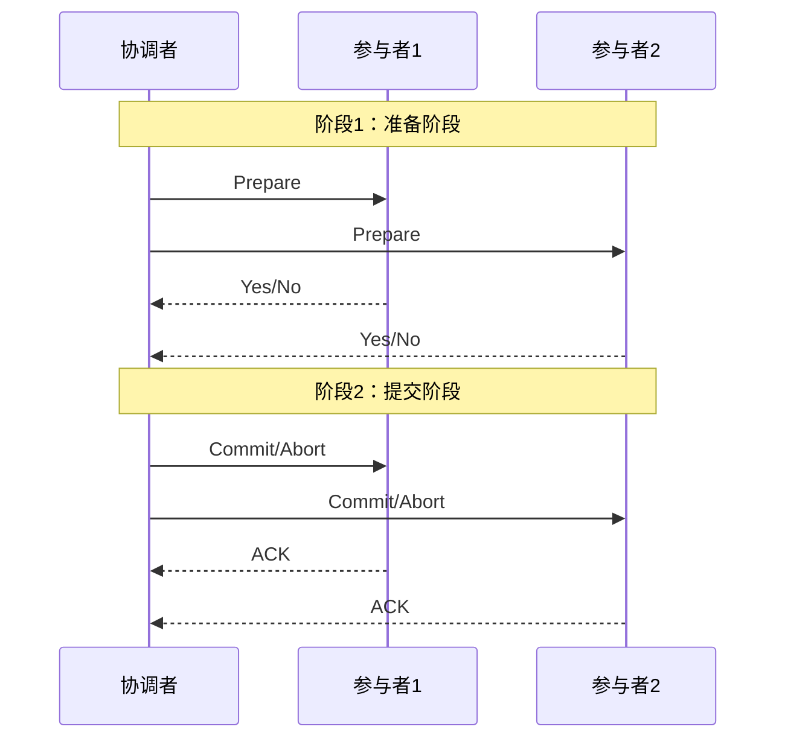
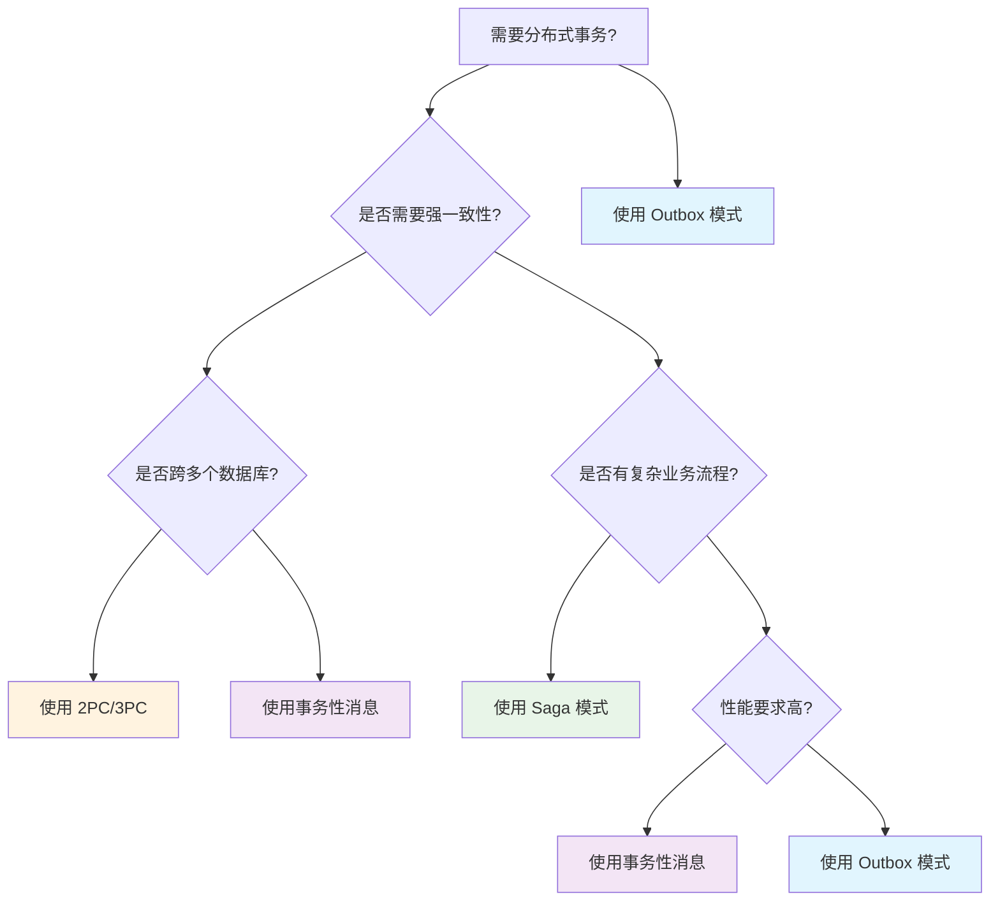

# Outbox 模式技术文档

## 目录

1. [什么是 Outbox 模式](#1-什么是-outbox-模式)
2. [优缺点分析](#2-优缺点分析)
3. [核心原理](#3-核心原理)
4. [实现方式](#4-实现方式)
5. [关键挑战与应对策略](#5-关键挑战与应对策略)
6. [典型使用场景](#6-典型使用场景)
7. [与相近方案对比](#7-与相近方案对比)
8. [最佳实践](#8-最佳实践)
9. [落地实施步骤](#9-落地实施步骤)

---

## 1. 什么是 Outbox 模式

### 1.1 定义与核心概念

Outbox 模式是一种分布式系统设计模式，用于确保**业务操作**和**消息发布**的原子性。它通过将待发送的消息存储在与业务数据相同的数据库中，利用数据库事务的
ACID 特性来保证数据一致性。

**核心思想：**

- 在同一个数据库事务中完成业务数据更新和消息记录
- 通过异步机制将消息从 Outbox 表发布到消息队列
- 实现最终一致性，避免分布式事务的复杂性

### 1.2 解决的核心问题

#### 双写问题（Dual Write Problem）

在微服务架构中，我们经常遇到需要同时执行两个操作的场景：

```java
// ❌ 存在数据一致性问题的代码
@Service
@Transactional
public class OrderService {

    public Order createOrder(CreateOrderRequest request) {
        // 操作1：保存订单到数据库
        Order order = new Order(request);
        orderRepository.save(order);

        // 操作2：发送消息到消息队列
        messageProducer.send("order.created", order);

        return order;
    }
}
```

**问题分析：**

- 数据库操作成功，消息发送失败 → 订单已创建，但其他服务未收到通知
- 消息发送成功，数据库事务回滚 → 消息已发送，但订单实际未创建
- 无法保证两个操作的原子性

#### 传统解决方案的局限性

1. **分布式事务（2PC/3PC）**

- 性能开销大
- 系统复杂度高
- 可用性差

2. **消息事务**

- 依赖特定的消息中间件
- 增加系统耦合度

3. **补偿机制**

- 业务逻辑复杂
- 难以处理所有异常情况

### 1.3 与事务性消息发送的关系

Outbox 模式本质上是一种**事务性消息发送**的实现方式：



**与传统事务性消息的区别：**

- 不依赖特定的消息中间件
- 使用标准的数据库事务机制
- 更容易理解和实现

## 2. 优缺点分析

### 2.1 优势

#### 2.1.1 数据一致性保证

**强一致性：**

```java
@Service
@Transactional
public class OrderService {

    public Order createOrder(CreateOrderRequest request) {
        // 在同一个事务中完成两个操作
        Order order = new Order(request);
        orderRepository.save(order);

        // 保存事件到 Outbox 表
        OutboxEvent event = new OutboxEvent(
            order.getId().toString(),
            "order",
            "order.created",
            toJson(order)
        );
        outboxRepository.save(event);

        // 要么都成功，要么都失败
        return order;
    }
}
```

**最终一致性：**

- 即使消息发布暂时失败，也会通过重试机制最终发布
- 保证业务数据和消息的最终一致性

#### 2.1.2 高可靠性

**消息不丢失：**

- 所有消息都持久化存储在数据库中
- 支持重试机制和故障恢复
- 可以手动重新发布失败的消息

**At-Least-Once 语义：**

- 保证消息至少被发送一次
- 通过幂等性处理避免重复消息的影响

#### 2.1.3 系统解耦

**业务逻辑与消息发布分离：**

```java
// 业务服务专注于业务逻辑
@Service
public class OrderService {
    public Order createOrder(CreateOrderRequest request) {
        // 只关心业务逻辑
        Order order = processOrder(request);
        recordEvent("order.created", order);
        return order;
    }
}

// 发布器专门负责消息发布
@Component
public class OutboxPublisher {
    @Scheduled(fixedDelay = 5000)
    public void publishEvents() {
        // 专注于消息发布逻辑
    }
}
```

#### 2.1.4 可观测性

**完整的事件记录：**

```sql
-- 可以查看所有事件的状态和历史
SELECT
    id, aggregate_id, event_type, status,
    created_time, published_time, retry_count, error_message
FROM outbox_events
WHERE aggregate_id = 'ORDER-123'
ORDER BY created_time;
```

### 2.2 劣势

#### 2.2.1 复杂性增加

**额外的组件和代码：**

- 需要设计和维护 Outbox 表
- 需要开发消息发布器组件
- 需要实现事件清理机制
- 增加了系统的整体复杂度

#### 2.2.2 存储开销

**额外的存储空间：**

```java
// 每个业务操作都会产生额外的存储开销
public void createOrder(CreateOrderRequest request) {
    Order order = new Order(request);           // 业务数据存储
    orderRepository.save(order);

    OutboxEvent event = new OutboxEvent(...);   // 额外的事件存储
    outboxRepository.save(event);
}
```

**存储增长问题：**

- Outbox 表会持续增长
- 需要定期清理已发布的事件
- 可能影响数据库性能

#### 2.2.3 消息延迟

**非实时发布：**

```java
@Scheduled(fixedDelay = 5000) // 最多5秒延迟
public void publishEvents() {
    // 定期扫描和发布，存在延迟
}
```

#### 2.2.4 消息重复

**At-Least-Once 语义的副作用：**

- 消息可能被重复发送
- 消费者必须实现幂等性处理
- 增加了消费者的复杂度

### 2.3 适用场景

#### 2.3.1 必须使用的场景

1. **强一致性要求**

- 金融交易系统
- 订单处理系统
- 账户管理系统

2. **业务流程依赖**

- 电商下单流程
- 工作流系统
- 审批流程

3. **审计合规要求**

- 操作日志记录
- 合规性报告
- 数据变更追踪

#### 2.3.2 不适用的场景

1. **可容忍数据不一致**

- 日志统计
- 用户行为分析
- 推荐系统

2. **极高性能要求**

- 高频交易
- 实时游戏
- 物联网数据采集

3. **简单单体应用**

- 无微服务架构
- 单一数据库
- 简单业务逻辑

## 3. 核心原理

### 3.1 概念模型



### 3.2 数据流时序图



### 3.3 关键组件说明

#### 3.3.1 业务表

存储核心业务数据的表，如订单表、用户表等。

```sql
CREATE TABLE orders (
    id BIGINT PRIMARY KEY AUTO_INCREMENT,
    customer_id BIGINT NOT NULL,
    product_id BIGINT NOT NULL,
    quantity INT NOT NULL,
    amount DECIMAL(10,2) NOT NULL,
    status VARCHAR(20) NOT NULL,
    created_time DATETIME NOT NULL
) ENGINE=InnoDB DEFAULT CHARSET=utf8mb4;
```

#### 3.3.2 Outbox 表

存储待发布事件的表，是 Outbox 模式的核心。

```sql
CREATE TABLE outbox_events (
    id BIGINT PRIMARY KEY AUTO_INCREMENT,
    aggregate_id VARCHAR(100) NOT NULL COMMENT '聚合根ID',
    aggregate_type VARCHAR(50) NOT NULL COMMENT '聚合类型',
    event_type VARCHAR(100) NOT NULL COMMENT '事件类型',
    event_data JSON NOT NULL COMMENT '事件数据',
    status ENUM('PENDING','PUBLISHED','FAILED') DEFAULT 'PENDING',
    created_time DATETIME NOT NULL DEFAULT CURRENT_TIMESTAMP,
    published_time DATETIME NULL,
    retry_count INT DEFAULT 0,
    error_message TEXT NULL,

    INDEX idx_status_created (status, created_time),
    INDEX idx_aggregate (aggregate_type, aggregate_id),
    INDEX idx_event_type (event_type)
) ENGINE=InnoDB DEFAULT CHARSET=utf8mb4;
```

**字段说明：**

- `aggregate_id`: 业务聚合的唯一标识
- `aggregate_type`: 聚合类型，如 "order", "user"
- `event_type`: 事件类型，如 "order.created", "user.updated"
- `event_data`: 事件的详细数据，JSON 格式
- `status`: 事件状态（待发布/已发布/失败）
- `retry_count`: 重试次数，用于失败重试控制

#### 3.3.3 消息发布器

负责从 Outbox 表中读取事件并发布到消息队列的组件。

```java
@Component
@Slf4j
public class OutboxPublisher {

    @Autowired
    private OutboxEventRepository outboxRepository;

    @Autowired
    private MessageProducer messageProducer;

    @Scheduled(fixedDelay = 5000)
    @Transactional
    public void publishPendingEvents() {
        List<OutboxEvent> events = outboxRepository.findPendingEvents(100);

        for (OutboxEvent event : events) {
            try {
                publishEvent(event);
                markAsPublished(event);
            } catch (Exception e) {
                handleFailure(event, e);
            }
        }
    }

    private void publishEvent(OutboxEvent event) throws Exception {
        String topic = event.getAggregateType() + "." + event.getEventType();
        messageProducer.send(topic, event.getEventData());
    }
}
```

#### 3.3.4 消息队列

用于传递消息的中间件，如 Kafka、RabbitMQ、RocketMQ 等。

#### 3.3.5 消费者服务

接收和处理消息的下游服务。

```java
@Component
public class OrderEventHandler {

    @EventListener
    @Transactional
    public void handleOrderCreated(OrderCreatedEvent event) {
        // 实现幂等性检查
        if (isAlreadyProcessed(event.getEventId())) {
            return;
        }

        // 处理业务逻辑
        processOrderCreated(event);

        // 记录处理状态
        markAsProcessed(event.getEventId());
    }
}
```

## 4. 实现方式

### 4.1 数据库层面实现

#### 4.1.1 事务内写入方式

**基本实现：**

```java
@Service
@Transactional
public class OrderService {

    @Autowired
    private OrderRepository orderRepository;

    @Autowired
    private OutboxEventRepository outboxRepository;

    public Order createOrder(CreateOrderRequest request) {
        // 1. 执行业务逻辑
        Order order = new Order(request);
        orderRepository.save(order);

        // 2. 在同一事务中保存事件
        OutboxEvent event = OutboxEvent.builder()
            .aggregateId(order.getId().toString())
            .aggregateType("order")
            .eventType("order.created")
            .eventData(toJson(order))
            .build();

        outboxRepository.save(event);

        return order;
    }

    private String toJson(Object obj) {
        try {
            return objectMapper.writeValueAsString(obj);
        } catch (Exception e) {
            throw new RuntimeException("Failed to serialize event data", e);
        }
    }
}
```

#### 4.1.2 CDC (Change Data Capture) 方式（MySQL 5.7）

使用数据库的变更日志来捕获 Outbox 表的变化：

```yaml
# Debezium 配置示例
name: outbox-connector
config:
  connector.class: io.debezium.connector.mysql.MySqlConnector
  database.hostname: localhost
  database.port: 3306
  database.user: debezium
  database.password: password
  database.server.name: mysql-server-1
  database.history.kafka.bootstrap.servers: localhost:9092
  database.history.kafka.topic: schema-changes.outbox
  database.include.list: outbox_demo
  table.include.list: outbox_demo.outbox_events
  transforms: outbox
  transforms.outbox.type: io.debezium.transforms.outbox.EventRouter
  transforms.outbox.route.topic.replacement: ${routedByValue}.events
```

**CDC 方式的优势：**

- 实时性更好，无需轮询
- 减少应用层复杂度
- 更好的性能表现

### 4.2 应用层面实现

#### 4.2.1 定时轮询实现

```java
@Component
@Slf4j
public class PollingOutboxPublisher {

    private static final int BATCH_SIZE = 100;
    private static final int MAX_RETRY = 3;

    @Autowired
    private OutboxEventRepository outboxRepository;

    @Autowired
    private MessageProducer messageProducer;

    @Scheduled(fixedDelay = 5000) // 每5秒执行一次
    @Transactional
    public void publishEvents() {
        try {
            List<OutboxEvent> events = outboxRepository
                .findPendingEvents(MAX_RETRY, PageRequest.of(0, BATCH_SIZE));

            for (OutboxEvent event : events) {
                processEvent(event);
            }

        } catch (Exception e) {
            log.error("Error in polling publisher", e);
        }
    }

    private void processEvent(OutboxEvent event) {
        try {
            // 发布消息
            String topic = buildTopic(event);
            messageProducer.send(topic, event.getEventData());

            // 标记为已发布
            event.markAsPublished();
            outboxRepository.save(event);

            log.info("Published event: {}", event.getId());

        } catch (Exception e) {
            // 处理失败
            event.incrementRetryCount();
            event.setErrorMessage(e.getMessage());

            if (event.getRetryCount() >= MAX_RETRY) {
                event.markAsFailed();
            }

            outboxRepository.save(event);
            log.error("Failed to publish event: {}", event.getId(), e);
        }
    }

    private String buildTopic(OutboxEvent event) {
        return event.getAggregateType() + "." + event.getEventType();
    }
}
```

#### 4.2.2 事件驱动实现

```java
@Component
public class EventDrivenOutboxPublisher {

    @Autowired
    private MessageProducer messageProducer;

    @EventListener
    @Async
    public void handleOutboxEvent(OutboxCreatedEvent event) {
        try {
            // 立即尝试发布
            publishEvent(event.getOutboxEvent());

        } catch (Exception e) {
            // 发布失败，记录错误，等待定时任务重试
            log.error("Failed to publish event immediately: {}",
                     event.getOutboxEvent().getId(), e);
        }
    }

    private void publishEvent(OutboxEvent event) throws Exception {
        String topic = event.getAggregateType() + "." + event.getEventType();
        messageProducer.send(topic, event.getEventData());

        // 更新状态
        event.markAsPublished();
        outboxRepository.save(event);
    }
}
```

### 4.3 具体技术栈示例

#### 4.3.1 Spring Boot + MySQL 5.7 + Kafka

**项目依赖：**

```xml
<dependencies>
    <dependency>
        <groupId>org.springframework.boot</groupId>
        <artifactId>spring-boot-starter-data-jpa</artifactId>
    </dependency>
    <dependency>
        <groupId>org.springframework.kafka</groupId>
        <artifactId>spring-kafka</artifactId>
    </dependency>
    <dependency>
        <groupId>mysql</groupId>
        <artifactId>mysql-connector-java</artifactId>
    </dependency>
    <dependency>
        <groupId>com.fasterxml.jackson.core</groupId>
        <artifactId>jackson-databind</artifactId>
    </dependency>
</dependencies>
```

**配置文件：**

```yaml
spring:
  datasource:
    url: jdbc:mysql://localhost:3306/outbox_demo?useUnicode=true&characterEncoding=utf8&useSSL=false&serverTimezone=UTC
    username: root
    password: password
    driver-class-name: com.mysql.cj.jdbc.Driver

  jpa:
    hibernate:
      ddl-auto: update
    show-sql: true
    properties:
      hibernate:
        dialect: org.hibernate.dialect.MySQL57Dialect

  kafka:
    bootstrap-servers: localhost:9092
    producer:
      key-serializer: org.apache.kafka.common.serialization.StringSerializer
      value-serializer: org.apache.kafka.common.serialization.StringSerializer
      acks: all
      retries: 3

outbox:
  publisher:
    enabled: true
    batch-size: 100
    poll-interval: 5000
    max-retry: 3
```

**实体类定义：**

```java
@Entity
@Table(name = "outbox_events")
@Data
@Builder
@NoArgsConstructor
@AllArgsConstructor
public class OutboxEvent {

    @Id
    @GeneratedValue(strategy = GenerationType.IDENTITY)
    private Long id;

    @Column(name = "aggregate_id", nullable = false)
    private String aggregateId;

    @Column(name = "aggregate_type", nullable = false)
    private String aggregateType;

    @Column(name = "event_type", nullable = false)
    private String eventType;

    @Column(name = "event_data", nullable = false, columnDefinition = "json")
    private String eventData;

    @Enumerated(EnumType.STRING)
    @Column(name = "status")
    private EventStatus status = EventStatus.PENDING;

    @Column(name = "created_time")
    private LocalDateTime createdTime = LocalDateTime.now();

    @Column(name = "published_time")
    private LocalDateTime publishedTime;

    @Column(name = "retry_count")
    private Integer retryCount = 0;

    @Column(name = "error_message")
    private String errorMessage;

    public void markAsPublished() {
        this.status = EventStatus.PUBLISHED;
        this.publishedTime = LocalDateTime.now();
    }

    public void markAsFailed() {
        this.status = EventStatus.FAILED;
    }

    public void incrementRetryCount() {
        this.retryCount++;
    }
}

enum EventStatus {
    PENDING, PUBLISHED, FAILED
}
```

**Repository 接口：**

```java
@Repository
public interface OutboxEventRepository extends JpaRepository<OutboxEvent, Long> {

    @Query("SELECT e FROM OutboxEvent e WHERE e.status = 'PENDING' " +
           "AND e.retryCount < :maxRetry ORDER BY e.createdTime ASC")
    List<OutboxEvent> findPendingEvents(@Param("maxRetry") int maxRetry, Pageable pageable);

    @Query("SELECT e FROM OutboxEvent e WHERE e.status = 'FAILED'")
    List<OutboxEvent> findFailedEvents(Pageable pageable);

    @Modifying
    @Query("DELETE FROM OutboxEvent e WHERE e.status = 'PUBLISHED' " +
           "AND e.publishedTime < :cutoffTime")
    int deletePublishedEventsBefore(@Param("cutoffTime") LocalDateTime cutoffTime);

    long countByStatus(EventStatus status);
}
```

**Kafka 消息生产者：**

```java
@Component
@Slf4j
public class KafkaMessageProducer implements MessageProducer {

    @Autowired
    private KafkaTemplate<String, String> kafkaTemplate;

    @Override
    public void send(String topic, String message) throws Exception {
        try {
            ListenableFuture<SendResult<String, String>> future =
                kafkaTemplate.send(topic, message);

            // 同步等待发送结果
            SendResult<String, String> result = future.get(10, TimeUnit.SECONDS);

            log.debug("Message sent successfully to topic: {}, partition: {}, offset: {}",
                     topic, result.getRecordMetadata().partition(),
                     result.getRecordMetadata().offset());

        } catch (Exception e) {
            log.error("Failed to send message to topic: {}", topic, e);
            throw e;
        }
    }
}
```

## 5. 关键挑战与应对策略

### 5.1 消息重复发送与幂等性

#### 5.1.1 问题描述

由于 Outbox 模式提供 At-Least-Once 语义，消息可能被重复发送：

```java
// 可能导致重复发送的场景
public void publishEvent(OutboxEvent event) {
    try {
        messageProducer.send(event.getTopic(), event.getData()); // 发送成功
        event.markAsPublished();
        outboxRepository.save(event); // 这一步失败，导致下次重复发送
    } catch (Exception e) {
        // 处理异常
    }
}
```

#### 5.1.2 应对策略

**1. 消费者幂等性设计**

```java
@Component
public class OrderEventHandler {

    @Autowired
    private ProcessedEventRepository processedEventRepository;

    @EventListener
    @Transactional
    public void handleOrderCreated(OrderCreatedEvent event) {
        // 幂等性检查
        String eventId = event.getEventId();
        if (processedEventRepository.existsByEventId(eventId)) {
            log.info("Event already processed: {}", eventId);
            return;
        }

        try {
            // 处理业务逻辑
            processOrderCreated(event);

            // 记录处理状态
            ProcessedEvent processedEvent = new ProcessedEvent(
                eventId, event.getEventType(), LocalDateTime.now()
            );
            processedEventRepository.save(processedEvent);

        } catch (Exception e) {
            log.error("Failed to process event: {}", eventId, e);
            throw e;
        }
    }
}
```

**2. 业务层面幂等性**

```java
@Service
public class InventoryService {

    @Transactional
    public void reserveInventory(ReserveInventoryEvent event) {
        String orderId = event.getOrderId();

        // 检查是否已经处理过该订单
        InventoryReservation existing = reservationRepository
            .findByOrderId(orderId);

        if (existing != null) {
            log.info("Inventory already reserved for order: {}", orderId);
            return; // 幂等性处理
        }

        // 执行库存预留
        Inventory inventory = inventoryRepository
            .findByProductId(event.getProductId());

        inventory.reserve(event.getQuantity());
        inventoryRepository.save(inventory);

        // 记录预留信息
        InventoryReservation reservation = new InventoryReservation(
            orderId, event.getProductId(), event.getQuantity()
        );
        reservationRepository.save(reservation);
    }
}
```

### 5.2 消息顺序保证

#### 5.2.1 问题描述

在分布式环境中，消息的发送和消费顺序可能不一致：

```java
// 可能出现顺序问题的场景
public void updateOrderStatus(Long orderId, OrderStatus newStatus) {
    // 事件1：订单状态更新为 PAID
    publishEvent("order.status.changed", new StatusChangedEvent(orderId, PAID));

    // 事件2：订单状态更新为 SHIPPED
    publishEvent("order.status.changed", new StatusChangedEvent(orderId, SHIPPED));

    // 消费者可能先收到 SHIPPED 事件，再收到 PAID 事件
}
```

#### 5.2.2 应对策略

**1. 分区键策略**

```java
@Component
public class KafkaMessageProducer implements MessageProducer {

    @Override
    public void send(String topic, String key, String message) throws Exception {
        // 使用聚合ID作为分区键，确保同一聚合的消息有序
        kafkaTemplate.send(topic, key, message);
    }
}

// 发布事件时指定分区键
public void publishEvent(OutboxEvent event) {
    String topic = event.getAggregateType() + "." + event.getEventType();
    String partitionKey = event.getAggregateId(); // 使用聚合ID作为分区键

    messageProducer.send(topic, partitionKey, event.getEventData());
}
```

**2. 版本号机制**

```java
@Entity
public class OutboxEvent {
    // ... 其他字段

    @Column(name = "version")
    private Long version; // 事件版本号

    @Column(name = "sequence_number")
    private Long sequenceNumber; // 序列号
}

// 消费者处理时检查版本
@EventListener
public void handleOrderEvent(OrderEvent event) {
    Order order = orderRepository.findById(event.getOrderId());

    // 检查版本，只处理更新的事件
    if (event.getVersion() <= order.getVersion()) {
        log.info("Ignoring old event version: {}", event.getVersion());
        return;
    }

    // 处理事件
    processEvent(event);

    // 更新版本
    order.setVersion(event.getVersion());
    orderRepository.save(order);
}
```

### 5.3 性能优化

#### 5.3.1 批量处理

```java
@Component
public class BatchOutboxPublisher {

    private static final int BATCH_SIZE = 100;

    @Scheduled(fixedDelay = 5000)
    @Transactional
    public void publishEventsBatch() {
        List<OutboxEvent> events = outboxRepository
            .findPendingEvents(MAX_RETRY, PageRequest.of(0, BATCH_SIZE));

        if (events.isEmpty()) {
            return;
        }

        // 批量发布
        Map<String, List<OutboxEvent>> eventsByTopic = events.stream()
            .collect(Collectors.groupingBy(this::buildTopic));

        for (Map.Entry<String, List<OutboxEvent>> entry : eventsByTopic.entrySet()) {
            String topic = entry.getKey();
            List<OutboxEvent> topicEvents = entry.getValue();

            try {
                // 批量发送到同一个topic
                publishBatch(topic, topicEvents);

                // 批量更新状态
                markAsPublished(topicEvents);

            } catch (Exception e) {
                handleBatchFailure(topicEvents, e);
            }
        }
    }

    private void publishBatch(String topic, List<OutboxEvent> events) throws Exception {
        List<ProducerRecord<String, String>> records = events.stream()
            .map(event -> new ProducerRecord<>(topic, event.getAggregateId(), event.getEventData()))
            .collect(Collectors.toList());

        // 批量发送
        for (ProducerRecord<String, String> record : records) {
            kafkaTemplate.send(record);
        }
    }
}
```

#### 5.3.2 分区策略

```sql
-- MySQL 5.7 无原生表分区管理语法（8.0+分区更成熟），可使用按月多表或 InnoDB 分区（5.7 支持 RANGE/LIST）
-- 示例：基于 RANGE 的分区（创建主表时定义）
CREATE TABLE outbox_events (
  id BIGINT NOT NULL AUTO_INCREMENT,
  aggregate_id VARCHAR(100) NOT NULL,
  aggregate_type VARCHAR(50) NOT NULL,
  event_type VARCHAR(100) NOT NULL,
  event_data JSON NOT NULL,
  status ENUM('PENDING','PUBLISHED','FAILED') DEFAULT 'PENDING',
  created_time DATETIME NOT NULL DEFAULT CURRENT_TIMESTAMP,
  published_time DATETIME NULL,
  retry_count INT DEFAULT 0,
  error_message TEXT NULL,
  PRIMARY KEY (id, created_time),
  KEY idx_status_created (status, created_time),
  KEY idx_aggregate (aggregate_type, aggregate_id)
)
PARTITION BY RANGE (TO_DAYS(created_time)) (
  PARTITION p202401 VALUES LESS THAN (TO_DAYS('2024-02-01')),
  PARTITION p202402 VALUES LESS THAN (TO_DAYS('2024-03-01')),
  PARTITION pmax VALUES LESS THAN MAXVALUE
);
```

#### 5.3.3 异步处理

```java
@Component
public class AsyncOutboxPublisher {

    @Autowired
    @Qualifier("outboxTaskExecutor")
    private TaskExecutor taskExecutor;

    @Scheduled(fixedDelay = 5000)
    public void publishEventsAsync() {
        List<OutboxEvent> events = outboxRepository.findPendingEvents(100);

        // 异步并行处理
        events.forEach(event -> {
            taskExecutor.execute(() -> {
                try {
                    publishEvent(event);
                } catch (Exception e) {
                    log.error("Failed to publish event: {}", event.getId(), e);
                }
            });
        });
    }
}

@Configuration
public class TaskExecutorConfig {

    @Bean("outboxTaskExecutor")
    public TaskExecutor outboxTaskExecutor() {
        ThreadPoolTaskExecutor executor = new ThreadPoolTaskExecutor();
        executor.setCorePoolSize(5);
        executor.setMaxPoolSize(20);
        executor.setQueueCapacity(100);
        executor.setThreadNamePrefix("outbox-publisher-");
        executor.initialize();
        return executor;
    }
}
```

### 5.4 故障恢复与监控

#### 5.4.1 故障恢复机制

```java
@Component
public class OutboxRecoveryService {

    /**
     * 重新发布失败的事件
     */
    @Scheduled(cron = "0 */10 * * * ?") // 每10分钟执行一次
    public void retryFailedEvents() {
        List<OutboxEvent> failedEvents = outboxRepository
            .findFailedEvents(PageRequest.of(0, 50));

        for (OutboxEvent event : failedEvents) {
            try {
                // 重置状态为待发布
                event.setStatus(EventStatus.PENDING);
                event.setRetryCount(0);
                event.setErrorMessage(null);

                outboxRepository.save(event);

                log.info("Reset failed event for retry: {}", event.getId());

            } catch (Exception e) {
                log.error("Failed to reset event: {}", event.getId(), e);
            }
        }
    }

    /**
     * 清理已发布的旧事件
     */
    @Scheduled(cron = "0 0 2 * * ?") // 每天凌晨2点执行
    @Transactional
    public void cleanupOldEvents() {
        LocalDateTime cutoffTime = LocalDateTime.now().minusDays(7);

        try {
            int deletedCount = outboxRepository.deletePublishedEventsBefore(cutoffTime);
            log.info("Cleaned up {} old published events", deletedCount);

        } catch (Exception e) {
            log.error("Failed to cleanup old events", e);
        }
    }
}
```

#### 5.4.2 监控指标

```java
@Component
public class OutboxMetrics {

    private final MeterRegistry meterRegistry;
    private final OutboxEventRepository outboxRepository;

    public OutboxMetrics(MeterRegistry meterRegistry,
                        OutboxEventRepository outboxRepository) {
        this.meterRegistry = meterRegistry;
        this.outboxRepository = outboxRepository;
    }

    @Scheduled(fixedDelay = 60000) // 每分钟更新一次指标
    public void updateMetrics() {
        // 待发布事件数量
        long pendingCount = outboxRepository.countByStatus(EventStatus.PENDING);
        Gauge.builder("outbox.events.pending")
            .description("Number of pending outbox events")
            .register(meterRegistry, pendingCount);

        // 失败事件数量
        long failedCount = outboxRepository.countByStatus(EventStatus.FAILED);
        Gauge.builder("outbox.events.failed")
            .description("Number of failed outbox events")
            .register(meterRegistry, failedCount);

        // 发布延迟
        Duration avgDelay = calculateAveragePublishDelay();
        Timer.builder("outbox.publish.delay")
            .description("Average delay between event creation and publication")
            .register(meterRegistry)
            .record(avgDelay);
    }

    private Duration calculateAveragePublishDelay() {
        // 计算平均发布延迟的逻辑
        return Duration.ofSeconds(5); // 示例值
    }
}
```

## 6. 典型使用场景

### 6.1 微服务间异步通信

#### 6.1.1 电商订单处理流程

```java
@Service
@Transactional
public class OrderService {

    public Order createOrder(CreateOrderRequest request) {
        // 1. 创建订单
        Order order = new Order(request);
        order.setStatus(OrderStatus.CREATED);
        orderRepository.save(order);

        // 2. 发布订单创建事件
        publishEvent("order.created", OrderCreatedEvent.builder()
            .orderId(order.getId())
            .customerId(order.getCustomerId())
            .productId(order.getProductId())
            .quantity(order.getQuantity())
            .amount(order.getAmount())
            .build());

        return order;
    }

    public void confirmPayment(Long orderId, PaymentConfirmation confirmation) {
        // 1. 更新订单状态
        Order order = orderRepository.findById(orderId).orElseThrow();
        order.setStatus(OrderStatus.PAID);
        order.setPaymentId(confirmation.getPaymentId());
        orderRepository.save(order);

        // 2. 发布支付确认事件
        publishEvent("order.payment.confirmed", PaymentConfirmedEvent.builder()
            .orderId(orderId)
            .paymentId(confirmation.getPaymentId())
            .amount(confirmation.getAmount())
            .paidTime(LocalDateTime.now())
            .build());
    }
}
```

**下游服务处理：**

```java
// 库存服务
@Component
public class InventoryEventHandler {

    @EventListener
    @Transactional
    public void handleOrderCreated(OrderCreatedEvent event) {
        // 预留库存
        inventoryService.reserveInventory(
            event.getProductId(),
            event.getQuantity(),
            event.getOrderId()
        );
    }

    @EventListener
    @Transactional
    public void handlePaymentConfirmed(PaymentConfirmedEvent event) {
        // 确认库存扣减
        inventoryService.confirmReservation(event.getOrderId());
    }
}

// 物流服务
@Component
public class ShippingEventHandler {

    @EventListener
    @Transactional
    public void handlePaymentConfirmed(PaymentConfirmedEvent event) {
        // 创建发货单
        shippingService.createShippingOrder(event.getOrderId());
    }
}
```

### 6.2 事件驱动架构

#### 6.2.1 用户生命周期管理

```java
@Service
@Transactional
public class UserService {

    public User registerUser(UserRegistrationRequest request) {
        // 1. 创建用户
        User user = new User(request);
        user.setStatus(UserStatus.ACTIVE);
        userRepository.save(user);

        // 2. 发布用户注册事件
        publishEvent("user.registered", UserRegisteredEvent.builder()
            .userId(user.getId())
            .email(user.getEmail())
            .registrationTime(user.getCreatedTime())
            .build());

        return user;
    }

    public void updateUserProfile(Long userId, UpdateProfileRequest request) {
        // 1. 更新用户信息
        User user = userRepository.findById(userId).orElseThrow();
        UserProfile oldProfile = user.getProfile().copy();

        user.updateProfile(request);
        userRepository.save(user);

        // 2. 发布用户信息更新事件
        publishEvent("user.profile.updated", UserProfileUpdatedEvent.builder()
            .userId(userId)
            .oldProfile(oldProfile)
            .newProfile(user.getProfile())
            .updatedTime(LocalDateTime.now())
            .build());
    }
}
```

**事件处理器：**

```java
// 邮件服务
@Component
public class EmailEventHandler {

    @EventListener
    public void handleUserRegistered(UserRegisteredEvent event) {
        // 发送欢迎邮件
        emailService.sendWelcomeEmail(event.getEmail());
    }

    @EventListener
    public void handleProfileUpdated(UserProfileUpdatedEvent event) {
        // 发送信息变更确认邮件
        emailService.sendProfileUpdateConfirmation(event.getUserId());
    }
}

// 推荐服务
@Component
public class RecommendationEventHandler {

    @EventListener
    public void handleUserRegistered(UserRegisteredEvent event) {
        // 初始化用户推荐模型
        recommendationService.initializeUserModel(event.getUserId());
    }

    @EventListener
    public void handleProfileUpdated(UserProfileUpdatedEvent event) {
        // 更新推荐模型
        recommendationService.updateUserModel(
            event.getUserId(),
            event.getNewProfile()
        );
    }
}
```

### 6.3 分布式事务处理

#### 6.3.1 银行转账场景

```java
@Service
@Transactional
public class TransferService {

    public TransferResult transfer(TransferRequest request) {
        String transferId = UUID.randomUUID().toString();

        try {
            // 1. 扣减源账户余额
            Account fromAccount = accountRepository
                .findById(request.getFromAccountId()).orElseThrow();

            if (fromAccount.getBalance().compareTo(request.getAmount()) < 0) {
                throw new InsufficientBalanceException();
            }

            fromAccount.debit(request.getAmount());
            accountRepository.save(fromAccount);

            // 2. 发布扣款事件
            publishEvent("account.debited", AccountDebitedEvent.builder()
                .transferId(transferId)
                .accountId(request.getFromAccountId())
                .amount(request.getAmount())
                .balance(fromAccount.getBalance())
                .build());

            // 3. 增加目标账户余额
            Account toAccount = accountRepository
                .findById(request.getToAccountId()).orElseThrow();

            toAccount.credit(request.getAmount());
            accountRepository.save(toAccount);

            // 4. 发布入账事件
            publishEvent("account.credited", AccountCreditedEvent.builder()
                .transferId(transferId)
                .accountId(request.getToAccountId())
                .amount(request.getAmount())
                .balance(toAccount.getBalance())
                .build());

            // 5. 创建转账记录
            Transfer transfer = new Transfer(
                transferId,
                request.getFromAccountId(),
                request.getToAccountId(),
                request.getAmount(),
                TransferStatus.COMPLETED
            );
            transferRepository.save(transfer);

            // 6. 发布转账完成事件
            publishEvent("transfer.completed", TransferCompletedEvent.builder()
                .transferId(transferId)
                .fromAccountId(request.getFromAccountId())
                .toAccountId(request.getToAccountId())
                .amount(request.getAmount())
                .completedTime(LocalDateTime.now())
                .build());

            return TransferResult.success(transferId);

        } catch (Exception e) {
            // 发布转账失败事件
            publishEvent("transfer.failed", TransferFailedEvent.builder()
                .transferId(transferId)
                .fromAccountId(request.getFromAccountId())
                .toAccountId(request.getToAccountId())
                .amount(request.getAmount())
                .reason(e.getMessage())
                .failedTime(LocalDateTime.now())
                .build());

            throw e;
        }
    }
}
```

### 6.4 具体业务案例

#### 6.4.1 内容管理系统

```java
@Service
@Transactional
public class ContentService {

    public Article publishArticle(PublishArticleRequest request) {
        // 1. 创建文章
        Article article = new Article(request);
        article.setStatus(ArticleStatus.PUBLISHED);
        article.setPublishedTime(LocalDateTime.now());
        articleRepository.save(article);

        // 2. 发布文章发布事件
        publishEvent("article.published", ArticlePublishedEvent.builder()
            .articleId(article.getId())
            .title(article.getTitle())
            .authorId(article.getAuthorId())
            .categoryId(article.getCategoryId())
            .tags(article.getTags())
            .publishedTime(article.getPublishedTime())
            .build());

        return article;
    }

    public void updateArticle(Long articleId, UpdateArticleRequest request) {
        // 1. 更新文章
        Article article = articleRepository.findById(articleId).orElseThrow();
        String oldContent = article.getContent();

        article.update(request);
        article.setUpdatedTime(LocalDateTime.now());
        articleRepository.save(article);

        // 2. 发布文章更新事件
        publishEvent("article.updated", ArticleUpdatedEvent.builder()
            .articleId(articleId)
            .oldContent(oldContent)
            .newContent(article.getContent())
            .updatedTime(article.getUpdatedTime())
            .build());
    }
}
```

**事件处理：**

```java
// 搜索服务
@Component
public class SearchEventHandler {

    @EventListener
    public void handleArticlePublished(ArticlePublishedEvent event) {
        // 添加到搜索索引
        searchService.indexArticle(event.getArticleId());
    }

    @EventListener
    public void handleArticleUpdated(ArticleUpdatedEvent event) {
        // 更新搜索索引
        searchService.updateArticleIndex(event.getArticleId());
    }
}

// 缓存服务
@Component
public class CacheEventHandler {

    @EventListener
    public void handleArticlePublished(ArticlePublishedEvent event) {
        // 预热缓存
        cacheService.warmupArticleCache(event.getArticleId());
    }

    @EventListener
    public void handleArticleUpdated(ArticleUpdatedEvent event) {
        // 清除缓存
        cacheService.evictArticleCache(event.getArticleId());
    }
}

// 通知服务
@Component
public class NoticeEventHandler {

    @EventListener
    public void handleArticlePublished(ArticlePublishedEvent event) {
        // 通知订阅者
        noticeService.notifySubscribers(
            event.getAuthorId(),
            event.getTitle()
        );
    }
}
```

#### 6.4.2 IoT 设备管理

```java
@Service
@Transactional
public class DeviceService {

    public void recordDeviceData(DeviceDataRequest request) {
        // 1. 保存设备数据
        DeviceData data = new DeviceData(request);
        deviceDataRepository.save(data);

        // 2. 更新设备状态
        Device device = deviceRepository.findById(request.getDeviceId()).orElseThrow();
        device.updateLastSeen(LocalDateTime.now());
        device.updateStatus(request.getStatus());
        deviceRepository.save(device);

        // 3. 发布设备数据事件
        publishEvent("device.data.received", DeviceDataReceivedEvent.builder()
            .deviceId(request.getDeviceId())
            .dataType(request.getDataType())
            .value(request.getValue())
            .timestamp(request.getTimestamp())
            .build());

        // 4. 检查告警条件
        if (isAlarmConditionMet(request)) {
            publishEvent("device.alarm.triggered", DeviceAlarmTriggeredEvent.builder()
                .deviceId(request.getDeviceId())
                .alarmType(determineAlarmType(request))
                .severity(determineSeverity(request))
                .message(buildAlarmMessage(request))
                .triggeredTime(LocalDateTime.now())
                .build());
        }
    }
}
```

**事件处理：**

```java
// 数据分析服务
@Component
public class AnalyticsEventHandler {

    @EventListener
    public void handleDeviceDataReceived(DeviceDataReceivedEvent event) {
        // 实时数据分析
        analyticsService.processDeviceData(event);
    }
}

// 告警服务
@Component
public class AlarmEventHandler {

    @EventListener
    public void handleDeviceAlarmTriggered(DeviceAlarmTriggeredEvent event) {
        // 发送告警通知
        alarmService.sendAlarmNotice(event);

        // 记录告警历史
        alarmService.recordAlarmHistory(event);
    }
}

// 监控服务
@Component
public class MonitoringEventHandler {

    @EventListener
    public void handleDeviceDataReceived(DeviceDataReceivedEvent event) {
        // 更新监控指标
        monitoringService.updateDeviceMetrics(event.getDeviceId(), event);
    }
}
```

## 7. 与相近方案对比

### 7.1 vs 2PC/3PC (两阶段/三阶段提交)

#### 7.1.1 2PC/3PC 特点

**2PC 流程：**



#### 7.1.2 对比分析

| 特性       | Outbox 模式 | 2PC/3PC |
|----------|-----------|---------|
| **一致性**  | 最终一致性     | 强一致性    |
| **性能**   | 高（异步）     | 低（同步阻塞） |
| **可用性**  | 高         | 低（单点故障） |
| **复杂度**  | 中等        | 高       |
| **网络开销** | 低         | 高（多轮通信） |
| **锁定时间** | 短         | 长       |
| **故障恢复** | 简单        | 复杂      |

**代码对比：**

```java
// 2PC 方式（伪代码）
@GlobalTransactional
public void createOrderWith2PC(CreateOrderRequest request) {
    // 阶段1：准备
    orderService.prepareCreateOrder(request);      // 参与者1准备
    inventoryService.prepareReserve(request);      // 参与者2准备
    paymentService.preparePayment(request);        // 参与者3准备

    // 阶段2：提交（如果所有参与者都准备成功）
    orderService.commitCreateOrder();
    inventoryService.commitReserve();
    paymentService.commitPayment();
}

// Outbox 方式
@Transactional
public void createOrderWithOutbox(CreateOrderRequest request) {
    // 本地事务
    Order order = orderService.createOrder(request);

    // 记录事件（同一事务）
    outboxService.publishEvent("order.created", order);
    outboxService.publishEvent("inventory.reserve", request);
    outboxService.publishEvent("payment.create", request);

    // 异步处理其他服务
}
```

### 7.2 vs Saga 模式

#### 7.2.1 Saga 模式特点

**编排式 Saga：**

```java
@Component
public class OrderSagaOrchestrator {

    public void processOrder(CreateOrderRequest request) {
        try {
            // 步骤1：创建订单
            Order order = orderService.createOrder(request);

            // 步骤2：预留库存
            inventoryService.reserveInventory(request);

            // 步骤3：处理支付
            paymentService.processPayment(request);

        } catch (Exception e) {
            // 补偿操作
            compensateOrder(request);
        }
    }

    private void compensateOrder(CreateOrderRequest request) {
        paymentService.cancelPayment(request);
        inventoryService.releaseInventory(request);
        orderService.cancelOrder(request);
    }
}
```

#### 7.2.2 对比分析

| 特性        | Outbox 模式 | Saga 模式 |
|-----------|-----------|---------|
| **适用场景**  | 事件驱动      | 业务流程    |
| **编程模型**  | 事件发布/订阅   | 流程编排/协调 |
| **补偿机制**  | 不需要       | 必需      |
| **业务逻辑**  | 分散在各服务    | 集中在协调器  |
| **耦合度**   | 低         | 中等      |
| **实现复杂度** | 中等        | 高       |

**结合使用示例：**

```java
// Saga + Outbox 结合使用
@Component
public class OrderSagaWithOutbox {

    @SagaOrchestrationStart
    @Transactional
    public void startOrderSaga(CreateOrderRequest request) {
        // 1. 创建订单（本地事务 + Outbox）
        Order order = orderService.createOrder(request);

        // 2. 发布 Saga 开始事件
        outboxService.publishEvent("saga.order.started",
            OrderSagaStartedEvent.builder()
                .sagaId(UUID.randomUUID().toString())
                .orderId(order.getId())
                .request(request)
                .build());
    }

    @SagaOrchestrationStep
    @EventListener
    @Transactional
    public void handleInventoryReserved(InventoryReservedEvent event) {
        // 库存预留成功，继续下一步
        outboxService.publishEvent("saga.payment.requested",
            PaymentRequestedEvent.builder()
                .sagaId(event.getSagaId())
                .orderId(event.getOrderId())
                .amount(event.getAmount())
                .build());
    }
}
```

### 7.3 vs 事务性消息中间件

#### 7.3.1 事务性消息特点

**RocketMQ 事务消息：**

```java
@Component
public class TransactionalMessageProducer {

    @Autowired
    private RocketMQTemplate rocketMQTemplate;

    public void sendTransactionalMessage(CreateOrderRequest request) {
        // 发送半消息
        rocketMQTemplate.sendMessageInTransaction(
            "order-topic",
            MessageBuilder.withPayload(request).build(),
            request // 本地事务参数
        );
    }

    // 本地事务执行
    @RocketMQTransactionListener
    public class OrderTransactionListener implements RocketMQLocalTransactionListener {

        @Override
        public RocketMQLocalTransactionState executeLocalTransaction(
                Message msg, Object arg) {
            try {
                CreateOrderRequest request = (CreateOrderRequest) arg;
                orderService.createOrder(request);
                return RocketMQLocalTransactionState.COMMIT;
            } catch (Exception e) {
                return RocketMQLocalTransactionState.ROLLBACK;
            }
        }

        @Override
        public RocketMQLocalTransactionState checkLocalTransaction(Message msg) {
            // 事务状态回查
            return RocketMQLocalTransactionState.COMMIT;
        }
    }
}
```

#### 7.3.2 对比分析

| 特性        | Outbox 模式 | 事务性消息 |
|-----------|-----------|-------|
| **中间件依赖** | 无特殊要求     | 特定中间件 |
| **实现复杂度** | 中等        | 低     |
| **可移植性**  | 高         | 低     |
| **性能**    | 中等        | 高     |
| **事务保证**  | 最终一致性     | 强一致性  |
| **消息顺序**  | 需要额外处理    | 天然支持  |
| **监控调试**  | 容易        | 依赖中间件 |

### 7.4 各方案适用场景对比表

| 场景          | Outbox | 2PC/3PC | Saga | 事务性消息 | 推荐方案          |
|-------------|--------|---------|------|-------|---------------|
| **微服务事件通知** | ✅      | ❌       | ❌    | ✅     | Outbox        |
| **分布式事务**   | ✅      | ✅       | ✅    | ✅     | Saga + Outbox |
| **高性能要求**   | ✅      | ❌       | ✅    | ✅     | 事务性消息         |
| **强一致性要求**  | ❌      | ✅       | ❌    | ✅     | 2PC 或事务性消息    |
| **复杂业务流程**  | ❌      | ❌       | ✅    | ❌     | Saga          |
| **简单消息发送**  | ✅      | ❌       | ❌    | ✅     | Outbox 或事务性消息 |
| **跨多个数据库**  | ❌      | ✅       | ✅    | ❌     | 2PC 或 Saga    |
| **事件溯源**    | ✅      | ❌       | ✅    | ❌     | Outbox        |

### 7.5 方案选择决策树



### 7.6 混合方案

在实际项目中，往往需要结合多种方案：

```java
@Service
public class HybridTransactionService {

    /**
     * 场景1：简单事件通知 - 使用 Outbox
     */
    @Transactional
    public void createUser(CreateUserRequest request) {
        User user = userService.createUser(request);

        // 使用 Outbox 发布事件
        outboxService.publishEvent("user.created", user);
    }

    /**
     * 场景2：复杂业务流程 - 使用 Saga + Outbox
     */
    @Transactional
    public void processOrder(CreateOrderRequest request) {
        // 启动 Saga 流程
        OrderSaga saga = sagaManager.startSaga(request);

        // 使用 Outbox 发布 Saga 事件
        outboxService.publishEvent("saga.order.started", saga);
    }

    /**
     * 场景3：高性能消息发送 - 使用事务性消息
     */
    public void sendHighVolumeMessage(MessageRequest request) {
        // 使用 RocketMQ 事务消息
        transactionalMessageProducer.send(request);
    }

    /**
     * 场景4：强一致性要求 - 使用 2PC
     */
    @GlobalTransactional
    public void criticalTransaction(CriticalRequest request) {
        // 使用 Seata 分布式事务
        serviceA.operation1(request);
        serviceB.operation2(request);
    }
}
```

## 8. 最佳实践

### 8.1 工程实践

#### 8.1.1 代码组织

**1. 分层架构设计**

```
src/main/java/
├── domain/
│   ├── model/           # 领域模型
│   ├── event/           # 领域事件
│   └── repository/      # 仓储接口
├── infrastructure/
│   ├── outbox/          # Outbox 实现
│   │   ├── OutboxEvent.java
│   │   ├── OutboxEventRepository.java
│   │   └── OutboxPublisher.java
│   ├── messaging/       # 消息发送
│   └── persistence/     # 数据持久化
├── application/
│   ├── service/         # 应用服务
│   └── handler/         # 事件处理器
└── interfaces/
    └── rest/            # REST 接口
```

**2. 事件定义规范**

```java
// 基础事件接口
public interface DomainEvent {
    String getEventId();
    String getEventType();
    LocalDateTime getOccurredOn();
    String getAggregateId();
}

// 抽象基类
@Data
@NoArgsConstructor
@AllArgsConstructor
public abstract class AbstractDomainEvent implements DomainEvent {

    private String eventId = UUID.randomUUID().toString();
    private LocalDateTime occurredOn = LocalDateTime.now();

    @Override
    public String getEventType() {
        return this.getClass().getSimpleName();
    }
}

// 具体事件实现
@Data
@EqualsAndHashCode(callSuper = true)
public class OrderCreatedEvent extends AbstractDomainEvent {

    private String orderId;
    private String customerId;
    private BigDecimal amount;
    private List<OrderItem> items;

    @Override
    public String getAggregateId() {
        return orderId;
    }
}
```

**3. 事件发布服务**

```java
@Service
@Transactional
public class DomainEventPublisher {

    @Autowired
    private OutboxEventRepository outboxRepository;

    @Autowired
    private ObjectMapper objectMapper;

    public void publish(DomainEvent event) {
        try {
            OutboxEvent outboxEvent = OutboxEvent.builder()
                .aggregateId(event.getAggregateId())
                .aggregateType(extractAggregateType(event))
                .eventType(event.getEventType())
                .eventData(objectMapper.writeValueAsString(event))
                .build();

            outboxRepository.save(outboxEvent);

            log.debug("Published domain event: {}", event.getEventType());

        } catch (Exception e) {
            log.error("Failed to publish domain event: {}", event.getEventType(), e);
            throw new DomainEventPublishException("Failed to publish event", e);
        }
    }

    public void publishAll(List<DomainEvent> events) {
        events.forEach(this::publish);
    }

    private String extractAggregateType(DomainEvent event) {
        String eventType = event.getEventType();
        // OrderCreatedEvent -> order
        return eventType.replaceAll("([A-Z][a-z]+).*", "$1").toLowerCase();
    }
}
```

#### 8.1.2 测试策略

**1. 单元测试**

```java
@ExtendWith(MockitoExtension.class)
class OrderServiceTest {

    @Mock
    private OrderRepository orderRepository;

    @Mock
    private DomainEventPublisher eventPublisher;

    @InjectMocks
    private OrderService orderService;

    @Test
    void shouldCreateOrderAndPublishEvent() {
        // Given
        CreateOrderRequest request = new CreateOrderRequest(
            "customer-123", "product-456", 2, new BigDecimal("99.99")
        );

        Order savedOrder = new Order(request);
        when(orderRepository.save(any(Order.class))).thenReturn(savedOrder);

        // When
        Order result = orderService.createOrder(request);

        // Then
        assertThat(result).isNotNull();
        verify(orderRepository).save(any(Order.class));
        verify(eventPublisher).publish(any(OrderCreatedEvent.class));
    }
}
```

**2. 集成测试**

```java
@SpringBootTest
@Transactional
@Rollback
class OutboxIntegrationTest {

    @Autowired
    private OrderService orderService;

    @Autowired
    private OutboxEventRepository outboxRepository;

    @Autowired
    private TestEntityManager entityManager;

    @Test
    void shouldSaveOrderAndOutboxEventInSameTransaction() {
        // Given
        CreateOrderRequest request = new CreateOrderRequest(
            "customer-123", "product-456", 1, new BigDecimal("49.99")
        );

        // When
        Order order = orderService.createOrder(request);
        entityManager.flush();

        // Then
        List<OutboxEvent> events = outboxRepository.findAll();
        assertThat(events).hasSize(1);

        OutboxEvent event = events.get(0);
        assertThat(event.getAggregateId()).isEqualTo(order.getId().toString());
        assertThat(event.getEventType()).isEqualTo("OrderCreatedEvent");
        assertThat(event.getStatus()).isEqualTo(EventStatus.PENDING);
    }
}
```

## 9. 落地实施步骤

### 9.1 评估与设计阶段

- 明确一致性边界与延迟目标；识别聚合边界与事件清单，定义事件 Schema 与版本策略（新增字段向后兼容）
- 选择发布通道：轮询（MySQL 5.7 可通过 SELECT ... FOR UPDATE + 应用层并发控制；无 SKIP LOCKED，可用批量领取+状态标记避免抢占）或
  CDC（Debezium/Kafka Connect，MySQL 5.7）
- 规划主题与分区键（如 aggregate_id），结合顺序需求与吞吐目标确定分区数
- 设计幂等策略：幂等键/去重表（consumer_group + event_id）、业务 UPSERT、状态机忽略重复变迁
- Outbox 表结构、索引与分区策略（status, available/created_at, key_hash）；归档/TTL/冷热分离方案
- 监控与告警指标定义：
    - pending_count、failed_count、retry_rate
    - outbox_lag_seconds（最老 PENDING 年龄）
    - publish_latency/尾延迟P95/P99、CDC 延迟
    - 消费堆积、死信率

### 9.2 开发实现阶段

- 在同一事务中写业务表与 Outbox 表；封装统一 Outbox 写入 API（领域事件发布器）
- 发布器实现：
    - 批量读取与锁定（MySQL 5.7 无 SKIP LOCKED，推荐基于状态字段“领取”+乐观更新防并发；示例：先挑选 PENDING，更新为
      PROCESSING 并携带 workerId，再发布后置为 SENT/FAILED），指数退避 + 抖动
    - 生产端参数：acks=all、enable.idempotence=true、retries、压缩（zstd/lz4）
    - 失败入库（保留 last_error/attempt），支持手动/自动重放与 DLQ
- CDC（可选）：配置 Debezium Outbox Event Router（路由字段、主题命名、消息 key）
- 清理与归档：
    - 定期清理已发布历史（按时间阈值），或迁移至归档表/分区
    - Schema 演进留后门（headers JSON 承载扩展）
- 可观测性：日志链路追踪（traceId 贯穿）、指标埋点、错误事件审计

### 9.3 测试验证阶段

- 正常路径：事务提交后 Outbox 可见，发布器按预期发布，消费者幂等
- 异常路径与失败注入：
    - MQ 不可用/超时、发布器宕机/重启、数据库重启/连接池耗尽
    - 重复消息、乱序、背压与退避
- 性能与容量：批量大小、并发度、分区数量、payload 大小；端到端延迟与吞吐
- 对账与一致性：来源业务表 vs 目标投影/读模型的校验工具；回放与补偿流程演练

### 9.4 上线与运维阶段

- 蓝绿/灰度：
    - 影子发布器只读比对，验证无副作用后切换为正式发布
    - 轮询与 CDC 可在灰度阶段切换评估
- 仪表盘与告警生效：阈值合理、趋势检测；预案演练（MQ 宕机、DB 慢查询、热点分区）
- 日常巡检：索引健康、表体量增长、延迟与堆积、失败与重试占比
- 数据治理：按周期归档/删除已发布历史；容量巡检与热点调整
- 故障恢复手册：
    - 如何定位堆积（pending_count/outbox_lag_seconds）
    - 如何重放失败/DLQ 事件（按时间/聚合ID）
    - 如何快速降级与回滚（关闭发布器/限流、切换容灾）

### 9.5 每阶段关键检查点（清单）

- 评估与设计
    - [ ] 聚合边界、事件清单、Schema 与版本策略评审
    - [ ] 发布通道（轮询/CDC）与消息中间件选型评审
    - [ ] 分区键策略（顺序/吞吐）与主题规划评审
    - [ ] 幂等策略设计（去重表/UPSERT/状态机）
    - [ ] 监控指标与告警阈值定义
- 开发实现
    - [ ] 同事务写入业务与 Outbox（原子性用例覆盖）
    - [ ] 发布器批处理、退避、失败入库与 DLQ 路径
    - [ ] 配置化路由与分区；生产端可靠参数
    - [ ] 清理/归档任务上线；Schema 扩展预留
    - [ ] 可观测性（traceId/metrics/log）就绪
- 测试验证
    - [ ] 正常/异常/性能/回放场景覆盖
    - [ ] 一致性对账与基线延迟/吞吐达标
- 上线与运维
    - [ ] 灰度与回滚预案验证
    - [ ] 仪表盘与告警上线且演练通过
    - [ ] 归档与容量策略生效且不影响发布

### 附录：常用 SQL 片段

```sql
-- 读取待发布批次，避免锁冲突（PostgreSQL）
-- MySQL 5.7 示例：先领取后发布，避免并发冲突
UPDATE outbox SET status='PROCESSING', worker_id = :wid
WHERE status='PENDING'
ORDER BY occurred_at
LIMIT 100;

SELECT id, aggregate_type, aggregate_id, event_type, payload
FROM outbox
WHERE status='PROCESSING' AND worker_id = :wid
ORDER BY occurred_at
LIMIT 100;

-- 批量标记为已发布
UPDATE outbox
SET status = 'PUBLISHED', published_at = now()
WHERE id = ANY(:ids);

-- 幂等去重表示例（按消费者组与事件 ID）
CREATE TABLE IF NOT EXISTS consumer_offset (
  consumer_group text NOT NULL,
  event_id uuid NOT NULL,
  PRIMARY KEY (consumer_group, event_id)
);

-- 消费时：若已存在则跳过
INSERT INTO consumer_offset(consumer_group, event_id)
VALUES ('order-projector', :eventId)
ON DUPLICATE KEY UPDATE consumer_group = VALUES(consumer_group);

-- 目标表 UPSERT（避免重复副作用）
INSERT INTO projection_orders(id, user_id, amount, status)
VALUES (:orderId, :userId, :amount, 'CREATED')
ON DUPLICATE KEY UPDATE
  user_id = VALUES(user_id),
  amount  = VALUES(amount),
  status  = VALUES(status);
```

## 参考资料与延伸阅读

- Outbox Pattern — Chris Richardson（microservices.io）：https://microservices.io/patterns/data/transactional-outbox.html
- Debezium Outbox Event Router
  指南：https://debezium.io/documentation/reference/stable/transformations/outbox-event-router.html
- Kafka Exactly-Once/Idempotency 文档：https://kafka.apache.org/documentation/#semantics
- MySQL 5.7 二级索引与锁：推荐按 status, occurred_at 建索引；避免长事务；UPDATE 领取采用小批次+顺序键；参考 InnoDB
  锁行为文档：https://dev.mysql.com/doc/refman/5.7/en/innodb-locking.html
- Designing Data-Intensive Applications（DDIA）：https://dataintensive.net/
- Spring for Apache Kafka 参考文档：https://docs.spring.io/spring-kafka/reference/
